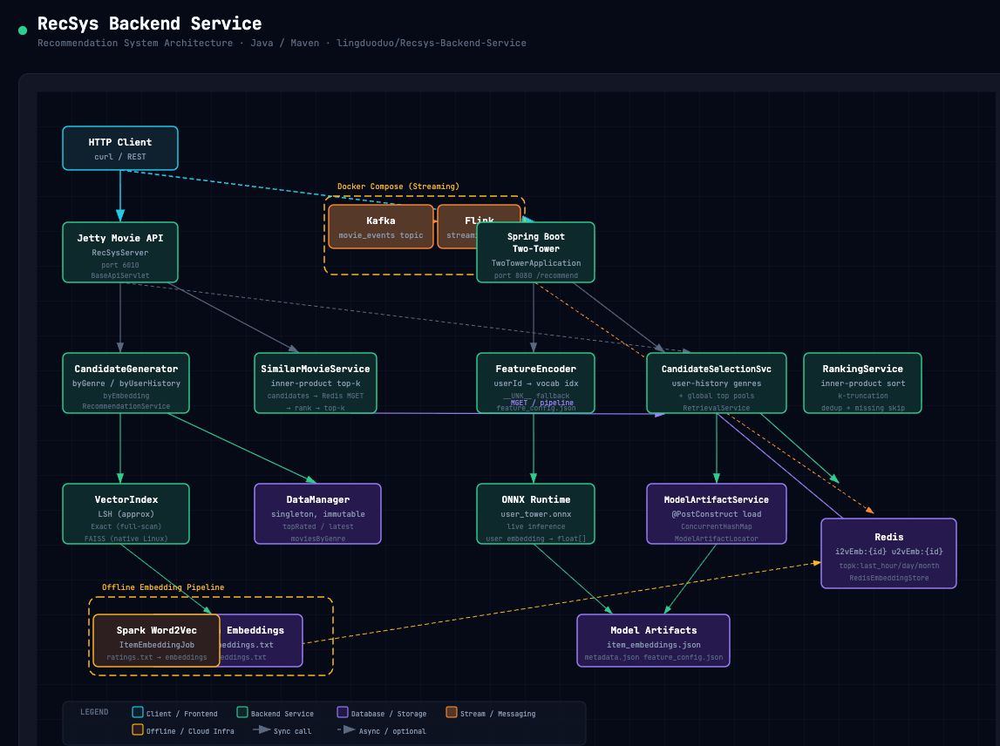

# RecSys

RecSys is a compact Maven workspace for experimenting with recommendation-system serving, retrieval, ranking, and offline embedding pipelines.

| Area | What it shows |
|---|---|
| Recommendation Serving API | Jetty, Redis, local item data, multi-strategy retrieval, and runtime embedding updates |
| Model serving demo | Spring Boot ONNX scoring with variant-aware model artifact loading |
| Rule-based offline embeddings | Spark Word2Vec item embeddings trained from user interaction sequences |
| Model-based offline training | PyTorch-exported ONNX models plus vocab/config artifacts generated offline |
| Online learning | Streaming feedback updates lightweight serving parameters outside the PyTorch model |



---

## Contents

- [Recommendation Flow](#recommendation-flow)
- [Recommendation Serving API](#recommendation-serving-api)
- [Microservice Gateway](#microservice-gateway)
- [Configuration](#configuration)
- [Capacity Planning](#capacity-planning)
- [JVM Tuning](#jvm-tuning)
- [Project Layout](#project-layout)
- [API Reference](#api-reference)
- [Model Serving Demo](#model-serving-demo)
- [A/B Testing](#ab-testing)
- [Testing](#testing)
- [Redis Test Data](#redis-test-data)
- [Online Serving](#online-serving)
- [Offline Item Embeddings](#offline-item-embeddings)
- [Embedding Storage Paths](#embedding-storage-paths)
- [Developer Notes](#developer-notes)
- [Pipeline Optimizations](#pipeline-optimizations)
- [LLM Gateway](#llm-gateway)
- [Model Rate Limiting](#model-rate-limiting)
- [AWS Saga Orchestration](#aws-saga-orchestration)
- [LLM Integration Ideas](#llm-integration-ideas)

---

## Recommendation Flow

The project demonstrates two recommendation paths that can be run independently or together:

**Offline / batch path (Recommendation Serving API, port 6010)**

Recall narrows the catalog to a candidate set; ranking scores and orders those candidates.

- **Single-strategy recall:** `CandidateGenerator.byGenre` expands from the genres of a seed movie.
- **Multi-way recall:** `CandidateGenerator.byUserHistory` merges candidates from user-history genres, global top-rated movies, and latest releases.
- **Embedding recall:** `CandidateGenerator.byEmbedding` retrieves items by ANN search on user and item embeddings.
- **Ranking:** `SimilarMovieService` scores each candidate with inner-product similarity and returns the top-K results.

**Online / real-time path (Online Prediction Server, port 7010)**

`OnlineRecommendationService` blends two live signals on every request:

- **Behavioral signals** (`OnlineRecommendationEngine`): recent per-user watch history + windowed trending Top-K, both written by the Flink job into Redis.
- **Embedding recall** (`CandidateGenerator.byEmbedding`): ANN search on offline-trained user-tower embeddings.

A normalized rank score fuses the two lists. Cold-start users with no embedding fall back to behavioral signals only. The response `strategy` field (`"online+model"` or `"online"`) shows which signals fired.

---

## Capacity Planning

This demo is sized for local development, but the production shape should be planned around the online serving path:

| Dimension | Production target / assumption | Design implication |
|---|---:|---|
| DAU / system daily active users | `200w+` users | Keep per-user online state compact: recent history lists, counters, and small learned parameters rather than large mutable profiles |
| Peak read QPS | `8k` recommendation requests/s | Serve hot features from local JVM cache first, Redis second; keep request-time ranking bounded by candidate count |
| Event TPS | Higher than read QPS during traffic bursts | Write behavior logs to MQ/Kafka first, then let Flink consume and aggregate asynchronously |
| Data scale | User history, item embeddings, engagement counters, Top-K windows | Store durable model artifacts offline; store online features in Redis with key prefixes, TTLs, and bounded Top-K/list sizes |
| Machine scale | Horizontally scaled stateless API + partitioned stream workers + Redis cluster/sentinel | Add serving instances behind a load balancer; scale Flink/Kafka by partitions; shard or cluster Redis by feature family |

For `200w+` DAU and `8k` peak QPS, the serving API should avoid synchronous heavy feature construction. Redis stores the latest online features (`user:<id>:recent_movies`, `movie:<id>:metrics`, `topk:<window>`) and model/vector side data that must be read with low latency. MQ/Kafka absorbs write spikes from exposure/click/view/order logs, and Flink smooths that bursty TPS into incremental Redis updates. This Redis + MQ peak-shaving pattern keeps recommendation reads predictable even when event traffic temporarily exceeds steady-state processing capacity.

The online-serving code includes runtime support for these assumptions:

- `OnlineServingMetricsService` tracks rolling QPS, latency, failures, rejected requests, and per-strategy failure rate and traffic mix (`share`).
- `OnlineLoadShedder` limits concurrent online requests; returns `429` with a `Retry-After` header when the instance is draining.
- `OnlineCapacityService` exposes DAU/QPS/TPS targets, remaining QPS `headroomQps`, and an `overloaded` flag alongside observed traffic.
- `/health` reports readiness, current QPS, in-flight requests, and suggested load-balancer weight.
- `/online/ops` returns metrics, load-shedder state, and capacity targets in one JSON payload with a `servedAt` ISO-8601 timestamp; also sets `Retry-After` when the shedder is draining.

Related production concerns:

- **Latency SLO:** track p50/p95/p99 end-to-end latency separately for recall, Redis reads, ranking, and response serialization.
- **Cache hit rate:** watch JVM local-cache hit rate and Redis MGET latency; hot embeddings and Top-K windows should avoid repeated cold reads.
- **Backpressure:** monitor Kafka consumer lag, Flink checkpoint duration, and Redis write latency so bursty TPS does not silently stale online features.
- **Degradation:** when Redis or model inference is slow, fall back to cached Top-K/trending recommendations and cap candidate counts.
- **Capacity triggers:** scale API replicas on QPS/CPU/p99 latency, Kafka/Flink on lag and processing time, and Redis on memory, ops/s, network, and hot-key pressure.
- **Consistency:** avoid cross-system distributed transactions across Kafka/Flink/Redis; use at-least-once MQ delivery, event-id idempotency, and Redis last-write-wins timestamps for eventual consistency.

---

## JVM Tuning

Three GC profile files live at the repo root. Pick one based on your latency target:

| File | Collector | Pause target | When to use |
|---|---|---|---|
| `jvm.options` | G1GC | 100 ms | Default — balanced throughput and latency |
| `jvm-g1.options` | G1GC (enhanced) | 100 ms | G1 with adaptive IHOP, reserve percent, mixed-GC count, and phase-level logging |
| `jvm-zgc.options` | ZGC (Java 21 generational) | < 1 ms | Latency-critical inference path; requires Java 21+ |

```bash
# G1 (recommended default)
java $(cat jvm-g1.options) -jar recsys-api-*.jar

# ZGC for sub-millisecond pause experiments (Java 21+)
java $(cat jvm-zgc.options) -jar recsys-api-*.jar
```

The runnable JVM workloads also use explicit option profiles under `config/jvm/` and a shared launcher:

```bash
sh scripts/run-with-jvm-tuning.sh <profile> -- <maven command...>
```

Profiles:

| Profile | JVM options file | Run target |
|---|---|---|
| `recsys-serving` | `config/jvm/recsys-serving.jvmopts` | Jetty Recommendation Serving API, port `6010` |
| `recsys-serving-zgc` | `config/jvm/recsys-serving-zgc.jvmopts` | Same API with ZGC for low-pause experiments |
| `model-serving` | `config/jvm/model-serving.jvmopts` | Spring Boot ONNX model service, port `8080` |
| `model-serving-zgc` | `config/jvm/model-serving-zgc.jvmopts` | Same model service with ZGC for low-pause experiments |
| `online-serving` | `config/jvm/online-serving.jvmopts` | Jetty Online Prediction Server, port `7010` |
| `online-serving-zgc` | `config/jvm/online-serving-zgc.jvmopts` | Same online server with ZGC for tail-latency experiments |
| `offline-embedding` | `config/jvm/offline-embedding.jvmopts` | Local offline embedding / Spark driver runs |

Tuning starts from the JVM memory model:

| Area | What this service uses it for | Tuning control |
|---|---|---|
| Heap (`堆`) | Movie/user data, embeddings, vector indexes, local caches, request/response objects | `-Xms`, `-Xmx`, cache-size env vars such as `ONLINE_FEATURE_CACHE_MAX_USERS` and `RECSYS_RECOMMENDATION_CACHE_MAX_ENTRIES` |
| Thread stack (`栈`) | Jetty/Tomcat request threads, Redis calls, Spark helper threads | `-Xss`; serving profiles use `512k`, offline embedding uses `1m` |
| Method area / Metaspace (`方法区` / `元空间`) | Spring Boot, Jetty, Flink/Spark, ONNX/Jedis/Jackson class metadata | `-XX:MaxMetaspaceSize`; larger for Spring Boot and offline Spark runs |
| Direct/native memory | ONNX Runtime native buffers, NIO/direct buffers, JVM internals | `-XX:MaxDirectMemorySize`; larger in `model-serving` because ONNX uses native memory outside the Java heap |
| Code cache | JIT-compiled hot paths for ranking, vector math, cache, metrics, Spark/Scala code | `-XX:ReservedCodeCacheSize` |

Default profiles use G1 GC, bounded pause targets, string deduplication, heap dumps on OOM, and rotating GC/safepoint logs under `logs/`. The `*-zgc` profiles are low-pause alternatives for serving workloads on Java 17+. For production containers, set the process/container memory limit above `Xmx + MaxMetaspaceSize + MaxDirectMemorySize + thread_count * Xss + JVM/native overhead`; a practical first pass is 25-35% headroom above those explicit caps.

Serving G1 profiles use fixed heaps (`-Xms == -Xmx`) to remove heap-resize latency during traffic ramps. Offline embedding uses a growth range because batch runs may not always need the full heap.

| Profile | `-Xms` | `-Xmx` | 新生代 band | GC pause target | Region size | Rationale |
|---|---:|---:|---:|---:|---:|---|
| `recsys-serving` | `1g` | `2g` | `20%–40%` | `100 ms` | 4 MB | Jetty ranking/blending; small request objects; 2 g max leaves room for ranking caches |
| `model-serving` | `2g` | `2g` | `20%–40%` | `100 ms` | 4 MB | Spring Boot + ONNX; fixed heap prevents expansion pauses; float[128] embeddings well below humongous threshold |
| `online-serving` | `1g` | `2g` | `20%–40%` | `100 ms` | 4 MB | Real-time feature scoring; similar object profile to recsys-serving |
| `offline-embedding` | `4g` | `8g` | `30%–60%` | `200 ms` | 8 MB | Batch throughput-first; large Eden absorbs mini-batch float[][]; 8 MB regions keep batch arrays out of humongous path |

The young-gen band is set with `-XX:G1NewSizePercent` / `-XX:G1MaxNewSizePercent`. G1 adapts Eden within that range each collection to stay within `MaxGCPauseMillis`; treat the band as guardrails, not a fixed split. ZGC variants (`*-zgc`) use `Xmx` = 3–4 g to give the concurrent relocation 25–50 % headroom.

### GC Strategy

This repo targets Java 17, so the practical collector choices are G1 for the default path and ZGC for low-pause experiments:

| GC event | STW? | Typical pause | What it means | When to act |
|---|---|---|---|---|
| Minor GC | ✅ | 5–25 ms | Young-gen collection (Eden + Survivor); `Pause Young` in G1 logs | Expected and frequent; act if p99 > `MaxGCPauseMillis` or allocation rate spikes |
| G1 Mixed | ✅ | 10–50 ms | Reclaims young gen + selected old-gen regions; `Pause Mixed` in G1 logs | Normal when old gen fills gradually; frequent mixed GC means IHOP is too low |
| Full GC | ✅ | 200 ms – 5 s | Whole-heap compaction; `Pause Full` in G1 logs | **Treat as an incident** — cap caches, increase heap, or fix allocation spikes |
| STW | ✅ | varies | Any pause where all application threads halt | Monitor with `/health/gc` `stwLongestPauseMs`; act if above request SLO |
| CMS | ❌ | N/A (concurrent) | Legacy Concurrent Mark Sweep; deprecated Java 9, removed Java 14 | Do not configure on Java 17; migrate to G1 or ZGC |
| ZGC cycle | ❌ | N/A (wall time) | Concurrent GC cycle; actual STW phases < 1 ms | Watch `allocationStalls > 0` in `/health/gc` — signals need for more heap or GC threads |
| ZGC STW | ✅ | < 1 ms | Initial/final mark, relocate-start; Java 21 generational ZGC targets sub-ms | > 5 ms indicates a JVM regression |

Use G1 first when throughput, predictable memory use, and simple operations matter. Try ZGC when serving p99/p999 latency is dominated by STW pauses after heap/caching fixes. Avoid CMS flags in this Java 17 project because the JVM will fail startup.

GC logs can be summarized locally:

```bash
sh scripts/summarize-gc-logs.sh logs/gc-online-serving-*.log
```

The Spring Boot model service exposes two GC observability endpoints:

- `GET /health/jvm` — poll-based snapshot: heap/non-heap pools, thread counts, aggregate GC counters split by role (young, full, concurrent, STW), and per-collector breakdown.
- `GET /health/gc` — event-driven snapshot from `GcEventTracker`, which receives a JMX notification on every individual GC event. Provides STW pause histogram bucketed by severity (`<1ms → >500ms`), per-type event counts (Minor, Mixed, Full, CMS, ZGC), cumulative allocation and promotion totals, and danger-signal counters for G1 evacuation failures and ZGC allocation stalls.

```bash
curl http://localhost:8080/health/gc
```

```json
{
  "byType": {
    "MINOR_GC": {"events": 42, "totalPauseMs": 630, "avgPauseMs": 15.0},
    "FULL_GC":  {"events": 0,  "totalPauseMs": 0,   "avgPauseMs": 0.0}
  },
  "stwEventCount": 42,
  "stwTotalPauseMs": 630,
  "stwLongestPauseMs": 28,
  "stwAvgPauseMs": 15.0,
  "stwPauseHistogram": {
    "<1ms": 0, "1-10ms": 5, "10-50ms": 37, "50-200ms": 0, "200-500ms": 0, ">500ms": 0
  },
  "totalAllocatedBytes": 2147483648,
  "totalPromotedBytes": 52428800,
  "evacuationFailures": 0,
  "allocationStalls": 0
}
```

For serving workloads, useful alarms are: `evacuationFailures > 0` (G1 heap fragmentation), `allocationStalls > 0` (ZGC needs more heap or GC threads), `stwLongestPauseMs` above the request SLO, and any `FULL_GC` events. For offline embedding, longer pauses may be acceptable if total job throughput is healthy.

### Arthas Runtime Diagnostics

Use Arthas when the JVM is alive and the problem is happening now. The helper script expects an existing `arthas-boot.jar` at `tools/arthas/arthas-boot.jar`, or set `ARTHAS_BOOT_JAR`.

```bash
mkdir -p tools/arthas
curl -L -o tools/arthas/arthas-boot.jar https://arthas.aliyun.com/arthas-boot.jar
```

Find the Java process, then run focused checks:

```bash
jps -lv

# 线程分析: top CPU threads plus blocking/deadlock candidates.
sh scripts/arthas-diagnostics.sh <pid> thread

# CPU 热点: records an async-profiler flame graph under logs/arthas/.
sh scripts/arthas-diagnostics.sh <pid> cpu 60

# classloader: tree and loaded-class statistics; useful for duplicate classes or classloader leaks.
sh scripts/arthas-diagnostics.sh <pid> classloader

# watch: inspect method params, return value, exception, and cost for 5 calls.
sh scripts/arthas-diagnostics.sh <pid> watch \
  com.recsys.modelbased.model.service.RankingService rank

# trace: show call path cost for slow methods.
sh scripts/arthas-diagnostics.sh <pid> trace \
  com.recsys.modelbased.model.service.RecommendationService recommend

# jad: decompile the class actually loaded by this JVM.
sh scripts/arthas-diagnostics.sh <pid> jad \
  com.recsys.modelbased.model.service.RecommendationCache
```

Recommended incident flow:

| Symptom | Arthas command | What to look for |
|---|---|---|
| CPU high | `cpu 60`, then `thread` | Flame graph top frames in ranking, JSON, Redis client, or cache code |
| Request p99 high | `trace <class> <method>` | Slow subtree, Redis waits, model inference cost, synchronized/lock-heavy paths |
| Suspect bad input/output | `watch <class> <method>` | Params, return object, thrown exception, and `#cost` without adding logs |
| Thread stalls | `thread` | `BLOCKED`, deadlock output, or many workers waiting on the same monitor/future |
| Class conflict/leak | `classloader` and `jad` | Multiple versions of a class, unexpected loader ownership, generated proxy buildup |

### MAT Heap Analysis

Use MAT when heap keeps growing, Full GC recurs, or an OOM heap dump is available. The helper script uses `jcmd` for dumps and Eclipse MAT's `ParseHeapDump` CLI for reports.

```bash
# Live-only heap dump: excludes unreachable garbage after a full GC.
sh scripts/mat-heap-analysis.sh dump <pid>

# Full heap dump: includes unreachable objects; useful when comparing pre/post GC.
sh scripts/mat-heap-analysis.sh dump-all <pid>

# Quick top classes before opening MAT.
sh scripts/mat-heap-analysis.sh histogram <pid>

# Generate MAT leak suspects, top components, and overview reports.
MAT_PARSE_HEAP_DUMP=/path/to/mat/ParseHeapDump \
  sh scripts/mat-heap-analysis.sh report logs/heap-dumps/heap-<pid>-<timestamp>.hprof
```

Heap dump analysis checklist:

| Question | MAT view/report | RecSys-specific suspects |
|---|---|---|
| 内存泄漏 | Leak Suspects, Dominator Tree, Path To GC Roots | `RecommendationCache`, `LocalEmbeddingCache`, `OnlineFeatureStore`, Redis result buffers |
| 大对象 | Histogram, Top Components, Dominator Tree | Large `float[]`, `double[]`, `byte[]`, `ArrayList`, Jackson buffers, ONNX tensors |
| Cache oversizing | Dominator Tree retained heap by owner | Cache max entries too high, stale per-user recent-history entries, hot embedding cache growth |
| Classloader leak | Histogram by classloader, Path To GC Roots | Old Spring/Jetty loaders retained by threads, timers, or static singletons |
| OOM root cause | Leak Suspects plus GC logs | Full GC before OOM, humongous arrays, native/direct memory pressure outside heap |

---

## Recommendation Serving API

Runs the Jetty recommendation serving API on port `6010` with Redis-backed embeddings and Top-K state.

**Requirements:** Java 17, Maven, Docker with Docker Compose.

Start infrastructure:

```bash
colima start  
docker compose -f docker-compose.streaming.yml up -d
```

Run the API:

```bash
mvn clean compile
sh scripts/run-with-jvm-tuning.sh recsys-serving -- \
  mvn exec:java -Dexec.mainClass="com.recsys.serving.RecSysServer"
```

Smoke test:

```bash
curl "http://localhost:6010/health"
curl "http://localhost:6010/item?id=1"
curl "http://localhost:6010/similar?movieId=1&k=5"
curl "http://localhost:6010/getrecommendation?userId=123&mode=embedding&k=5"
curl -X POST "http://localhost:6010/v1/models/recmodel:predict" \
  -H "Content-Type: application/json" \
  -d '{"instances":[{"userId":123,"movieId":1},{"userId":123,"movieId":2}]}'
```

Select a classpath embedding backend:

```bash
RECSYS_VECTOR_BACKEND=lsh sh scripts/run-with-jvm-tuning.sh recsys-serving -- \
  mvn exec:java -Dexec.mainClass="com.recsys.serving.RecSysServer"
RECSYS_VECTOR_BACKEND=exact sh scripts/run-with-jvm-tuning.sh recsys-serving -- \
  mvn exec:java -Dexec.mainClass="com.recsys.serving.RecSysServer"
```

`lsh` is the default approximate backend. `exact` is useful for deterministic recall checks.

Stop infrastructure:

```bash
docker compose -f docker-compose.streaming.yml down
```

---

## Microservice Gateway

The repo can run as a small local microservice topology instead of one combined endpoint.
The API gateway is the public edge; domain-facing routes are preferred for new clients:

| Service | Port | Gateway prefix | Entrypoint |
|---|---:|---|---|
| User Profile Service | `6010` | `/api/users` | currently backed by `com.recsys.serving.RecSysServer` |
| Movie Metadata Service | `6010` | `/api/movies` | currently backed by `com.recsys.serving.RecSysServer` |
| Feature Service | `7010` | `/api/features` | currently backed by `com.recsys.streaming.OnlinePredictionServer` |
| Recommendation Retrieval Service | `8080` | `/api/retrieval` | currently backed by `com.recsys.modelbased.model.ModelApplication` |
| Ranking Service | `8080` | `/api/ranking` | currently backed by `com.recsys.modelbased.model.ModelApplication` |
| LLM Explanation Service | _(external)_ | `/api/explanations` | forwarded to `LLM_EXPLANATION_SERVICE_URL` |
| Agent Workflow Service | `8080` | `/api/agents` | currently backed by model-serving placeholder |
| Observability Service | `8080` | `/api/observability` | currently backed by model-serving health/metrics |
| Catalog / classic recommendation | `6010` | `/api/catalog` | `com.recsys.serving.RecSysServer` |
| Model recommendation | `8080` | `/api/model` | `com.recsys.modelbased.model.ModelApplication` |
| Online recommendation | `7010` | `/api/online` | `com.recsys.streaming.OnlinePredictionServer` |
| LLM proxy | _(external)_ | `/api/llm` | forwarded to `LLM_SERVICE_URL` (default Ollama `11434`) |
| API gateway | `8010` | `/` | `com.recsys.microservice.MicroserviceGatewayServer` |

Start Redis/Kafka/Flink infrastructure first if you need Redis-backed serving paths:

```bash
docker compose -f docker-compose.streaming.yml up -d
```

Run all local services plus the gateway:

```bash
sh scripts/run-microservices-local.sh
```

Or run only the gateway when the downstream services are already running:

```bash
sh scripts/run-with-jvm-tuning.sh api-gateway -- \
  mvn exec:java -Dexec.mainClass="com.recsys.microservice.MicroserviceGatewayServer"
```

Gateway smoke tests:

```bash
curl "http://localhost:8010/health"
curl "http://localhost:8010/api/users/user?id=123"
curl "http://localhost:8010/api/movies/item?id=1"
curl "http://localhost:8010/api/catalog/item?id=1"
curl "http://localhost:8010/api/catalog/getrecommendation?userId=123&mode=embedding&k=5"
curl "http://localhost:8010/api/online/online/recommendation?userId=123&window=last_hour&k=5"
curl -X POST "http://localhost:8010/api/model/api/v1/recommend" \
  -H "Content-Type: application/json" \
  -d '{"userId":"123","k":5}'
```

The gateway strips the service prefix before proxying, so `/api/movies/item?id=1` becomes `/item?id=1` on the movie metadata service. `GET /health` aggregates downstream health checks and returns `503` with `status: DEGRADED` when any registered service is unavailable. See `docs/api-gateway-service-topology.md` for the route ownership map.

### Docker, Kubernetes, And EKS

The same image can run every service by setting `RECSYS_MAIN_CLASS`.

Build the image locally:

```bash
docker build -t recsys-backend-service:local .
```

Deploy the local Kubernetes manifests:

```bash
kubectl apply -k k8s/base
kubectl -n recsys rollout status deployment/recsys-api-gateway
```

On Kubernetes and EKS, service discovery is handled by Kubernetes Services and DNS. The gateway receives cluster-local URLs from `k8s/base/configmap.yaml`:

```text
CATALOG_SERVICE_URL=http://recsys-catalog-serving:6010
MODEL_SERVICE_URL=http://recsys-model-serving:8080
ONLINE_SERVICE_URL=http://recsys-online-serving:7010
```

For EKS, push the image to Amazon ECR, set the image in `k8s/eks/kustomization.yaml`, and apply the overlay:

```bash
kubectl apply -k k8s/eks
kubectl -n recsys get svc recsys-api-gateway
```

See [docs/aws/eks-deployment.md](docs/aws/eks-deployment.md) for ECR and EKS commands.

---

## Configuration

### Recommendation Serving API (Jetty, port 6010)

| Env var | Default | Purpose |
|---|---:|---|
| `PORT` | `6010` | API server port |
| `REDIS_HOST` | `localhost` | Redis host |
| `REDIS_PORT` | `6379` | Redis port |
| `LOCAL_EMBEDDING_CACHE_MAX_ENTRIES` | `100000` | Max item/user embeddings retained in the local JVM read-through cache |
| `RECSYS_VECTOR_BACKEND` | `lsh` | Embedding backend: `lsh` or `exact`; `faiss` falls back to `lsh` in the portable build |

Example:

```bash
PORT=7010 REDIS_HOST=localhost REDIS_PORT=6379 \
  sh scripts/run-with-jvm-tuning.sh recsys-serving -- \
  mvn exec:java -Dexec.mainClass="com.recsys.serving.RecSysServer"
```

On startup the server seeds Redis with bundled movie and user embeddings if the Redis keys are empty.

### Microservice Gateway (Jetty, port 8010)

| Env var | Default | Purpose |
|---|---:|---|
| `GATEWAY_PORT` | `8010` | Gateway server port |
| `GATEWAY_TIMEOUT_MS` | `3000` | Upstream connect/request timeout |
| `CATALOG_SERVICE_URL` | `http://localhost:6010` | Base URL for `/api/catalog` |
| `MODEL_SERVICE_URL` | `http://localhost:8080` | Base URL for `/api/model` |
| `ONLINE_SERVICE_URL` | `http://localhost:7010` | Base URL for `/api/online` |
| `GATEWAY_RATE_LIMIT_RPS` | `0` | Optional per-gateway-pod local token-bucket rate; `0` disables gateway throttling |
| `GATEWAY_RATE_LIMIT_BURST` | `0` | Optional per-gateway-pod local token-bucket burst capacity |
| `GATEWAY_RATE_LIMIT_<ROUTE>_RPS` | _(unset)_ | Optional per-route override, for example `GATEWAY_RATE_LIMIT_MODEL_RPS` |
| `GATEWAY_RATE_LIMIT_<ROUTE>_BURST` | _(unset)_ | Optional per-route burst override, for example `GATEWAY_RATE_LIMIT_MODEL_BURST` |

### Model serving service (Spring Boot, port 8080)

| Env var / property | Default | Purpose |
|---|---:|---|
| `RECSYS_MODEL_ARTIFACTS_DIR` | _(empty)_ | Model artifact directory; resolves `artifacts/model/<variant>/...`; defaults to the bundled `classpath:artifacts/model/training/` |
| `RECSYS_MODEL_ITEM_EMBEDDINGS_SOURCE` | `classpath` | Model-serving item embedding source: `classpath` for `item_embeddings.json`, or `redis` for preloaded Redis embeddings |
| `RECSYS_MODEL_REDIS_ITEM_EMBEDDING_PREFIX` | `i2vEmb` | Redis key prefix used when model-serving item embeddings are loaded from Redis |
| `RECSYS_SPARK_ARTIFACTS_DIR` | _(empty)_ | PySpark artifact directory; overrides `classpath:artifacts/pyspark/` |
| `recsys.health.window-seconds` | `60` | Rolling window width (s) for recent failure rate, latency, and throughput metrics |
| `recsys.health.min-sample-size` | `5` | Minimum requests in the window before readiness thresholds are enforced |
| `recsys.health.max-failure-rate` | `0.5` | Failure rate `[0.0, 1.0]` above which `/health/ready` returns 503 |
| `recsys.health.max-avg-latency-ms` | `2000` | Average latency (ms) above which `/health/ready` returns 503 |
| `recsys.health.max-concurrent-requests` | `64` | Per-instance in-flight recommendation cap; excess requests fail fast with `503` |
| `recsys.health.max-in-flight-utilization` | `0.95` | In-flight utilization above which `/health/ready` returns `503` so load balancers drain the node |
| `MYSQL_ENABLED` | `false` | Optional MySQL access switch; disabled by default so normal serving paths do not open DB connections |
| `MYSQL_URL` | `jdbc:mysql://localhost:3306/recsys?...` | JDBC URL used only by explicit `MySqlClient` callers |
| `MYSQL_USER` | `recsys` | MySQL username |
| `MYSQL_PASSWORD` | _(empty)_ | MySQL password |

All `recsys.health.*` values are validated at startup — misconfiguration fails fast. Override via `application.yml` or environment variables (e.g. `RECSYS_HEALTH_MAX_FAILURE_RATE=0.3`).

MySQL support is intentionally minimal: the repo includes the runtime JDBC driver plus `com.recsys.mysql.MySqlClient`, but no JPA, no connection pool, and no startup connection. Use it only in repository code that explicitly needs SQL-backed reads, such as the million-scale pagination plans in `com.recsys.pagination`.

### A/B test configuration (Model serving service)

| Property | Default | Purpose |
|---|---:|---|
| `recsys.ab-test.enabled` | `false` | Enable or disable bucketing; when `false` every user gets `default-variant` |
| `recsys.ab-test.layer-name` | `default` | Experiment name mixed into the hash key — change this to run an independent parallel experiment |
| `recsys.ab-test.traffic-split-number` | `5` | Modulus for the hash bucket; 20 % of users land in A, 20 % in B, 60 % in control |
| `recsys.ab-test.bucket-a-variant` | `test` | Variant served to users in bucket 0 |
| `recsys.ab-test.bucket-b-variant` | `training` | Variant served to users in bucket 1 |
| `recsys.ab-test.default-variant` | `training` | Variant served to all other users (control group) |

All `recsys.ab-test.*` values are validated at startup. Override via `application.yml` or environment variables (e.g. `RECSYS_AB_TEST_ENABLED=true`).

---

## Project Layout

```text
src/main/java/com/recsys/
├── models/                 Immutable API/domain records
├── features/               Data loading, indexed access, retrieval, vector math, Redis stores
├── microservice/           API gateway, domain route map, LLM proxy, route health aggregation
├── serving/                Jetty server and servlet endpoints (port 6010)
├── streaming/              Online serving layer (port 7010)
│   ├── flink/              Flink streaming job — writes online features to Redis
│   ├── OnlineRecommendationService.java   Blends behavioral + embedding signals
│   ├── OnlineRecommendationEngine.java    Real-time scoring: recent history + trending
│   ├── OnlinePredictionServer.java        Jetty entry point
│   └── ...                (request/result records, feature stores, servlets)
├── mysql/                  Optional JDBC helper and connection settings (MySQL opt-in)
├── pagination/             SQL templates for million-row pagination (covering index, cursor, delayed join)
├── saga/                   AWS saga orchestration (SagaOrchestrator, TccSagaOrchestrator, Step Functions ASL generation)
├── training/
│   ├── rulebased/          Spark Word2Vec offline item embeddings
│   └── modelbased/
│       └── model/          Spring Boot ONNX model serving
│           ├── ModelApplication.java
│           ├── config/     Model artifact + A/B test configuration
│           ├── controller/ Recommendation and health APIs
│           ├── dto/        Request / response payloads
│           └── service/    Candidate selection, recall, ranking, ONNX inference, A/B bucketing
│                           ModelArtifactLocator — unified locator for model + spark artifact groups
└── data/                   Bundled sample data and seed embeddings
    ├── movies.txt
    ├── users.txt
    ├── ratings.txt
    ├── events.txt
    ├── online_features.txt
    ├── movie_embeddings.txt
    └── user_embeddings.txt

src/main/resources/artifacts/model/      Variant-aware model artifact root
├── training/
└── test/

src/main/resources/artifacts/model/training/   Bundled sample artifacts for the default variant
├── feature_config.json
└── dssm_model.onnx

docker-compose.streaming.yml              Legacy root compose for local Redis/Kafka/Flink experiments
streaming/online-serving/                 Canonical Kafka + Flink + Redis online-serving path
├── README.md
├── docker-compose.yml
├── data/movie_events.ndjson
└── scripts/
    ├── load_online_features.sh
    └── produce_movie_events.sh
```

---

## API Reference

The Jetty movie API exposes lookup, recommendation, similarity, pair-scoring, and embedding-update endpoints on port `6010`.

### Health

```bash
curl "http://localhost:6010/health"
# {"ok":true}
```

### Item Lookup

```bash
curl "http://localhost:6010/item?id=1"
# {"id":1,"title":"Inception","year":2010,"genres":["Sci-Fi","Thriller"]}
```

### User Lookup

```bash
curl "http://localhost:6010/getuser?userId=123"
# {"userId":123,"name":"Alice"}
```

### Recommendations

Four retrieval modes are supported. All require `userId`.

**Default (no `mode`) — multi-strategy by user history:**

```bash
curl "http://localhost:6010/getrecommendation?userId=123"
```

Merges three candidate pools via `CandidateGenerator.byUserHistory`: genre-based from the user's rating history (top 20 per genre), global top-100 by average rating, and latest 100 by release year. Already-watched movies are excluded.

**With `seedMovieId` — genre-based from seed:**

```bash
curl "http://localhost:6010/getrecommendation?userId=123&seedMovieId=2"
```

Uses `CandidateGenerator.byGenre`: for each genre on the seed movie, retrieves the top-100 by average rating, deduplicates, and removes the seed itself.

**`mode=embedding` — embedding-based retrieval:**

```bash
curl "http://localhost:6010/getrecommendation?userId=123&mode=embedding&k=20"
```

Uses `CandidateGenerator.byEmbedding` against classpath embeddings. Backend is controlled by `RECSYS_VECTOR_BACKEND`. Returns 404 if no user embedding is found. `k` is capped at 200 (default: 20).

Supported portable backends:

- `lsh` — approximate SimHash random-projection with inner-product reranking.
- `exact` — full-scan inner-product top-k with a bounded min-heap.

`faiss` is reserved for Linux native FAISS deployments and falls back to `lsh` in the portable build.

**`mode=topk` / `mode=trending` — Redis sorted-set trending:**

```bash
curl "http://localhost:6010/getrecommendation?userId=123&mode=topk&window=last_hour&k=5"
```

Reads pre-scored movie IDs from a Redis sorted set. Supported windows: `last_hour`, `last_day`, `last_month`.

### Similar Items

Computes inner-product similarity against Redis item embeddings:

```bash
curl "http://localhost:6010/similar?movieId=1&k=5"
# {"movieId":1,"similar":[{"movieId":4,"score":0.99}, ...]}
```

### Pair Prediction

Scores explicit `(userId, movieId)` pairs with a batched JSON `POST`:

```bash
curl -X POST "http://localhost:6010/v1/models/recmodel:predict" \
  -H "Content-Type: application/json" \
  -d '{
    "instances": [
      {"userId": 123, "movieId": 1},
      {"userId": 123, "movieId": 2}
    ]
  }'
```

```json
{
  "predictions": [
    [0.9231],
    [0.7412]
  ]
}
```

Notes:

- Scores each pair independently; does not do candidate generation or top-K assembly.
- Uses bundled classpath user and movie embeddings with inner-product scoring.
- Returns `400` when `instances` is empty, IDs are non-positive, or a user/movie embedding is missing.

### Set Embedding

Stores or updates a movie embedding in Redis. Default TTL is 24 hours; use `ttl=0` for no expiry.

```bash
# Raw body
curl -X POST "http://localhost:6010/setembedding?movieId=4" \
  -H "Content-Type: text/plain" \
  --data-binary "0.2 0.2 0.6"

# Form body
curl -X POST "http://localhost:6010/setembedding?movieId=5" \
  --data-urlencode "vec=0.1 0.3 0.6"

# Query parameter with custom TTL
curl -X POST "http://localhost:6010/setembedding?movieId=6&ttl=3600&vec=0.5+0.5+0.0"
```

---

## Model Serving Demo

A separate Spring Boot service on port `8080` that serves model-based retrieval through `ModelApplication`.

**Demonstrates:**

- DSSM ONNX inference in Java
- Offline model artifacts generated by a PyTorch/ONNX training pipeline
- Candidate pair scoring with user/item vocab lookup
- A/B variant-aware runtime pre-warming at startup — all configured model variants are loaded before the first request so no user pays cold-start cost
- Per-variant latency and success-rate metrics via `GET /health/ab-tests`, with deltas vs the control
- Readiness / liveness probes that check every pre-warmed variant, not just the default
- Rolling-window inference metrics (latency, failure rate, throughput)
- Config-driven probe thresholds with startup validation

At request time, `POST /api/v1/recommend` calls `ABTestService` to deterministically assign the user to a variant, fetches the pre-warmed `ModelRuntime` from `ModelRuntimeProvider`, runs `FeatureEncoder` → DSSM ONNX pair scoring, and records per-variant metrics in `InferenceMetricsService`. `ModelRuntimeProvider` owns the full lifecycle of every `ModelArtifactService` and `UserTowerInferenceService` instance — they are plain Java objects, not Spring beans.

The model artifact itself is offline-trained: PyTorch exports the ONNX file, and the same pipeline emits stable serving artifacts such as vocab/config metadata and pretrained item embeddings. To keep the deployable model small, the production export can strip the item-embedding table out of the ONNX artifact and publish those vectors into Redis as key-value records. Real-time streaming data is not used to mutate the ONNX weights in-process. Online learning lives in a separate layer for fast-changing function parameters, blending weights, recency/trending coefficients, thresholds, or other lightweight serving knobs learned from Kafka/Flink feedback streams and published to the online serving layer.

`ModelArtifactLocator` resolves artifacts into two groups: **model** (`classpath:artifacts/model/<variant>/...`, overridden by `RECSYS_MODEL_ARTIFACTS_DIR`) and **spark** (`classpath:artifacts/pyspark/`, overridden by `RECSYS_SPARK_ARTIFACTS_DIR`). When no variant is specified the locator defaults to the `training` variant.

### Artifact Contract

The service expects the following files exported by your modeling pipeline:

```text
feature_config.json        User vocab and feature metadata
item_embeddings.json       Optional serialized pretrained item embeddings (item_id → float[])
item_embeddings.faiss      Optional FAISS IndexFlatIP index
item_ids.json              Optional FAISS row-to-item-id mapping
metadata.json              Model version and training metadata
dssm_model.onnx            Exported DSSM model for runtime pair scoring
```

Point the service at your pipeline's output directory via `RECSYS_MODEL_ARTIFACTS_DIR` (see [Configuration](#configuration)). Organize variants as `<artifacts-dir>/<variant>/feature_config.json` plus the configured ONNX model file, or leave the model file on the classpath root for local demos. `RECSYS_MODEL_FILE` defaults to `dssm_model.onnx`. When `RECSYS_MODEL_ARTIFACTS_DIR` is unset, the bundled sample artifacts under `classpath:artifacts/model/training/` are used.

The full production artifact set is expected to come from an external PyTorch/ONNX training export pipeline. The bundled DSSM ONNX file and config are small demo artifacts.

The repo can generate sample offline item embeddings with Spark Word2Vec:

```bash
sh scripts/run-with-jvm-tuning.sh offline-embedding -- \
  mvn -Poffline-embedding exec:java \
  -Dexec.mainClass="com.recsys.training.rulebased.ItemEmbeddingJob" \
  -Dexec.args="--output=output/item_embeddings"
```

To preload those item embeddings into Redis for stripped-embedding model serving:

```bash
sh scripts/run-with-jvm-tuning.sh offline-embedding -- \
  mvn -Poffline-embedding exec:java \
  -Dexec.mainClass="com.recsys.training.rulebased.ItemEmbeddingJob" \
  -Dexec.args="--output=output/item_embeddings --save-to-redis=true --redis-host=localhost --redis-port=6379"
```

Then run the Spring Boot model service with Redis-backed item embeddings:

```bash
RECSYS_MODEL_ITEM_EMBEDDINGS_SOURCE=redis \
RECSYS_MODEL_REDIS_ITEM_EMBEDDING_PREFIX=i2vEmb \
RECSYS_MODEL_ARTIFACTS_DIR=/path/to/model/artifacts \
sh scripts/run-with-jvm-tuning.sh model-serving -- mvn spring-boot:run
```

### Feature Contract

| Input | Field |
|---|---|
| User tower | `user_id` |
| Item tower | `item_id` |

### Spring Boot Serving

```bash
# Use bundled classpath artifacts
sh scripts/run-with-jvm-tuning.sh model-serving -- mvn spring-boot:run

# Load artifacts from your modeling pipeline's output directory
RECSYS_MODEL_ARTIFACTS_DIR=/path/to/model/artifacts \
  sh scripts/run-with-jvm-tuning.sh model-serving -- mvn spring-boot:run
```

### Version Controller

`VersionController` manages the model update path after offline training finishes. A new PyTorch/ONNX export is first written under a new artifact variant, such as `<artifacts-dir>/candidate-v2/feature_config.json` plus the configured ONNX model file. The serving process can then preload the candidate, verify that its ONNX session is ready, and promote it to default traffic without directly overwriting the active model files.

```bash
# See the active model and all loaded variants
curl http://localhost:8080/api/v1/model/versions

# Warm a newly exported model variant before sending traffic to it
curl -X POST http://localhost:8080/api/v1/model/versions/preload \
  -H 'Content-Type: application/json' \
  -d '{"variant": "candidate-v2"}'

# Promote the warmed variant to default traffic
curl -X POST http://localhost:8080/api/v1/model/versions/activate \
  -H 'Content-Type: application/json' \
  -d '{"variant": "candidate-v2"}'

# Roll back to the previous active variant
curl -X POST http://localhost:8080/api/v1/model/versions/rollback
```

Activation updates the in-memory default variant used by `ABTestService`; it does not retrain the model or mutate ONNX weights. In production, persist the promoted version in your deployment/config system after validation so a restart comes back on the intended active version.

### Recommend

```bash
curl -X POST http://localhost:8080/api/v1/recommend \
  -H 'Content-Type: application/json' \
  -d '{"userId": "123", "k": 5, "excludeItemIds": ["2"]}'
```

```json
{
  "userId": "123",
  "modelVersion": "demo-model-ratings-v1",
  "abTestVariant": "training",
  "recommendations": [
    {"itemId": "1", "score": 0.9997},
    {"itemId": "3", "score": 0.7100}
  ]
}
```

`abTestVariant` is the name of the experiment variant the user was assigned to. Log this field alongside impressions and conversions to compare variants offline.

### A/B comparison metrics

Once requests have flowed through the service, compare variants directly:

```bash
curl http://localhost:8080/health/ab-tests
```

Example response:

```json
{
  "controlVariant": "training",
  "variants": {
    "training": {
      "variant": "training",
      "modelVersion": "demo-model-ratings-v1",
      "totalRequests": 120,
      "successCount": 118,
      "failureCount": 2,
      "successRate": 0.9833,
      "avgLatencyMs": 11.4,
      "successRateDeltaVsControl": 0.0,
      "avgLatencyDeltaVsControlMs": 0.0
    },
    "test": {
      "variant": "test",
      "modelVersion": "demo-model-ratings-test-v1",
      "totalRequests": 113,
      "successCount": 111,
      "failureCount": 2,
      "successRate": 0.9823,
      "avgLatencyMs": 12.1,
      "successRateDeltaVsControl": -0.001,
      "avgLatencyDeltaVsControlMs": 0.7
    }
  }
}
```

This endpoint gives you online operational comparison by variant: request volume, failure rate, average latency, and deltas versus the configured control. Pair it with offline business metrics such as CTR, watch time, or conversion for full experiment evaluation.

#### Request fields

| Field | Type | Required | Constraints |
|---|---|---|---|
| `userId` | string | yes | non-blank, max 50 chars |
| `k` | integer | no | 1–100, default `5` |
| `excludeItemIds` | string[] | no | max 500 entries, each max 50 chars |

#### Error response shape

All errors return a consistent JSON body regardless of failure type:

```json
{
  "error": "validation failed",
  "violations": [
    {"field": "k", "message": "k must be at most 100"}
  ]
}
```

Non-validation errors (`violations` is an empty array):

| Status | Cause |
|---|---|
| `400` | Bean-validation failure or service-level guard |
| `415` | Missing or wrong `Content-Type` (must be `application/json`) |
| `500` | Unhandled inference or runtime error |

### Health Probes

#### Liveness — `GET /health/live`

Always returns `200 OK` as long as the JVM's HTTP thread pool responds. Configure your orchestrator to restart the container when this endpoint times out or becomes unreachable.

```bash
curl http://localhost:8080/health/live
# {"status":"UP"}
```

#### Readiness — `GET /health/ready`

Returns `200` when the instance is fit to receive load-balancer traffic; `503` otherwise. The instance is pulled from rotation (without restart) when:

- Any pre-warmed model variant does not have a live ONNX session (checked via `ModelRuntimeProvider.areVariantsReady()`).
- In-flight recommendation utilization exceeds `recsys.health.max-in-flight-utilization`.
- The recent failure rate exceeds `recsys.health.max-failure-rate` (default 50 %).
- The average inference latency exceeds `recsys.health.max-avg-latency-ms` (default 2000 ms).

Threshold checks are skipped until `recsys.health.min-sample-size` requests are in the window, preventing false draining on cold start.

```bash
curl http://localhost:8080/health/ready
# 200: {"status":"UP","recentRequests":42,"recentFailureRate":0.02,"recentAvgLatencyMs":38.5,"throughputPerSecond":0.7,"inFlightRequests":7,"maxConcurrentRequests":64,"utilization":0.109,"suggestedWeight":89}
# 503: {"status":"DOWN","reason":"high failure rate","recentFailureRate":0.6,"threshold":0.5}
```

#### Load signal — `GET /health/load`

Returns the node-local concurrency snapshot used by readiness. External balancers that support dynamic weights can use `suggestedWeight` as a simple capacity signal; orchestrators that only understand healthy/unhealthy should keep using `/health/ready`.

```bash
curl http://localhost:8080/health/load
```

```json
{
  "inFlightRequests": 7,
  "maxConcurrentRequests": 64,
  "utilization": 0.109375,
  "maxReadinessUtilization": 0.95,
  "acceptedRequests": 1042,
  "rejectedRequests": 3,
  "suggestedWeight": 89
}
```

#### Overload protection

`POST /api/v1/recommend` is guarded by a per-instance concurrency limiter before model inference runs. When all request slots are occupied, the service returns `503 Service Unavailable` with `Retry-After: 1` instead of queueing indefinitely. This protects tail latency and lets upstream load balancers retry another healthy replica.

#### JVM memory — `GET /health/jvm`

Structured snapshot of the four JVM memory regions: heap (used/committed/max + per-pool breakdown), non-heap/metaspace pools, thread counts (live/daemon/peak), and aggregate GC counters split by collector role (young, full, concurrent, STW).

```bash
curl http://localhost:8080/health/jvm
```

#### GC events — `GET /health/gc`

Event-driven GC observability via JMX notifications. Fires on every individual GC event — not a poll — so pause histograms and evacuation failure detection are accurate regardless of scrape interval.

```bash
curl http://localhost:8080/health/gc
```

Key fields: `stwPauseHistogram` (`<1ms` through `>500ms`), `stwLongestPauseMs`, `byType` breakdown (Minor GC / G1 Mixed / Full GC / ZGC cycle / ZGC STW), `evacuationFailures`, `allocationStalls`.

#### Metrics — `GET /health/metrics`

Exposes both all-time counters (lock-free atomic) and rolling-window stats:

```bash
curl http://localhost:8080/health/metrics
```

```json
{
  "totalRequests": 1042,
  "successCount": 1038,
  "failureCount": 4,
  "allTimeAvgLatencyMs": 41.2,
  "recentRequests": 18,
  "recentFailures": 1,
  "recentAvgLatencyMs": 55.7,
  "recentFailureRate": 0.055,
  "throughputPerSecond": 0.3
}
```

#### Kubernetes probe config example

```yaml
livenessProbe:
  httpGet:
    path: /health/live
    port: 8080
  initialDelaySeconds: 30
  periodSeconds: 10

readinessProbe:
  httpGet:
    path: /health/ready
    port: 8080
  initialDelaySeconds: 15
  periodSeconds: 5
```

For Nginx, Envoy, ALB, or Kubernetes Service routing, deploy multiple identical model-serving pods and point the balancer at `/api/v1/recommend`; use `/health/ready` as the upstream health check. Liveness should only restart dead processes, while readiness and overload shedding handle normal traffic spikes without killing warm model runtimes.

Notes:

- Retrieval uses inner-product similarity in the portable Java path. If your pipeline exports a FAISS `IndexFlatIP` index (`item_embeddings.faiss` + `item_ids.json`), it is picked up automatically when `RECSYS_MODEL_ARTIFACTS_DIR` is set.
- For production-scale Java serving, use a Linux native FAISS binding (`com.criteo.jfaiss:jfaiss-cpu`) or a managed ANN service (OpenSearch kNN, Vespa, Milvus).
- Item embeddings reload on service restart; re-point `RECSYS_MODEL_ARTIFACTS_DIR` and restart to pick up a new model version.

---

## A/B Testing

`ABTestService` assigns each user to a variant deterministically by hashing `userId:layerName` modulo `trafficSplitNumber`. The result is returned in the `abTestVariant` response field so downstream logging can attribute impressions and conversions to the correct bucket.

### Bucketing logic

```
bucket = (userId + ":" + layerName).hashCode() & Integer.MAX_VALUE
         % trafficSplitNumber

bucket == 0  →  bucketAVariant  (treatment A)
bucket == 1  →  bucketBVariant  (treatment B)
otherwise    →  defaultVariant  (control)
```

With the default `trafficSplitNumber = 5`, 20 % of users land in A, 20 % in B, and 60 % in control.

### Layer isolation

The `layerName` salt is the key property for running multiple independent experiments simultaneously:

**Within the same layer — users are mutually exclusive across buckets.** A user assigned to variant A is never also assigned to variant B in the same layer. The A-population and B-population are always disjoint.

**Across different layers — bucket indices are independent.** A user can be in bucket 0 of `model-arch-test` *and* bucket 0 of `recall-strategy-test` at the same time. The two layers do not interfere.

```
Layer "model-arch-test":      user-7 → bucket 0 (test)
Layer "recall-strategy-test": user-7 → bucket 0 (test)          ← same bucket, independent layer
Layer "model-arch-test":      user-7 → bucket 0 (test)
Layer "recall-strategy-test": user-9 → bucket 2 (training)      ← different bucket, different layer
```

To run a second experiment in parallel, deploy a second instance with a different `recsys.ab-test.layer-name`; the user assignments will be orthogonal to the first experiment.

### Enable A/B testing

```yaml
recsys:
  ab-test:
    enabled: true
    layer-name: model-arch-test-2024q2
    traffic-split-number: 5
    bucket-a-variant: test
    bucket-b-variant: training
    default-variant: training
```

Or via environment variables:

```bash
RECSYS_AB_TEST_ENABLED=true \
RECSYS_AB_TEST_LAYER_NAME=model-arch-test-2024q2 \
  sh scripts/run-with-jvm-tuning.sh model-serving -- mvn spring-boot:run
```

---

## Testing

```bash
# Unit and integration tests (load tests excluded)
mvn test

# Load tests only
mvn test -DexcludedGroups="" -Dgroups=load
```

| Test class | What it covers |
|---|---|
| `ModelArtifactLocatorTest` | Classpath and external-dir resolution for model and spark artifact groups; whitespace-only override falls back to classpath |
| `ModelArtifactServiceTest` | Loads bundled `feature_config.json`; asserts model version, vocab contents, item vocab, and immutable fallback collections |
| `ModelRuntimeProviderTest` | Loads independent `training` and `test` runtimes from a temp directory; asserts each has a distinct model version and `ModelRuntime` instance |
| `FeatureEncoderTest` | Known user IDs map to their vocab indices; unknown IDs fall back to `__UNK__` (index 0) |
| `RankingServiceTest` | Items re-ordered by inner-product score descending; k-truncation, duplicate deduplication, and missing-embedding skip |
| `RetrievalServiceTest` | Embedding recall returns the top-K candidates by inner-product, ordered descending by score; null embedding, empty candidates, and unknown items are handled |
| `ABTestServiceTest` | Disabled flag, null/blank userId, per-bucket variant assignment, determinism; **same-layer** bucket-A and bucket-B populations are disjoint; **cross-layer** same bucket index is reachable and different layers diverge |
| `RecommendationServiceTest` | Service-level guards reject blank `userId` and out-of-range `k` before any downstream call; wires mocked sub-services and asserts the full response shape including `abTestVariant` |
| `RecommendationControllerTest` | Bean-validation rejections (blank userId, k out of range), malformed JSON, wrong content-type, and `IllegalArgumentException` → stable `ApiError` shape |
| `PredictionIntegrationTest` | End-to-end service pipeline against bundled classpath artifacts: ranked results, score ordering, excludeItemIds, unknown users |
| `RecommendationEndToEndTest` | Full HTTP chain (`@SpringBootTest`): controller → inference → metrics tracking; verifies `InferenceMetricsService` counters, `/health/ready`, and `/health/metrics` reflect real state |
| `InferenceLoadTest` _(tag: load)_ | 100 concurrent requests across 10 threads; reports avg latency, P95 latency, throughput (req/s), and success rate; asserts P95 ≤ 2000 ms and success rate ≥ 99 % |
| `OnlineRecommendationEngineTest` | Blends recent-history similarity with trending and excludes recently-watched movies; rejects unknown window values |
| `OnlineRecommendationServiceTest` | Blended scoring (movie in both lists ranks first), online-only fallback when no embedding, recently-watched exclusion, unknown user 404, bad window propagation |
| `JvmMemoryMonitorTest` | Heap/non-heap positive used bytes, usedFraction in [0,1], metaspace pool presence, thread count positivity, GC counter non-negativity, MB conversion correctness |
| `GcEventTrackerTest` | Initial-state zero counters, histogram key presence (`<1ms` through `>500ms`), `GcType.stw` flag correctness, `TypeStats.avgPauseMs()` calculation, destroy idempotence, live-collector smoke test with `System.gc()` |

---

## Redis Test Data

Seed trending data manually:

```bash
docker exec -it redis-dev redis-cli DEL topk:last_hour
docker exec -it redis-dev redis-cli ZADD topk:last_hour \
  2 11 1 1 1 2 1 3 1 4 1 5 1 7 1 8 1 9 1 12
docker exec -it redis-dev redis-cli ZREVRANGE topk:last_hour 0 9 WITHSCORES
```

Inspect seeded embeddings:

```bash
docker exec -it redis-dev redis-cli SCAN 0 MATCH 'i2vEmb:*' COUNT 20
docker exec -it redis-dev redis-cli GET i2vEmb:1
```

---

## Online Serving

The Kafka/Flink/Redis streaming path lives separately from the main Jetty movie API and the Spring Boot model-artifact service. At request time `OnlineRecommendationService` fuses real-time behavioral signals from Redis with offline embedding-based recall, returning a `strategy` field that shows which sources contributed.

This is also where online learning belongs. The streaming samples can update function-level serving parameters independently of the PyTorch/ONNX model: for example source-blending weights, recency decay, trending boosts, exploration rates, business-rule coefficients, or calibration thresholds. Those parameters should be stored in a fast serving store such as Redis or a config service, then read by the online serving layer without rebuilding or re-exporting the ONNX artifact.

See [streaming/online-serving/README.md](streaming/online-serving/README.md) for full setup instructions. Quick reference:

| Component | What it does |
|---|---|
| `LogCollector` | App/API boundary for exposure, click, watch, like, rating, dwell-time, search, and order logs; validates and emits Kafka-ready JSON lines or keyed Kafka envelopes |
| `OnlineJoiner` | Joins behavior logs with user/item/context features and emits labeled samples for training streams |
| `ExperienceCollector` | Groups joined point samples by request/list and emits ranked recommendation experiences for listwise training |
| `OnlineLearner` | Consumes listwise experiences and updates lightweight serving parameters without retraining PyTorch/ONNX artifacts |
| `OnlineFeatureStreamingJob` | Flink job: consumes Kafka events, deduplicates by `eventId`, writes recent history, user embeddings, hot movies, CTR, session, and trend features to Redis |
| `OnlineRecommendationEngine` | Scores candidates using per-user recent history + trending rank |
| `CandidateGenerator.byEmbedding` | ANN recall on offline user-tower embeddings |
| `OnlineRecommendationService` | Blends the two sources, excludes recently watched, falls back gracefully for cold-start users |
| `OnlineServingMetricsService` | Tracks rolling QPS, latency, failures, rejected requests, and per-strategy failure rate and traffic mix (`share`) |
| `OnlineLoadShedder` | Caps per-instance in-flight requests; sheds overload with HTTP `429` + `Retry-After` header |
| `OnlineCapacityService` | Exposes DAU/QPS/TPS sizing assumptions, remaining QPS headroom (`headroomQps`), and an `overloaded` flag alongside observed traffic |
| `OnlineOpsServlet` | Returns combined metrics/load/capacity snapshot at `GET /online/ops` with a `servedAt` timestamp; sets `Retry-After` when draining |
| `OnlinePredictionServer` | Jetty HTTP server on port `7010` exposing `/health`, `/online/features`, `/online/recommendation`, and `/online/ops` |

Recommended entrypoint:

```bash
# 1. Start infra
docker compose -f streaming/online-serving/docker-compose.yml up -d
# 2. Load sample features into Redis (no Flink required)
sh streaming/online-serving/scripts/load_online_features.sh
# 3. Start the server
sh scripts/run-with-jvm-tuning.sh online-serving -- \
  mvn exec:java -Dexec.mainClass="com.recsys.streaming.OnlinePredictionServer"
# 4. Try it
curl "http://localhost:7010/online/recommendation?userId=123&window=last_hour&k=5"
curl "http://localhost:7010/online/ops"
```

Online-serving environment knobs:

| Env var | Default | Purpose |
|---|---:|---|
| `ONLINE_DEMO_PORT` | `7010` | Online Jetty server port |
| `ONLINE_MAX_CONCURRENT_REQUESTS` | `512` | Per-instance in-flight request cap before returning `429` |
| `ONLINE_DRAIN_UTILIZATION` | `0.90` | Utilization threshold where `/health` returns `503` for load-balancer drain |
| `ONLINE_REDIS_RATE_LIMIT_QPS` | `0` | Optional Redis-backed cross-instance request limit; `0` disables distributed rate limiting |
| `ONLINE_REDIS_RATE_LIMIT_WINDOW_SECONDS` | `1` | Redis rate-limit window size |
| `ONLINE_FEATURE_CACHE_MAX_USERS` | `10000` | Max Redis online feature keys kept in the short-TTL JVM cache |
| `ONLINE_FEATURE_REDIS_MGET_BATCH_SIZE` | `500` | Max Redis feature keys per `MGET` batch for bulk online feature reads |
| `REDIS_EMBEDDING_MGET_BATCH_SIZE` | `500` | Max embedding keys per Redis `MGET` batch for vector cache reads |
| `ONLINE_METRICS_WINDOW_SECONDS` | `60` | Rolling metrics window for QPS, latency, failures, and rejected requests |
| `ONLINE_TARGET_DAU` | `2000000` | Runtime capacity assumption for daily active users |
| `ONLINE_PEAK_QPS` | `8000` | Runtime peak read-QPS target |
| `ONLINE_PEAK_TPS` | `20000` | Runtime peak event-TPS target used for sizing notes |

Legacy note: `docker-compose.streaming.yml` is still available for the older root-level setup, but `streaming/online-serving` is the maintained path.

---

## Offline Item Embeddings

**Online prediction path:**

```text
LogCollector → Kafka → OnlineJoiner → ExperienceCollector ──► OnlineLearner ──► serving parameters
                                             │
                                             └───────────────► training streams / HDFS
                         │
                         └─► Flink → Redis (behavioral features) ─┐
                                                                  ├─> OnlineRecommendationService
user embeddings (ANN recall) ─────────────────────────────────────┘
```

The bundled `events.txt` rows model the Kafka payloads produced by `LogCollector`. `OnlineJoiner` models the step that joins those logs with user, item, and context features to produce labeled samples. `ExperienceCollector` groups those point samples back into ranked recommendation-list experiences keyed by user and request/list ID, which is the shape used by listwise online and offline training. `OnlineLearner` is the online-training counterpart: it consumes those list experiences, updates lightweight item-bias parameters in the serving process, and lets `OnlineRecommendationService` apply those adjustments at ranking time. This is intentionally not PyTorch/ONNX retraining; it is real-time parameter learning from the stream. The `online_features.txt` rows model the low-latency aggregates the Flink job writes into Redis (`user:<id>:recent_movies`, engagement counters, `topk:last_hour`). `OnlineRecommendationService` blends these real-time signals with offline embedding-based recall at request time.

**Redis Feature Store keys written by Flink:**

| Feature family | Redis key | Value shape |
|---|---|---|
| Recent user history | `user:<userId>:recent_movies` | Space-delimited movie IDs, newest last |
| User embedding | `feature:user:<userId>:embedding` | L2-normalized hashed embedding CSV |
| Session feature | `feature:user:<userId>:session:<sessionId>` | Counts and last event fields |
| Movie CTR feature | `feature:movie:<movieId>:ctr:<window>` | impressions, clicks, ctr, watches, dwells, likes, ratings, engagement score |
| Hot movies | `topk:<window>` and `feature:hot_movies:<window>` | Redis ZSET movie ID → engagement score |
| Trend feature | `feature:trend:<window>` | Compact `movieId:score` list |

**Data processing contracts:**

- `EventSemantics` is the shared normalization and label policy for `LogCollector` and `OnlineJoiner`: impressions/exposures label `0`, clicks, searches, meaningful watch events, and meaningful dwell-time events label `1`, likes/high ratings label `2`, and orders/purchases label `3`.
- `LogCollector` sanitizes feature maps before emitting Kafka-ready JSON: blank keys and null values are dropped, keys/values are trimmed, and output order is deterministic. `collectForKafka()` returns a keyed envelope with topic `movie_events`, key `user:<userId>` for per-user ordering, and headers for `schemaVersion`, `eventType`, and `source`.
- Supported user event types are `impression`/`exposure`/`show`, `click`, `view`/`watch`, `like`, `rating`, `dwell`, `search`, and `order`/`purchase`. Item events require `movieId > 0`; `search` may use `movieId = 0` and put query text in `features.query`.
- Use `watchMs` for video playback duration and `dwellMs` for page/card dwell time. Dwell events above 10 seconds contribute positive training intent and Redis engagement weight.
- Kafka producers should use `LogCollector.KafkaEvent.key()` as the record key so all events for a user stay ordered within one partition. For high-volume click/watch/dwell streams, prefer `acks=all`, `enable.idempotence=true`, `compression.type=zstd` or `lz4`, `linger.ms=20`, and a larger `batch.size` so the producer batches bursty UI telemetry without blocking serving threads.
- `OnlineJoiner` namespaces features as `user.*`, `item.*`, `context.*`, and `event.*`, then produces immutable joined samples.
- `ExperienceCollector` groups by `userId + event.requestId`, sorts by `event.rank`, and compacts duplicate movie feedback within the same request by keeping the strongest label.
- `OnlineLearner` performs bounded online updates over list experiences and exposes item-level score adjustments to serving.
- `OnlineFeatureStreamingJob` treats Kafka/Flink/Redis as an eventually consistent pipeline rather than a distributed transaction. It deduplicates by `eventId` with Flink state TTL and writes Redis feature keys with `:updated_at` companion keys so stale window snapshots cannot overwrite newer state.

**Offline embedding path:**

```text
Kafka / HDFS → Spark → embedding training → model registry / vector store → service
```

The bundled `ratings.txt` rows model the batch/HDFS-style positive feedback used by Spark Word2Vec. Spark dependencies are isolated behind the `offline-embedding` Maven profile and declared `provided` scope — the cluster supplies Spark at runtime.

Training is split into two loops:

- Offline training generates durable artifacts such as item embeddings and user-tower/model files. Those artifacts are exported, loaded by the serving layer, and changed on a release/reload cadence.
- Online learning consumes `ExperienceCollector` output from the real-time stream and updates small serving parameters continuously. In this demo `OnlineLearner` maintains bounded per-item bias terms, so fresh feedback can influence online recommendations without rebuilding offline embeddings or retraining an ONNX/PyTorch model.

Train Word2Vec item embeddings from bundled ratings:

```bash
mvn -Poffline-embedding exec:java \
  -Dexec.mainClass="com.recsys.training.rulebased.ItemEmbeddingJob" \
  -Dexec.args="--output=output/item_embeddings"
```

Useful options:

```text
--ratings=/path/to/ratings.csv
--output=output/item_embeddings
--vector-size=16
--window-size=5
--min-count=1
--max-iter=10
--step-size=0.025
--min-rating=3.5
--synonym-movie-id=1
```

The output CSV uses the same `movieId,vector` shape as `movie_embeddings.txt`, so generated vectors can be copied into the bundled seed data or loaded into Redis as `i2vEmb:<movieId>`.

Write embeddings directly to Redis after training:

```bash
mvn -Poffline-embedding exec:java \
  -Dexec.mainClass="com.recsys.training.rulebased.ItemEmbeddingJob" \
  -Dexec.args="--output=output/item_embeddings --save-to-redis=true --redis-host=localhost --redis-port=6379"
```

Redis options:

```text
--save-to-redis=true        Enable Redis output (default: false)
--redis-host=localhost      Redis host (default: localhost)
--redis-port=6379           Redis port (default: 6379)
--redis-key-prefix=i2vEmb  Key prefix — written as {prefix}:{movieId} (default: i2vEmb)
--redis-ttl=86400           TTL in seconds; 0 = no expiry (default: 86400)
```

All writes are pipelined in a single round-trip. Key and value formats are compatible with `RedisEmbeddingStore` and `VectorMath.parseVector`.

---

## Embedding Storage Paths

### Rule-based → Redis

`ItemEmbeddingJob` writes to Redis when `--save-to-redis=true`. `SimilarMovieService` builds a metadata candidate set, fetches only those vectors via `RedisEmbeddingStore.getEmbeddings(candidateIds)`, then ranks by inner-product.

```
Spark Word2Vec
  └─ Jedis pipeline ──► Redis (i2vEmb:{movieId} → "0.169 0.296 -0.130 ...")
                                │
                         SimilarMovieService
                           metadata candidate set → MGET embeddings → inner-product top-k
```

Key: `{prefix}:{id}` (e.g. `i2vEmb:1`) · Value: space-separated floats · TTL: 86400 s (configurable)

### Model-based → offline artifacts + Redis embeddings

The model-serving path treats PyTorch/ONNX artifacts as offline-trained assets. The model's embedding layer is trained offline in PyTorch; item embeddings are exported as pretrained vectors and preloaded into Redis (`i2vEmb:{movieId}` by default). Keeping the item-embedding table in Redis instead of packaging it inside the ONNX file reduces the online model size and makes deployment cheaper.

The bundled DSSM demo loads a configured ONNX file, `feature_config.json`, user vocab, and item vocab, then scores candidate `(user_id, item_id)` pairs in Java through ONNX Runtime. In a production stripped-embedding setup, the ONNX artifact should consume compact IDs or features while item vectors are fetched from Redis for retrieval/ranking paths that need them.

For local demos, your modeling pipeline can export `feature_config.json`, `metadata.json`, the configured ONNX file (`RECSYS_MODEL_FILE`, default `dssm_model.onnx`), and optional `item_embeddings.json`. Point `RECSYS_MODEL_ARTIFACTS_DIR` at a directory organised as `<dir>/training/` and `<dir>/test/` for variant-aware serving, or leave it unset to use the bundled classpath artifacts under `artifacts/model/training/`.

For Redis-backed serving, preload the PyTorch-trained item vectors as Redis key-values and start the service with:

```bash
RECSYS_MODEL_ITEM_EMBEDDINGS_SOURCE=redis \
RECSYS_MODEL_REDIS_ITEM_EMBEDDING_PREFIX=i2vEmb \
sh scripts/run-with-jvm-tuning.sh model-serving -- mvn spring-boot:run
```

`ModelArtifactService` still loads `feature_config.json` from the artifact bundle so it can validate metadata and vocab mappings. Item vectors come from the offline export, either as `item_embeddings.json` for local demos or `RedisEmbeddingStore.loadAll()` for production-style serving.

```
Modeling pipeline (any framework)
  ├─ compact model export ──► artifacts/model/<variant>/   (feature_config.json, dssm_model.onnx)
  └─ pretrained item embedding export ──► Redis i2vEmb:{movieId} → "0.169 0.296 -0.130 ..."
                                      │
                         ModelRuntimeProvider (@PostConstruct warmUp)
                           └─ per variant: ModelArtifactService → vocab/config from artifacts
                                           RedisEmbeddingStore → item vectors from Redis
                                           UserTowerInferenceService → OrtSession
                                      │
                         CandidateSelectionService → DSSM ONNX pair scoring → top-k
```

TTL: Redis-configurable for key-value embeddings; classpath artifacts reload on service restart.

### Recommendation Serving API → classpath

`CandidateGenerator` loads `movie_embeddings.txt` and `user_embeddings.txt` from the classpath at startup for the `mode=embedding` path. This is the same bundled seed data seeded into Redis on first start, used here for direct heap-based scoring without a Redis round-trip.

```
movie_embeddings.txt / user_embeddings.txt (classpath)
  └─ DataLoader → CandidateGenerator (JVM heap)
       └─ byEmbedding(userId, k) → VectorIndex backend → inner-product rerank → top-k
```

### Comparison

| | Rule-based (Redis) | Model-based (ONNX service) | Serving API (classpath) |
|---|---|---|---|
| Written by | Spark job → Jedis pipeline | External PyTorch/ONNX pipeline; pretrained item embeddings preloaded to Redis | Bundled text resources |
| Stored in | Redis (`i2vEmb:{id}`) | Compact ONNX + config/vocab artifacts; item embeddings in Redis key-value records | Classpath + JVM heap |
| Loaded by | `RedisEmbeddingStore.getEmbeddings` | `ModelRuntimeProvider.warmUp()` per variant; `ModelArtifactService` loads config/vocab and Redis item vectors | `CandidateGenerator` constructor |
| User vector | Not produced | Encoded user/item IDs scored live by ONNX | Preloaded from `user_embeddings.txt` |
| Retrieval backend | Metadata candidates → Redis MGET → exact inner-product | Candidate set → DSSM ONNX pair scoring | `VectorIndex`: `lsh` or `exact` |
| TTL | 86400 s default | Redis-configurable for key-value item embeddings; classpath artifacts reload on restart | N/A — reloads on restart |

---

## Developer Notes

**Data loading:**

- `DataLoader` loads bundled text resources from `com/recsys/data`.
- `DataManager` is a read-only singleton owning immutable maps, precomputed sorted lists (`topRatedMovies`, `latestMovies`), genre indexes (`moviesByGenre`), and fast lookup helpers. Retrieval logic stays outside this class.

**Serving API retrieval:**

- `CandidateGenerator` owns Jetty recall strategies and classpath embeddings. Created once in `RecSysServer` and injected into `RecommendationService`.
- `byGenre` — seed-movie genre recall.
- `byUserHistory` — multi-way recall from user-history genres, global top-rated, and latest releases.
- `byEmbedding` — embedding recall through the `VectorIndex` interface (`lsh` or `exact`).

**Redis-backed embeddings:**

- `RedisEmbeddingStore` is a generic key-prefix store for `getEmbedding`, `setEmbedding`, `setEmbeddings`, and `scanIds`.
- Supports both `i2vEmb:` item and `u2vEmb:` user embeddings.
- Bulk writes use Redis pipelines; bulk reads use `SCAN` + `MGET` to avoid blocking large keyspace operations.
- `LocalEmbeddingCache` is the bounded JVM read-through/write-through layer in front of Redis. It uses access-order LRU eviction so frequently read embeddings stay resident under capacity pressure, and batch reads deduplicate cache misses before issuing Redis `MGET`.

**Hot-key and multi-level cache controls:**

- `HotKeyDetector` — sliding-window hot-key detection (滑动窗口热Key检测). Each key uses two buckets, current + previous, and alpha-weighted rate blending so hotness does not reset abruptly at bucket boundaries. The per-key path is lock-free (`AtomicLong currentCount` + volatile `prevCount`). Public API: `record`, `isHot`, `accessRate`, `topHotKeys(n)`, and `evictIdle`.
- `ShardedTopKStore` — key sharding + hot local cache for Top-K windows (Key分片 + 热点本地缓存). Each logical window is replicated across physical Redis shards such as `topk:{window}:s0 ... topk:{window}:s{N-1}`. On a local-cache miss, one shard is chosen at random, reducing per-key Redis QPS by roughly `N`; the 2 s JVM cache and per-window singleflight absorb most reads, so sharding is mainly active on TTL refresh. `seedAllShards()` fan-out writes keep shard replicas consistent during Flink trending refreshes. Monitoring methods: `localHitRate()` and `redisFetches()`.
- `MultiLevelEmbeddingCache` — explicit L1 -> L2 -> L3 embedding cache. L1 is the JVM hot-key cache, L2 is usually Redis, and L3 is an optional fallback snapshot. L2/L3 hits promote to L1; when L1 is full, `HotKeyDetector.isHot()` gates eviction of one arbitrary entry so genuinely hot keys can still enter. L2 exceptions fall through to L3 for graceful degradation. `TierStats` exposes `l1HitRate()` and `l2HitRate()` for request-path monitoring.

**Servlet and ranking:**

- `BaseApiServlet` centralizes JSON headers, Jackson serialization, error responses, and request parameter parsing.
- `SimilarMovieService` demonstrates candidate recall + embedding ranking: build metadata candidates, fetch vectors via Redis `MGET`, rank by inner product.

**Online serving (`com.recsys.streaming`):**

- `LogCollector` — validates app behavior logs, sanitizes feature maps, and normalizes them into the JSON shape consumed by Kafka/Flink.
- `OnlineJoiner` — joins behavior logs with user/item/context features, applies shared label semantics, and produces immutable labeled samples for online/offline model updates.
- `ExperienceCollector` — groups joined samples by `userId + event.requestId`, orders items by displayed rank, compacts duplicate item feedback, and emits list-shaped recommendation experiences.
- `OnlineLearner` — consumes recommendation experiences and updates per-item bias parameters used by `OnlineRecommendationService`. Biases are bounded by `maxItemCount` (default 10,000) with LRU-style eviction of the lowest-magnitude entries. `flushToRedis` / `loadFromRedis` persist the learned state across restarts.
- `OnlineFeatureStore` — reads per-user history, user embeddings, movie/session/CTR/trend features, and other Redis online feature keys through `getFeature` / `getFeatures`. It keeps a bounded short-TTL JVM cache for hot keys (`ONLINE_FEATURE_CACHE_MAX_USERS`), caches null Redis misses briefly, and chunks bulk reads with `ONLINE_FEATURE_REDIS_MGET_BATCH_SIZE`.
- `OnlineRecommendationEngine` — scores candidates from per-user recent-watch history (Redis) and trending Top-K (Redis sorted set). Accepts `window` (`last_hour`, `last_day`, `last_month`).
- `OnlineRecommendationService` — orchestrates `OnlineRecommendationEngine` + `CandidateGenerator.byEmbedding`. Blends normalized rank scores (`ONLINE_WEIGHT=1.0`, `MODEL_WEIGHT=0.5`), excludes recently-watched movies, and falls back to online-only for cold-start users. Returns a `strategy` field in the result.
- `OnlineFeatureStreamingJob` (profile `streaming-flink`) — Flink 1.18 job that reads `MovieEvent` records from Kafka or a local file, deduplicates by `eventId`, then writes per-user recent-movie lists, per-movie engagement metrics, and global top-K to Redis. Redis writes use companion `:updated_at` keys to keep old retries from overwriting newer feature snapshots.
- `RedisTopKStore` — reads trending sorted sets from Redis and keeps a short local cache for hot Top-K windows.
- `RedisRateLimiter` — optional Redis-backed fixed-window limiter for cross-instance online request protection. It fails open if Redis is unavailable.
- `OnlineServingMetricsService` — node-local rolling-window metrics for online serving: QPS, average latency, failures, rejected requests, and per-strategy `failureRate` and `share` (traffic mix). The strategy map is capped at 50 entries.
- `OnlineLoadShedder` — node-local concurrency limiter for online requests. Excess traffic returns HTTP `429`; when draining, `retryAfterSeconds()` returns `1` and callers can set a `Retry-After` header.
- `OnlineCapacityService` — exposes runtime sizing assumptions (`ONLINE_TARGET_DAU`, `ONLINE_PEAK_QPS`, `ONLINE_PEAK_TPS`) alongside observed QPS, remaining `headroomQps`, and an `overloaded` flag.
- `OnlineOpsServlet` — returns the combined metrics/load/capacity snapshot at `GET /online/ops` with a `servedAt` ISO-8601 timestamp; sets `Retry-After` on the response when the shedder is draining.
- `OnlinePredictionServer` — Jetty entry point on port `7010`; wires `OnlineRecommendationService` and exposes `/health`, `/online/features`, `/online/recommendation`, and `/online/ops`.

**Model serving:**

- `ModelArtifactLocator` — single artifact resolver exposing **model** (`classpath:artifacts/model/<variant>/`, overridden by `RECSYS_MODEL_ARTIFACTS_DIR`) and **spark** groups. Blank variant defaults to `training`.
- `ModelRuntimeProvider` — Spring `@Service` that owns the full lifecycle of every per-variant runtime. `@PostConstruct warmUp()` pre-loads the default variant and, when A/B testing is enabled, the A and B variants. `areVariantsReady()` checks whether all loaded runtimes have live ONNX sessions.
- `VersionController` — Spring REST controller for model version operations: list loaded versions, preload a candidate variant, activate it as the default, and roll back to the previous active variant.
- `ModelVersionService` — coordinates `VersionController`, `ModelRuntimeProvider`, and `ABTestConfig` so promotion happens only after the candidate runtime can be loaded.
- `ModelArtifactService` — plain Java class (not a Spring bean); loads `feature_config.json`, user vocab, item vocab, and optional item embeddings for one variant. Created and called by `ModelRuntimeProvider`.
- `UserTowerInferenceService` — plain Java class (not a Spring bean); manages a single `OrtSession` for one variant and scores DSSM `(user_id, item_id)` pairs. Created and initialized by `ModelRuntimeProvider`; closed on `@PreDestroy`.
- `CandidateSelectionService` — plain Java class (not a Spring bean); builds the candidate pool from user-history genres, global top-rated, and latest releases. Excluded item IDs are filtered eagerly inside `addIfAvailable` (before insertion) rather than removed in bulk at the end.
- `RetrievalService` — plain Java class (not a Spring bean); merges embedding-based and metadata-based recall. Embedding recall returns candidates sorted descending by inner-product score. Metadata recall exits as soon as `recallSize` is reached to avoid wasted iteration.
- `RankingService` — plain Java class (not a Spring bean); scores recalled candidates and returns the top-k.
- `ABTestConfig` — `@ConfigurationProperties(prefix = "recsys.ab-test")` with `@Validated` startup checks; holds `layerName`, `trafficSplitNumber`, variant names, and the `enabled` flag.
- `ABTestService` — hashes `userId:layerName` to a bucket index; returns a typed `Assignment` record (variant, bucket, layerName, inExperiment). Same layer → mutually exclusive buckets; different layers → independent assignments.
- `InferenceMetricsService` — global rolling-window metrics plus per-variant counters. `abTestSnapshot(controlVariant)` computes success-rate and latency deltas vs control, exposed at `GET /health/ab-tests`.
- `LoadShedder` — per-instance concurrency limiter and load snapshot used for overload protection and load-balancer readiness decisions.
- `HealthProperties` — `@ConfigurationProperties(prefix = "recsys.health")` with `@Validated` startup checks; all probe thresholds in one place, overridable via env vars.
- `JvmMemoryMonitor` — poll-based snapshot of the four JVM memory regions (堆/栈/元空间/非堆) using `MemoryMXBean`, `MemoryPoolMXBeans`, `ThreadMXBean`, and `GarbageCollectorMXBeans`. Classifies collectors by role (young, full, concurrent, STW-other) and reports usedFraction per pool.
- `GcEventTracker` — event-driven GC observability that attaches a JMX `NotificationListener` to each `GarbageCollectorMXBean` at `@PostConstruct` and fires on every individual GC event. Maintains STW pause histogram (6 severity buckets), per-type counters (`MINOR_GC`, `G1_MIXED`, `FULL_GC`, `CMS_PHASE`, `ZGC_CYCLE`, `ZGC_STW_PAUSE`), cumulative allocation/promotion byte totals from per-pool before/after snapshots, G1 evacuation failure detection, and ZGC allocation stall detection. Listeners deregister cleanly via `DisposableBean.destroy()`.
- `HealthController` — `/health/live` (liveness), `/health/ready` (readiness gated on `ModelRuntimeProvider.areVariantsReady()`, load, and rolling metrics), `/health/load` (node-local concurrency snapshot), `/health/metrics` (global snapshot), `/health/ab-tests` (per-variant comparison snapshot), `/health/jvm` (JVM memory region snapshot from `JvmMemoryMonitor`), `/health/gc` (GC event snapshot from `GcEventTracker`).
- `GlobalExceptionHandler` — maps bean-validation failures, malformed JSON, wrong content-type, and unexpected errors to a consistent `ApiError` shape.

**LLM gateway (`com.recsys.microservice`):**

- `LlmProxyServlet` — LLM-optimized reverse proxy; detects `"stream":true` for SSE passthrough, retries once on upstream `429`, pre-checks a token budget, caches non-streaming `200` responses by SHA-256, and shares a circuit breaker with the health servlet.
- `LlmResponseCache` — LRU cache with TTL keyed by SHA-256 of the request body. Uses a `ThreadLocal<MessageDigest>` to avoid per-call `MessageDigest` allocation. Disabled when `LLM_CACHE_MAX_SIZE` or `LLM_CACHE_TTL_SECONDS` is zero.
- `LlmTokenRateLimiter` — token-count-aware rate limiter; consumes `max_tokens` per call rather than one token per request, preventing large-context calls from exhausting a shared quota.
- `EnvVars` — package-private utility (`EnvReader` FI + `readInt`/`readLong`/`readDouble` helpers) shared across all gateway components to parse environment variables.
- `TokenBucket` — package-private refillable token bucket with `tryAcquire(int needed)` and `tryAcquire()` (= 1 token), shared by `GatewayRateLimiter` and `LlmTokenRateLimiter`.

**Model rate limiting (`com.recsys.modelbased.model.service`):**

- `ModelRateLimiter` — per-user token bucket (`recsys.model.rate-limit.*`); enforced in `RecommendationController` before the global concurrency semaphore. Throws `RateLimitExceededException` which `GlobalExceptionHandler` maps to `429` with `Retry-After`.

**AWS saga orchestration (`com.recsys.saga`):**

- `SagaOrchestrator` — sequential compensating-transaction orchestrator with best-effort rollback and full-jitter exponential backoff on retries.
- `TccSagaOrchestrator` — Try/Confirm/Cancel orchestrator; Try reserves, Confirm commits, Cancel releases in reverse order.
- `AwsStepFunctionsSagaDefinition` / `AwsTccStepFunctionsSagaDefinition` — generate Step Functions ASL JSON with per-step retry policies and jitter strategy.
- `InMemorySagaStateStore` — `ConcurrentHashMap`-backed store with optimistic locking via `saveConditionally`; throws `SagaConflictException` on version mismatch.
- `SagaBackoff` — shared full-jitter exponential backoff (`uniform(0, min(30 s, base * 2^attempt))`) used by both orchestrators.

**MySQL and pagination (`com.recsys.mysql`, `com.recsys.pagination`):**

- `MySqlConnectionSettings` — immutable settings record read from `MYSQL_ENABLED`, `MYSQL_URL`, `MYSQL_USER`, `MYSQL_PASSWORD`. Disabled by default so no serving path opens a DB connection at startup.
- `MySqlClient` — thin JDBC wrapper with no connection pool. Callers pass an explicit `Connection` for scoped queries, or use the single-plan overload for one-shot reads. `query(..., queryTimeoutSeconds)` bounds slow scans. `queryPage()` executes a cursor-page plan and extracts the next-page token from the last row automatically, returning `PageResult<T>` (`rows` + `nextCursor`); `nextCursor` is `null` on the last page.
- `MillionScalePaginationSql` — SQL template builder for three million-row pagination strategies, all using `FORCE INDEX` against a composite covering index:
  - `coveringIndexDdl()` — generates a `CREATE INDEX` statement with equality-filter columns first, then sort column and id, then any extra projected columns.
  - `countWithCoveringIndex()` — `SELECT COUNT(*) FORCE INDEX` forces MySQL to use the narrow index tree instead of the clustered primary key scan (5–20× faster on large tables).
  - `cursorPage()` / `cursorPageBefore()` — keyset/seek pagination using a `SeekCursor(sortValue, id)` opaque token. Zero `OFFSET` at any depth; O(1) per page regardless of position. `cursorPageBefore` reverses `ORDER BY` and uses `beforeOperator`; callers reverse the returned list for display order.
  - `delayedJoinPage()` — deferred-join pagination: inner subquery walks only the covering index for `(id, sortCol)` page keys; outer join fetches full rows only for those keys, avoiding reading skipped rows entirely.

---

## Pipeline Optimizations

Optimizations applied to the serving path targeting OOM, Full GC, thread blocking, and CPU spikes:

| Component | Problem | Fix |
|---|---|---|
| `OnlineFeatureStore` | `ConcurrentHashMap.compute()` held a CHM bin lock during the Redis network call, stalling all threads hashing to the same segment | Replaced with `CompletableFuture` inflight map; Redis fetch runs entirely outside any lock |
| `RecommendationCache.TtlLruCache` | `synchronized` + access-order `LinkedHashMap` serialised every cache read through an exclusive write lock | `ReentrantReadWriteLock` + insertion-order `LinkedHashMap`; concurrent reads now share a read lock |
| `RedisEmbeddingStore.loadAll()` | Accumulated all key names then issued one unbounded `MGET` — OOM / Full GC risk on large stores | Batch-`MGET` per SCAN page (≤500 keys); peak heap is now O(page) not O(all embeddings) |
| `RedisEmbeddingStore.getEmbeddings()` | Large or duplicate embedding requests could create oversized `MGET` calls and repeat the same key in Redis | Deduplicates IDs in request order and chunks Redis `MGET` calls with `REDIS_EMBEDDING_MGET_BATCH_SIZE` |
| `LocalEmbeddingCache` | FIFO-style eviction could evict hot embeddings inserted early, and repeated IDs in a batch request were forwarded as duplicate misses | Access-order LRU keeps recently used vectors hot; batch misses are deduplicated before the backing-store fetch |
| `HotKeyDetector` | Fixed-window hot-key counters reset abruptly at boundaries and can misclassify traffic spikes or post-boundary hot keys | Two-bucket sliding window blends current and previous bucket rates with alpha weighting; lock-free per-key counters keep request-path overhead low |
| `ShardedTopKStore` | A single `topk:{window}` sorted-set key can become a Redis hot key when JVM caches expire across many instances | Replicates each logical window into N shard keys, reads a random shard on TTL refresh, and uses local 2 s cache + singleflight to collapse most reads |
| `MultiLevelEmbeddingCache` | Redis hiccups or uneven embedding popularity can turn hot embedding reads into repeated network calls or hard misses | L1 JVM hot-key cache promotes L2/L3 hits, falls through from L2 to L3 on errors, and exposes per-tier hit rates for tuning |
| `MultiLevelEmbeddingCache` | Missing embeddings for popular but unavailable movie IDs repeatedly hit Redis/L3 under high QPS | Adds a short-lived null sentinel so repeated misses are absorbed locally while writes clear the sentinel immediately |
| `ModelArtifactService` | `Arrays.copyOf()` doubled live heap (two full copies of all embedding vectors) during startup | Removed defensive copy; vectors are read-only after load |
| `OnlineFeatureStore.evictIfNeeded()` | O(N) `removeIf` over 10K entries ran on every cache-miss request at capacity | Rate-limited to once per 5 s; `Enumeration.nextElement()` replaced with `Iterator` (safe under concurrent modification) |
| `OnlineFeatureStore.getFeatures()` | Request-time AI features such as user embeddings, CTR, session, and trend data were only readable one Redis key at a time | Adds a bulk online feature-store read path with dedupe, bounded local cache, null-miss caching, and chunked Redis `MGET` |
| `OnlineLearner.evictIfNeeded()` | O(N log N) heap allocation ran on every `learn()` call past the item limit | Rate-limited to once per 5 s |
| `UserTowerInferenceService.close()` | Closed `OrtEnvironment` (JVM-wide singleton), invalidating all other A/B-test variant sessions | Now only closes the per-variant `OrtSession`; environment is process-global |
| `OnlineServingMetricsService` | `Instant.now()` allocation on every request's hot path | `System.currentTimeMillis() / 1000L` — no allocation |

---

## LLM Gateway

The API gateway includes an LLM-optimized reverse proxy route registered at `/api/llm/*`. It uses a dedicated `HttpClient` with a longer timeout (default 120 s) so large-context inference calls do not block the shared proxy pool.

| Feature | Behaviour |
|---|---|
| Streaming passthrough | Detects `"stream":true` in the request JSON and pipes the SSE/chunked upstream response byte-by-byte without buffering |
| Retry-on-429 | When the upstream LLM returns `429 Too Many Requests`, reads `Retry-After` and retries once (buffered mode only; streaming 429s surface immediately) |
| Token-based rate limiting | Reads `max_tokens` from the request body and pre-checks a local token-bucket; requests that would exhaust the budget get `429` with `Retry-After` and `X-RateLimit-*` headers |
| Response caching | Non-streaming `200` responses are cached in an LRU map keyed by SHA-256 of the request body; cache hits return `X-Cache: HIT` and skip the upstream entirely |
| Circuit breaker | Shared with the gateway health endpoint; opens after repeated upstream 5xx / timeouts and fast-fails with `503` during the cooldown window |

Default route target is Ollama (`http://localhost:11434`). Override via `LLM_SERVICE_URL` for any OpenAI-compatible endpoint.

### LLM gateway environment variables

| Env var | Default | Purpose |
|---|---:|---|
| `LLM_SERVICE_URL` | `http://localhost:11434` | Base URL for the LLM backend |
| `LLM_TIMEOUT_MS` | `120000` | Per-request timeout in ms |
| `LLM_MAX_RETRY_WAIT_MS` | `30000` | Max `Retry-After` wait before abandoning the 429 retry |
| `LLM_DEFAULT_TOKEN_ESTIMATE` | `1000` | Token estimate used when `max_tokens` is absent |
| `LLM_TOKEN_RATE_LIMIT_TPS` | `0` | Refill rate in LLM-tokens/second (`0` = disabled) |
| `LLM_TOKEN_RATE_LIMIT_BURST` | `0` | Burst capacity in LLM-tokens (`0` = disabled) |
| `LLM_CACHE_MAX_SIZE` | `500` | Max cached responses before LRU eviction (`0` = disabled) |
| `LLM_CACHE_TTL_SECONDS` | `300` | Cache entry TTL in seconds (`0` = disabled) |

Smoke test (Ollama):

```bash
curl -X POST "http://localhost:8010/api/llm/api/generate" \
  -H "Content-Type: application/json" \
  -d '{"model":"llama3","prompt":"Summarize this movie: Inception","max_tokens":200}'
```

---

## Model Rate Limiting

`ModelRateLimiter` applies a per-user token-bucket rate limit to the Spring Boot model inference endpoint (`POST /api/v1/recommend`). The check runs before the global concurrency semaphore so a single high-traffic user cannot monopolise the shared ONNX inference slots.

Each user gets an independent bucket that refills at `rps` tokens/second with a `burst` capacity. Up to `maxUsers` buckets are tracked with LRU eviction. When the bucket is empty the service returns `429 Too Many Requests` with a `Retry-After` header.

| Property | Default | Purpose |
|---|---:|---|
| `recsys.model.rate-limit.rps` | `0.0` | Per-user requests/second (`0` = disabled) |
| `recsys.model.rate-limit.burst` | `0` | Burst capacity per user (`0` = disabled) |
| `recsys.model.rate-limit.max-users` | `10000` | Max tracked users (LRU eviction above this) |

Example — allow each user 5 req/s with a burst of 10:

```yaml
recsys:
  model:
    rate-limit:
      rps: 5.0
      burst: 10
```

Or via environment variables:

```bash
RECSYS_MODEL_RATE_LIMIT_RPS=5.0 \
RECSYS_MODEL_RATE_LIMIT_BURST=10 \
  sh scripts/run-with-jvm-tuning.sh model-serving -- mvn spring-boot:run
```

`429` response shape:

```json
{"error": "request rate limit exceeded — retry after 1s", "violations": []}
```

The `Retry-After` header is set to the ceiling of the bucket refill wait in seconds.

---

## AWS Saga Orchestration

The `com.recsys.saga` package provides durable multi-step orchestration for eventual-consistency workflows backed by AWS Step Functions.

### Orchestrators

| Class | Pattern | When to use |
|---|---|---|
| `SagaOrchestrator` | Choreography / compensating transaction | Steps can run in sequence with rollback-on-failure; compensations run best-effort so every completed step is attempted regardless of individual failures |
| `TccSagaOrchestrator` | Try / Confirm / Cancel | Stronger consistency — Try reserves without committing, Confirm makes it final, Cancel releases all unconfirmed reservations in reverse order |

Both orchestrators use **full-jitter exponential backoff** (matching `MaxDelaySeconds: 30` and `JitterStrategy: FULL` in the generated Step Functions ASL) to prevent thundering herd on AWS service quota hits.

### State store

`SagaStateStore` is an interface with two write operations:

- `save(saga)` — unconditional write (used by simple stores)
- `saveConditionally(saga)` — optimistic locking; throws `SagaConflictException` when the stored version does not match, then increments the version on success

`InMemorySagaStateStore` implements both with `ConcurrentHashMap.compute` for atomic version checks (suitable for single-node testing). Production deployments should back this with DynamoDB conditional writes or an equivalent.

### Step Functions ASL generation

`AwsStepFunctionsSagaDefinition.render(definition)` and `AwsTccStepFunctionsSagaDefinition.render(definition)` produce ready-to-deploy Step Functions JSON with:

- Per-step `Retry` policies (exponential backoff, `MaxDelaySeconds: 30`, `JitterStrategy: FULL`)
- `Catch` routing to compensating / cancel states on failure
- Terminal `SagaCompleted` (Succeed) and `SagaCancelled` / `ManualReconciliationRequired` (Fail) states

### Usage sketch

```java
SagaOrchestrator orchestrator = new SagaOrchestrator(store, publisher, Clock.systemUTC());

SagaInstance result = orchestrator.execute(
    sagaId, correlationId, payloadJson,
    definition,          // SagaDefinition with ordered SagaStep list
    Map.of(
        "charge-payment",  (saga, step) -> paymentService.charge(...),
        "reserve-model",   (saga, step) -> modelSlotService.reserve(...)
    ),
    Map.of(
        "charge-payment",  (saga, step) -> paymentService.refund(...),
        "reserve-model",   (saga, step) -> modelSlotService.release(...)
    )
);
// result.status() == SagaStatus.COMPLETED or FAILED
```

Participant commands should use `sagaId + stepName` as their idempotency key because retries and replay are expected in the at-least-once AWS event path.

---

## LLM Integration Ideas

- Use text embeddings as item/user features for retrieval.
- Use an LLM as a zero-shot ranker or reranker for diversity, freshness, and domain-specific constraints.
- Fine-tune for direct item generation when supervised recommendation data is available.
- Add conversational recommendation on top of the existing serving layer.
