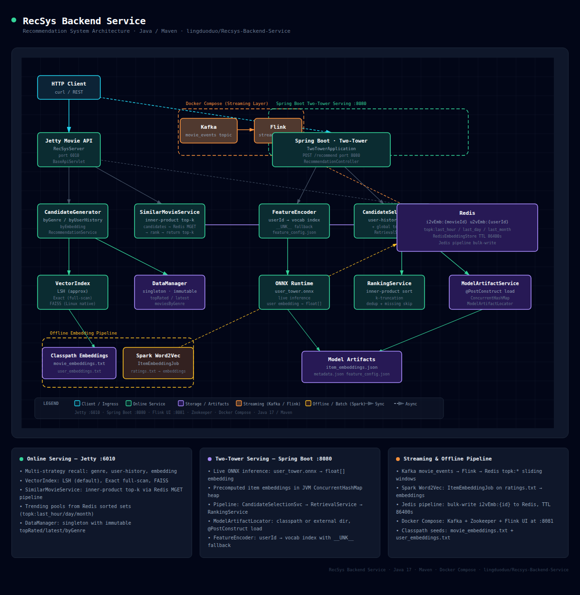

# RecSys

A compact Maven workspace demonstrating recommendation-system serving, retrieval, ranking, and offline embedding pipelines across four independently runnable services.

| Service | Port | Function |
|---|---:|---|
| Catalog / Recommendation Serving | `6010` | Kafka → Flink → Redis pipeline; cold-start fallback and multi-channel recall (embedding + trending + genre + popularity) |
| Online Prediction Server | `7010` | Real-time feature store — serves per-user history and windowed trending written by the Flink job |
| Model Serving (Spring Boot) | `8080` | Load ONNX model → encode user tower → score candidates; A/B variant management, result caching, load shedding |
| API Gateway | `8010` | Single entry point for all three services: edge auth (API key / Cognito JWT), per-route circuit breakers, health-checked upstreams, optional registry-based discovery, token-bucket rate limiting, LLM proxy, Prometheus `/metrics` |

---

## Architecture Layers

| Layer | Key Components |
|---|---|
| Model Serving | `ModelApplication`, `RecommendationController`, `ModelRuntimeProvider`, A/B testing, feature flags — see [Port 8080](#port-8080--model-serving-spring-boot), [A/B Testing](#ab-testing), [Feature Flags](#feature-flags) |
| Online Serving | `OnlinePredictionServer`, `OnlineFeatureStore`, `ShardedTopKStore`, `OnlineLearner` — see [Port 7010](#port-7010--online-prediction-server-feature-store), [Online Serving](#online-serving) |
| Catalog Serving | `RecSysServer` (Armeria), embedding-based recall, `RecommendationService.Similar` — see [Port 6010](#port-6010--catalog--recommendation-serving) |
| API Gateway | `MicroserviceGatewayServer` (Armeria), `MicroserviceRouteTable`, `GatewayAuthenticator` (API key / Cognito JWT), `RouteCircuitBreaker`, `GatewayRateLimiter`, `LlmProxyService` — see [Port 8010](#port-8010--api-gateway) |
| Recommendation Service | Shared recall → rank → paginate → hydrate pipeline, `MultiChannelRecallService` — see [Shared recall core](#shared-recall-core) |
| Data Infrastructure | Redis embedding store, AZ-aware read-replica router, multi-level cache (L1/L2/L3), LSH vector index, consistent-hash sharded record store, sharded top-K, MySQL catalog + transactional outbox — see [Sharded Record Store](#sharded-record-store), [Redis Read Replicas](#redis-read-replicas) |
| Messaging & Load Balancing | `AsyncEventPublisher` (SQS/Kafka transports), durable outbox relay + read-your-writes consistency, `ApplicationLoadBalancer` (L7), capacity-weight feedback — see [Event Publishers](#event-publishers-message-queues), [Durable Eventual Consistency](#durable-eventual-consistency), [Load Balancing](#load-balancing) |
| Domain Model | Shared value objects: `Movie`, `User`, `MovieCandidate`, `RecommendationQuery` |
| Configuration | Spring `@ConfigurationProperties`, feature flag providers, JVM tuning options — see [Configuration](#configuration) |
| Infrastructure | Kubernetes base + EKS overlay, CloudFront CDN edge, Docker, Flink streaming topology — see [Kubernetes & EKS](#kubernetes--eks), [CDN Edge investigation](12_CDNS.md) |
| Documentation | README, architecture docs, design specs, implementation plans |

---

### System Design
| Concept | Key Components |
|---|---|
| Load Balancing | `ApplicationLoadBalancer` (L7), capacity-weight feedback (`X-Capacity-Weight` / `suggestedWeight`), gateway health-checked upstream endpoint groups (`UpstreamEndpointGroups`) — see [Load Balancing](#load-balancing) |
| Caching | `MultiLevelEmbeddingCache` (L1/L2/L3), `TtlSingleFlightCache`, `LogicalExpiryEmbeddingCache`, `RecommendationCache`, `LlmResponseCache`, CloudFront edge cache — see [Hot-key and cache controls](#hot-key-and-cache-controls), [Pipeline Optimizations](#pipeline-optimizations), [CDN Edge investigation](12_CDNS.md) |
| Database Sharding | `ShardedRecordStore`, `ShardedTopKStore`, versioned `ShardTopology` (`shard:topology`), online reshard via `POST /shards/topology` — see [Sharded Record Store](#sharded-record-store) |
| Replication | `RedisReadReplicaRouter` + `RoutingRedisExecutor` (AZ-aware replica reads), Redis Sentinel failover — see [Redis Read Replicas](#redis-read-replicas) |
| CAP Theorem | Read-your-writes after outbox commit, generation dual-read during a reshard window, tunable AZ-local vs primary reads (`RoutingRedisExecutor`) — see [Durable Eventual Consistency](#durable-eventual-consistency) |
| Consistent Hashing | `ConsistentHashRing`, `ShardTopologyProvider` (30 s topology refresh, generation dual-read on migration) — see [Sharded Record Store](#sharded-record-store) |
| Messaging Queues | `AsyncEventPublisher` (`KafkaAsyncEventPublisher` / `SqsAsyncEventPublisher`), Kafka → Flink → Redis pipeline (`OnlineFeatureStreamingJob`) — see [Event Publishers](#event-publishers-message-queues) |
| Rate Limiting | `TokenBucket`, `GatewayRateLimiter` (per `(route, principal)`), `LlmTokenRateLimiter` (token-budget), `RedisRateLimiter` (distributed, global; **weighted sliding-window** ≈1× the limit with no local fast-path, fail-open + circuit breaker) — see [Gateway rate limiting](#rate-limiting-gatewayratelimiter), [Model Rate Limiting](#model-rate-limiting) |
| API Gateway | `MicroserviceGatewayServer`, `MicroserviceRouteTable`, `RouteCircuitBreaker`, `GatewayRateLimiter`, `LlmProxyService` — see [Microservice Gateway](#microservice-gateway) |
| MicroService | Four independently runnable services (`6010`/`7010`/`8080`/`8010`) behind `MicroserviceGatewayServer`; clean-architecture `api`/`application`/`domain`/`infrastructure` layers — see [Microservice Gateway](#microservice-gateway), [Project Layout](#project-layout) |
| Service Discovery | Three-layer resolution — static route table (`MicroserviceRoute`) → opt-in Redis registry (`ServiceRegistrar` / `RegistryBackedUpstreams`, `svc:registry:<name>`, static-route fallback) → Cloud Map 30 s DNS TTL → health-checked endpoint groups (`UpstreamEndpointGroups`) — see [Service Discovery investigation](11_Service_Discovery.md) |
| CDNS | CloudFront edge (`scripts/create-cdn-distribution.sh`), narrow cache of the two catalog reads (`recsys-item`/`recsys-similar` policies), origin lockdown (`GatewayOriginSecret` + `x-origin-secret`, rotation set), `GATEWAY_PUBLIC_PATHS` exact-path discipline, nginx local stand-in (`docker-compose.cdn.yml`) — see [CDN Edge investigation](12_CDNS.md) |
| DB Indexing | Two composite `movies` seek indexes + 5 outbox/saga indexes, `FORCE INDEX` plan pinning with static contract tests + Docker `EXPLAIN` (`MovieCatalogRepository`, `MySqlIndexContractTest`), covering-index / keyset / delayed-join access patterns (`MillionScalePaginationSql`) — see [DB Indexing investigation](13_DB_Indexing.md), [MySQL Index Inventory](#mysql-index-inventory) |
| Partitioning | Consistent-hash record shards (`ConsistentHashRing`, versioned topology + online reshard), windowed top-K replica shards (`topk:<window>:s0..s3`), `userId`-keyed Kafka/Flink partitions (24 @ 50k evt/s), and `(score, id)` keyset cursor windows (`/v2/recommend`, HMAC catalog cursors) — see [Partitioning investigation](14_Partitioning.md), [Sharded Record Store](#sharded-record-store) |
| Eventual Consistency | `OutboxRelay` + `DurableEventPublisher` (transactional outbox), `OutboxReconciler`, generation dual-read, read-your-writes — see [Durable Eventual Consistency](#durable-eventual-consistency) |
| SSE streaming | Real-time token streaming via Server-Sent Events (`text/event-stream`) passthrough in the LLM proxy — `LlmProxyService.forwardStreaming` reactively pipes upstream frames straight to the client over a long-lived HTTP/2 connection (`LLM_PING_INTERVAL_MS` keepalive); the streaming path skips response caching and retry-on-429 — see [LLM Gateway](#llm-gateway) |
| Scalability | Compute scales out via 4 CPU/mem HPAs (`k8s/base/hpa.yaml`, model-serving tuned most aggressively); data tier scales horizontally (consistent-hash record shards + live reshard, 4× replicated top-K shards, 24-partition Kafka/Flink @ 50k evt/s, AZ-local Redis read replicas); per-instance overload gates (`OnlineLoadShedder` / `OnlineAdmissionControl`, `WorkerBulkhead`) fail fast so HPA can react, with recall degradation observable via `GET /health/load` (`recall.degradedRatio`) and the gate knees pinned by `@Tag("load")` characterization harnesses ([overload-characterization.md](docs/runbooks/overload-characterization.md)). `AutoScalingGroup` / `InstanceProvisioner` are bounds + AZ-balancing and `OnlineCapacityService` is sizing observability — neither is a metric-driven controller in production (the signal-driven `application/autoscaling/CapacityController` closes that loop as a tested reference, but no server schedules it); DR standby is pre-scaled on failover via `scripts/dr-standby-capacity.sh promote` — see [Capacity Planning](#capacity-planning), [Scalability investigation](17_Scalability.md) |
| Fault Tolerance | `CircuitBreaker` / `RouteCircuitBreaker`, `WorkerBulkhead`, `LoadShedder` / `OnlineLoadShedder`, `ChannelHealthMonitor` backoff, `FaultInjector`, fail-open Redis/rate-limiter, graceful drain, multi-region DR — see [Fault Tolerance investigation](18_Fault_Tolerance.md) |
| Monitoring | `InferenceMetricsService` / `OnlineServingMetricsService` (Micrometer), Prometheus `/metrics`, health endpoints, `GcEventTracker` / `JvmMemoryMonitor`, `TraceIdAspect` — see [Metrics (`/metrics`)](#metrics-metrics), [Capacity Planning](#capacity-planning) |
| AuthN and AuthZ | Edge auth `GatewayAuthenticator` (API key / `CognitoJwtVerifier` JWT) → `x-authenticated-*` propagation, `AdminTokenGuard` operator token, `GatewayOriginSecret` — see [Authentication](#authentication-gatewayauthenticator) |


[Architecture Diagram (interactive)](https://htmlpreview.github.io/?https://github.com/lingduoduo/Recsys-Backend-Service/blob/main/recsys-architecture.html)

---

## Quick Start

**Requirements:** Java 17, Maven, Docker + Colima (Mac) or Docker Desktop.

```bash
# 1. Start infrastructure (Redis Sentinel, Kafka, Flink)
colima start
docker compose -f docker-compose.streaming.yml up -d

# 2. Build
mvn package -DskipTests

# 3. Start all four services (logs → logs/<service>.log)
sh scripts/run-microservices-local.sh
```

Check the full stack is healthy:

```bash
curl http://localhost:8010/health
```

```json
{
  "status": "UP",
  "checkedAt": "...",
  "ports": {"6010": "UP", "8080": "UP", "7010": "UP", "8010": "UP"},
  "services": {
    "model-inference": {"status": "UP", "healthUrl": "http://localhost:8080/health/ready", "statusCode": 200, "latencyMs": 4},
    "catalog":  {"status": "UP", "healthUrl": "http://localhost:6010/health", "statusCode": 200, "latencyMs": 2},
    "model":    {"status": "UP", "healthUrl": "http://localhost:8080/health/ready", "statusCode": 200, "latencyMs": 3},
    "online":   {"status": "UP", "healthUrl": "http://localhost:7010/health", "statusCode": 200, "latencyMs": 2},
    "...": "abridged; additional registered routes omitted"
  }
}
```

The `ports` block is a deduped per-port rollup (backends plus the gateway's own `8010`); `services` keeps the full per-route detail. See [Health aggregation](#health-aggregation).

### Start individual services

Run each service in its own terminal. Redis must be running first (step 1 above).

```bash
# Port 6010 — Catalog & Recommendation Serving
mvn exec:java -Dexec.mainClass=com.recsys.api.serving.RecSysServer
curl http://localhost:6010/health
# {"ok":true}

# Port 7010 — Online Prediction Server
mvn exec:java -Dexec.mainClass=com.recsys.api.online.OnlinePredictionServer
curl http://localhost:7010/online/ops
# {"servedAt":"...","metrics":{...},"load":{...},"capacity":{...}}

# Port 8080 — Model Serving (Spring Boot / ONNX)
mvn spring-boot:run
curl http://localhost:8080/health/ready
# {"status":"UP",...}

# Port 8010 — API Gateway
mvn exec:java -Dexec.mainClass=com.recsys.api.gateway.MicroserviceGatewayServer
curl http://localhost:8010/health
# {"status":"UP","services":{...}}
```

> The gateway (8010) proxies the other three services — start 6010, 7010, and 8080 first if you want all gateway routes healthy.

---

## Contents

- [Architecture Layers](#architecture-layers)
- [Quick Start](#quick-start)
- [Services & Ports](#services--ports)
- [Recommendation Flow](#recommendation-flow)
- [API Reference](#api-reference)
  - [Port 6010 — Catalog & Recommendation Serving](#port-6010--catalog--recommendation-serving)
  - [Shared recall core](#shared-recall-core)
  - [Port 7010 — Online Prediction Server (Feature Store)](#port-7010--online-prediction-server-feature-store)
  - [Port 8080 — Model Serving (Spring Boot)](#port-8080--model-serving-spring-boot)
  - [Port 8010 — API Gateway](#port-8010--api-gateway)
- [SQL Use Cases](#sql-use-cases)
- [Microservice Gateway](#microservice-gateway)
- [CDN Edge](#cdn-edge)
- [Service Registry](#service-registry)
- [Fault Tolerance](#fault-tolerance)
- [Configuration](#configuration)
- [Project Layout](#project-layout)
- [Model Serving Demo](#model-serving-demo)
- [A/B Testing](#ab-testing)
- [Feature Flags](#feature-flags)
- [Testing](#testing)
- [Redis Test Data](#redis-test-data)
- [Online Serving](#online-serving)
- [Sharded Record Store](#sharded-record-store)
- [Redis Read Replicas](#redis-read-replicas)
- [Event Publishers (Message Queues)](#event-publishers-message-queues)
- [Durable Eventual Consistency](#durable-eventual-consistency)
- [Load Balancing](#load-balancing)
- [Offline Item Embeddings](#offline-item-embeddings)
- [Kubernetes & EKS](#kubernetes--eks)
- [Capacity Planning](#capacity-planning)
- [JVM Tuning](#jvm-tuning)
- [Pipeline Optimizations](#pipeline-optimizations)
- [LLM Gateway](#llm-gateway)
- [Model Rate Limiting](#model-rate-limiting)
- [AWS Saga Orchestration](#aws-saga-orchestration)
- [Developer Notes](#developer-notes)

---

## Services & Ports

Start each service individually with JVM tuning:

```bash
# Catalog / Recommendation Serving — port 6010
env PORT=6010 sh scripts/run-with-jvm-tuning.sh recsys-serving -- \
  mvn exec:java -Dexec.mainClass=com.recsys.api.serving.RecSysServer
curl http://localhost:6010/health
# {"ok":true}

# Online Prediction Server — port 7010
env ONLINE_DEMO_PORT=7010 sh scripts/run-with-jvm-tuning.sh online-serving -- \
  mvn exec:java -Dexec.mainClass=com.recsys.api.online.OnlinePredictionServer
curl http://localhost:7010/online/ops
# {"servedAt":"...","metrics":{...},"load":{...},"capacity":{...}}

# Model Serving (Spring Boot / ONNX) — port 8080
env SERVER_PORT=8080 sh scripts/run-with-jvm-tuning.sh model-serving -- \
  mvn spring-boot:run
curl http://localhost:8080/health/ready
# {"status":"UP",...}

# API Gateway — port 8010
env GATEWAY_PORT=8010 sh scripts/run-with-jvm-tuning.sh api-gateway -- \
  mvn exec:java -Dexec.mainClass=com.recsys.api.gateway.MicroserviceGatewayServer
curl http://localhost:8010/health
# {"status":"UP","services":{...}}
```

Key env vars: `REDIS_HOST` (default `localhost`), `REDIS_PORT` (default `6379`).

---

## Recommendation Flow

Three independent recommendation paths share a common Redis-backed data layer written by the Flink streaming job.

**Data pipeline (shared)** — Kafka → Flink → Redis

- The Flink job `OnlineFeatureStreamingJob` consumes user events from Kafka and writes per-user recent history (`user:<id>:recent_movies`), user-tower embeddings (`feature:user:<id>:embedding`), and windowed trending counters (`topk:<window>:s0..s3`) into Redis.
- All three serving paths read from this shared Redis store; without the Flink job the lists are empty but the APIs remain healthy.

**Port 6010 — Cold-start & multi-channel recall**

1. On startup, `RecSysServer` seeds item and user embeddings from classpath text files if Redis is empty — providing a usable baseline before the Flink job writes live data.
2. `MultiChannelRecallService` runs all **five** recall channels in parallel — embedding ANN, windowed trending Top-K, genre history, global popularity, and a dedicated cold-start channel — merged under the `QuotaPolicy.defaultMovie()` quota.
3. Results are merged by the quota-aware two-phase merge, already-watched items are excluded, and top-K are returned.

**Port 7010 — Shared multi-channel recall (real-time)**

1. `OnlineFeatureStore` reads per-user recent watch history from Redis (`user:<id>:recent_movies`); `ShardedTopKStore` serves windowed trending items from sharded Redis keys (`topk:<window>:s0..s3`).
2. `OnlineRecommendationService` runs the **same `MultiChannelRecallService`** as 6010 — five channels in parallel (embedding ANN, `online_recent_history`, trending, popularity, cold_start) under the 7010-specific `QuotaPolicy.defaultOnline()` quota, with warm/cold classification from the cache-backed user embedding.
3. `OnlineLearner` re-ranks the merged candidates (adds a learned per-item score adjustment), recent watches are excluded, and the top-`k` are returned with `strategy: "multichannel"`. If every channel returns empty, the trending snapshot is served as a fallback. The `/online/features` endpoint still exposes the raw Redis view for debugging.

**Port 8080 — ONNX model serving**

1. `ModelRuntimeProvider` loads the PyTorch-exported DSSM `dssm_model.onnx` (or an A/B variant artifact) and warms it at startup.
2. `RetrievalService` runs the user tower through ONNX to produce a user embedding.
3. `RankingService` inner-product scores the user embedding against pre-loaded item embeddings and returns top-K.
4. `ABTestService` deterministically assigns each user to a variant bucket (`(userId + ":" + layerName).hashCode() % split`); the active variant's artifacts are used and `abTestVariant` is returned in every response.
5. Cold-start users (not in the model's user vocabulary) are served from a shared pre-scored pool gated by a PostHog feature flag.

---

## API Reference

### Port 6010 — Catalog & Recommendation Serving

Armeria service at the tail of the Kafka → Flink → Redis pipeline. At startup it seeds item and user embeddings from classpath files if Redis is empty, ensuring cold-start recommendations are available before the Flink job delivers live data. Every `/getrecommendation` call fans out across **five recall channels** — embedding ANN, trending Top-K (multi-window), genre history, global popularity, and a dedicated cold-start channel — running each in parallel on a bounded thread pool with per-channel timeouts and circuit-breaker backoff.

Per request, the service probes the user's embedding (`u2vEmb:<userId>`, one heap lookup → Redis fallthrough) to classify the user as **warm** or **cold**, then merges channels with a **quota-aware two-phase merge**:

| Channel | Warm quota | Cold quota |
|---|---:|---:|
| embedding | 60% | 0% |
| trending | 20% | 20% |
| genre_history | 15% | 10% |
| popularity | 5% | 20% |
| cold_start | 0% | 50% |

Phase 1 fills each channel's quota by score; phase 2 gap-fills any shortfall (e.g. a backed-off channel's slots) from the remaining pool. A malformed/blank `userId` defaults to the cold quota.

#### Health check

Verify the service is running:

```bash
curl http://localhost:6010/health
# {"ok":true}
```

#### User lookup

Fetch a user profile by `userId`:

```bash
curl "http://localhost:6010/getuser?userId=123"
curl "http://localhost:6010/user?userId=123"          # REST alias (gateway-friendly)
# 200: {"userId":123,"name":"Alice"}
# 404: {"error":"user not found","userId":123}
```

#### Movie (item) lookup

Fetch a movie by `id`:

```bash
curl "http://localhost:6010/item?id=1"
curl "http://localhost:6010/movie?id=1"               # REST alias
# 200: {"id":1,"title":"Inception","year":2010,"genres":["Sci-Fi","Thriller"]}
# 404: {"error":"movie not found","id":1}
```

#### Recommendations

Runs all five recall channels in parallel, classifies the user as warm/cold from their embedding, and merges with the quota-aware two-phase merge described above. Already-watched movies are automatically excluded.

```bash
curl "http://localhost:6010/getrecommendation?userId=123"
curl "http://localhost:6010/recommendation?userId=123"   # REST alias

# Limit results (default 20, max 100)
curl "http://localhost:6010/getrecommendation?userId=123&k=10"
```

> **The user must exist in the catalog.** `/getrecommendation` looks up the user first and returns `404 {"error":"user not found"}` for an unknown id. The bundled seed data has users **123–127** (warm — all have embeddings) plus **`200` ("New User")**, a built-in **cold** user with no embedding. `userId=999` is not a cold user, it's a missing user (404).

**Cold-start vs. warm — same endpoint, different recall mix.** A *cold* user **exists in the catalog but has no `u2vEmb:<id>` embedding**: its results come from the cold-start, trending, and popularity channels (embedding contributes nothing). A *warm* user has an embedding, so embedding ANN takes 60% of the slots.

```bash
# Warm seeded user — embedding-led (60% of slots from embedding ANN)
curl "http://localhost:6010/getrecommendation?userId=123&k=10"

# Built-in COLD user (200 = "New User", no embedding) — cold_start / trending / popularity dominate
curl "http://localhost:6010/getrecommendation?userId=200&k=10"

# Flip the cold user warm by seeding an embedding — embedding ANN now contributes.
# The vector must match the seed embedding dimension (6); a mismatch returns 400.
curl -X POST "http://localhost:6010/setuserembedding?userId=200&vec=0.1+0.5+0.4+0.0+0.0+0.0"
curl "http://localhost:6010/getrecommendation?userId=200&k=10"
```

```json
{
  "user": {"userId": 123, "name": "Alice"},
  "recommendations": [
    {"id": 4, "title": "The Matrix", "year": 1999, "genres": ["Sci-Fi", "Action"]},
    {"id": 7, "title": "Interstellar", "year": 2014, "genres": ["Sci-Fi", "Drama"]}
  ]
}
```

Returns `404` if `userId` is not found; `400` if `k` is out of range.

The vector backend for the embedding channel is controlled by `RECSYS_VECTOR_BACKEND`:

```bash
# Approximate (default) — SimHash random-projection + inner-product reranking
RECSYS_VECTOR_BACKEND=lsh mvn exec:java -Dexec.mainClass=com.recsys.api.serving.RecSysServer

# Exact — full-scan inner-product top-k (deterministic, slower)
RECSYS_VECTOR_BACKEND=exact mvn exec:java -Dexec.mainClass=com.recsys.api.serving.RecSysServer
```

#### Recommendations v2 — cursor pagination (`/v2/recommend`)

`POST /v2/recommend` drives the same multi-channel recall through the recall → rank → hydrate → paginate pipeline (`RecommendationOrchestrator`). It takes a JSON `RecommendationQuery` and returns an opaque **seek cursor** for stable pagination. Cold/warm channel selection is identical to `/getrecommendation`.

The cursor is a *keyset* anchor on the last item's `(score, itemId)` — **not** an absolute offset — so excluding items or a shifting ranked list between pages never silently skips or duplicates results. Recall is bounded to a window of `5 × limit` candidates and recomputed each request, so this paginates within a fresh recall window rather than over a frozen million-row snapshot.

```bash
# First page — no cursor. Keep excludedItemIds fixed for the whole browse.
curl -s -X POST http://localhost:6010/v2/recommend \
  -H 'Content-Type: application/json' \
  -d '{
        "userId": "42",
        "limit": 20,
        "excludedItemIds": ["101", "205"]
      }'

# Next page — same excludedItemIds, cursor = the previous response's nextCursor.
# Repeat, feeding nextCursor back in, until "nextCursor": null.
curl -s -X POST http://localhost:6010/v2/recommend \
  -H 'Content-Type: application/json' \
  -d '{
        "userId": "42",
        "limit": 20,
        "excludedItemIds": ["101", "205"],
        "cursor": "djI6MC45Mzo0"
      }'
```

```json
{
  "userId": "42",
  "items": [
    {"itemId": "4", "score": 0.93, "rank": 1, "features": {"title": "The Matrix", "year": 1999}}
  ],
  "nextCursor": "djI6MC45Mzo0",
  "trace": {"candidateCount": "50", "rankedCount": "50"}
}
```

`limit` must be 1–100; a blank `userId` returns `400`. Unlike `/getrecommendation`, this pipeline does **not** look up the user in the catalog, so an unknown (non-blank) `userId` does not 404 — it runs recall directly (cold quota if it has no embedding). When there are no more results `nextCursor` is `null`. The `trace` map reports `candidateCount` (recalled) and `rankedCount` for debugging.

**Cursor vs. exclusion paging — pick one model, don't mix them.** Use the cursor for a fixed result set (keep `excludedItemIds` constant, advance the cursor until `nextCursor` is `null`); omit the cursor and page by a growing `excludedItemIds` for an ever-fresh feed. Why the seek cursor stays stable and why mixing the two models conflates them is explained in the [Partitioning investigation](14_Partitioning.md#in-memory-ranked-list--v2recommend).

#### Similar movies

Computes inner-product similarity against Redis item embeddings and returns the closest movies (default `k=10`, max 200):

```bash
curl "http://localhost:6010/similar?movieId=1&k=5"
# 200: {"movieId":1,"similar":[{"movieId":4,"score":0.99},{"movieId":7,"score":0.97},...]}
# 404: {"error":"embedding not found for movieId","movieId":1}

curl "http://localhost:6010/similar?movieId=3&k=10"
```

#### Pair prediction

Scores explicit (userId, movieId) pairs using bundled user/movie embeddings and inner-product scoring:

```bash
curl -X POST "http://localhost:6010/v1/models/recmodel:predict" \
  -H "Content-Type: application/json" \
  -d '{"instances":[{"userId":123,"movieId":1},{"userId":123,"movieId":2}]}'
# {"predictions":[[0.9231],[0.7412]]}
```

Returns `400` when `instances` is empty, IDs are non-positive, or an embedding is missing.

#### Set / update an item embedding

Stores or updates a movie embedding in Redis (default TTL 24 h; `ttl=0` for no expiry).

> The vector **must be 6-dimensional** — it has to match the seed embedding dimension so the ANN index can hash it. A mismatched dimension returns `400 {"error":"vector dimension mismatch: expected 6, got 3"}`. Pass it either as the request body (space-separated) or as the `vec` query param (`+` = space). Do **not** use `--data-urlencode "vec=..."` — that sends a `vec=` prefix and percent-encodes the spaces, which the parser can't read.

```bash
# Raw plain-text body (just the numbers)
curl -X POST "http://localhost:6010/setembedding?movieId=4" \
  -H "Content-Type: text/plain" --data-binary "0.2 0.2 0.6 0.0 0.0 0.0"

# Vector as a query param (+ = space)
curl -X POST "http://localhost:6010/setembedding?movieId=5&vec=0.1+0.3+0.6+0.0+0.0+0.0"

# Query param with custom TTL (seconds)
curl -X POST "http://localhost:6010/setembedding?movieId=6&ttl=3600&vec=0.5+0.5+0.0+0.0+0.0+0.0"
# {"ok":true,"movieId":6,"dim":6,"ttl":3600}
```

#### Set / update a user embedding

Stores or updates a user embedding in Redis (`u2vEmb:<userId>`). Same calling conventions as the item endpoint; the vector must also be **6-dimensional** to match the seed embeddings:

```bash
# Raw plain-text body (just the numbers)
curl -X POST "http://localhost:6010/setuserembedding?userId=123" \
  -H "Content-Type: text/plain" --data-binary "0.1 0.5 0.4 0.0 0.0 0.0"

# Query param with custom TTL (seconds)
curl -X POST "http://localhost:6010/setuserembedding?userId=123&ttl=3600&vec=0.1+0.5+0.4+0.0+0.0+0.0"
# {"ok":true,"userId":123,"dim":6,"ttl":3600}
```

---

### Shared recall core

Both serving ports run the **same** `MultiChannelRecallService` — only their per-port wiring differs. That wiring is bundled in a `RecallConfig` built once at startup and handed to `MultiChannelRecallService.from(config)`:

| `RecallConfig` field | Port 6010 (`RecSysServer`) | Port 7010 (`OnlinePredictionServer`) |
|---|---|---|
| `channels` | embedding, trending, **genre_history**, popularity, cold_start | embedding, **online_recent_history**, trending, popularity, cold_start |
| `quotaPolicy` | `QuotaPolicy.defaultMovie()` | `QuotaPolicy.defaultOnline()` |
| `channelTimeoutMs` | `RECALL_CHANNEL_TIMEOUT_MS` (default `200`) | `RECALL_CHANNEL_TIMEOUT_MS` (default `200`) |
| `healthMonitor` | `ChannelHealthMonitor` (per-channel backoff) | `ChannelHealthMonitor` |
| `userEmbeddingStore` | `u2vEmb` Redis store + heap cache | `u2vEmb` store wrapped in `LogicalExpiryEmbeddingCache` |

**How a request flows through it:**

1. **Classify** — probe the user embedding (cache → Redis) to label the user **warm** (has an embedding) or **cold** (none). A malformed/blank `userId` defaults to the cold quota.
2. **Fan out** — run every channel in parallel on a bounded thread pool. Each channel has `RECALL_CHANNEL_TIMEOUT_MS` to respond; a timeout/error returns empty and trips `ChannelHealthMonitor` backoff so a sick channel is skipped on subsequent requests until it recovers.
3. **Quota merge (two-phase)** — phase 1 fills each channel's quota by score; phase 2 gap-fills any shortfall (a backed-off channel's unused slots) from the remaining pool. Already-excluded items (`excludedItemIds`) are dropped.

The per-channel timeout is the one knob shared across both ports — set `RECALL_CHANNEL_TIMEOUT_MS=<ms>` once to tune 6010 and 7010 together (unset → 200 ms, unchanged).

`QuotaPolicy` encodes each port's warm/cold quota as ordered fraction maps plus a *residual* channel that absorbs leftover slots; the [6010](#port-6010--catalog--recommendation-serving) and [7010](#port-7010--online-prediction-server-feature-store) tables above show the resolved percentages.

**Try it — one user, both ports.** The *same warm user* runs through the *same shared core*; only the per-port `RecallConfig` (channel set + quota) differs, so the returned mix differs:

```bash
# Port 6010 — genre_history in the channel set, QuotaPolicy.defaultMovie()
curl "http://localhost:6010/getrecommendation?userId=123&k=10"

# Port 7010 — online_recent_history instead of genre_history, QuotaPolicy.defaultOnline()
curl "http://localhost:7010/online/recommendation?userId=123&k=10"
```

Both classify user `123` as **warm** (it has a `u2vEmb:123` embedding) and lead with embedding ANN; 6010 fills its residual from genre history while 7010 fills its from recent-watch history. Swap in the built-in cold user (`200`) to see both ports flip to the `cold_start` / `trending` / `popularity` mix from the same code path.

### Port 7010 — Online Prediction Server (Feature Store)

Real-time serving built on the **same shared `MultiChannelRecallService`** as port 6010, plus a feature store for the per-user signals written by the Flink job. `OnlineFeatureStore` reads recent watch history (`user:<id>:recent_movies`) and `ShardedTopKStore` reads windowed trending items (`topk:<window>:s0..s3`) directly from Redis. The recommendation endpoint runs **five recall channels in parallel** — embedding ANN, recent-history similarity, trending, popularity, and cold-start — each on a bounded thread pool with a per-channel timeout (`RECALL_CHANNEL_TIMEOUT_MS`, default 200 ms) and `ChannelHealthMonitor` backoff, then re-ranks the merge with `OnlineLearner`. The feature snapshot endpoint exposes the raw Redis view for debugging. Responses populate once the Flink job is writing to Redis; without it the lists are empty but the API is healthy.

Per request the user is classified **warm/cold** from their (cache-backed) embedding, then channels are merged with the **quota-aware two-phase merge** under `QuotaPolicy.defaultOnline()`:

| Channel | Warm quota | Cold quota |
|---|---:|---:|
| embedding | 50% | 0% |
| online_recent_history | 25% | 10% |
| trending | 15% | 20% |
| popularity | 10% | 20% |
| cold_start | 0% | 50% |

(The percentages that aren't a fixed fraction come from a *residual* channel that absorbs the remaining slots — `popularity` for warm, `online_recent_history` for cold.) This is the same merge engine as 6010, just a different channel set and quota — see [Shared recall core](#shared-recall-core).

#### Real-time recommendations

Runs the five-channel recall, re-ranks with `OnlineLearner`, excludes recent watches, and returns the top-`k`. The response also carries the recent-history and per-`window` trending snapshots the UI renders alongside the recommendations.

```bash
curl "http://localhost:7010/online/recommendation?userId=123"
curl "http://localhost:7010/online/recommendation?userId=123&window=last_day&k=10"
curl "http://localhost:7010/online/recommendation?userId=124&window=last_month&k=5"
```

| Param | Required | Default | Values |
|---|---|---|---|
| `userId` | yes | — | any int |
| `k` | no | 5 | 1–20 |
| `window` | no | `last_hour` | `last_hour`, `last_day`, `last_month` |

```json
{
  "user": {"userId": 123, "name": "Alice"},
  "window": "last_hour",
  "strategy": "multichannel",
  "recentMovies": [
    {"id": 4, "title": "The Matrix", "year": 1999, "genres": ["Sci-Fi", "Action"]}
  ],
  "trendingMovies": [
    {"id": 11, "title": "Interstellar", "year": 2014, "genres": ["Sci-Fi", "Drama"]}
  ],
  "recommendations": [
    {"id": 4, "title": "The Matrix", "year": 1999, "genres": ["Sci-Fi", "Action"]}
  ]
}
```

`strategy` is always `"multichannel"`. The `window` parameter only affects the `trendingMovies` snapshot in the response — the recall channels themselves use fixed windows (`last_hour`, `last_day`). Returns `404` if `userId` is not found; `429` (with a `Retry-After` header) when the load shedder is active.

> Like 6010, this endpoint 404s on unknown users, and warm vs. cold changes the **recall mix**, not the `strategy` string. Seeded users **123–127** have embeddings, so embedding ANN leads (50% of warm slots); the built-in cold user **200 ("New User")** has no embedding, so `cold_start` / `trending` / `popularity` lead:

```bash
# Warm user — embedding-led
curl "http://localhost:7010/online/recommendation?userId=123&k=10"

# Built-in COLD user (200) — cold_start / trending / popularity lead
curl "http://localhost:7010/online/recommendation?userId=200&window=last_hour&k=5"
# {... "strategy":"multichannel", "recommendations":[ ... ]}
```

#### Recommendations v2 — cursor pagination (`/v2/recommend`)

`POST /v2/recommend` drives the same 7010 multichannel recall through the shared recall → rank → hydrate → paginate pipeline (`OnlineBlendingPipeline`), returning a cursor for stable, million-scale pagination. Same JSON `RecommendationQuery` body and cursor semantics as 6010's `/v2/recommend`.

```bash
curl -X POST "http://localhost:7010/v2/recommend" \
  -H "Content-Type: application/json" \
  -d '{"userId":"123","limit":10,"excludedItemIds":["1","2"]}'
```

#### Feature snapshot

Returns the raw Redis feature view for a user — useful for debugging what signals are available:

```bash
curl "http://localhost:7010/online/features?userId=123"
curl "http://localhost:7010/online/features?userId=123&window=last_hour"
```

```json
{
  "user": {"userId": 123, "name": "Alice"},
  "window": "last_hour",
  "recentMovies": [
    {"id": 4, "title": "The Matrix", "year": 1999, "genres": ["Sci-Fi", "Action"]}
  ],
  "trendingMovies": [
    {"id": 11, "title": "Interstellar", "year": 2014, "genres": ["Sci-Fi", "Drama"]}
  ]
}
```

#### Ops and metrics

Returns latency percentiles, per-strategy counters, load-shedder state, rate-limiter state, capacity targets, and async-event queue stats in one payload:

```bash
curl "http://localhost:7010/online/ops"
```

```json
{
  "servedAt": "2026-06-03T12:00:00Z",
  "metrics": {
    "totalRequests": 42, "successCount": 41, "failureCount": 1, "rejectedCount": 0,
    "recentAvgLatencyMs": 22.5, "recentFailureRate": 0.0, "recentRejectedRate": 0.0, "qps": 0.7,
    "p50Ms": 20, "p95Ms": 45, "p99Ms": 80, "strategies": {"multichannel": {...}}
  },
  "load": {
    "inFlightRequests": 0, "maxConcurrentRequests": 64, "utilization": 0.0, "drainUtilization": 0.9,
    "acceptedRequests": 42, "rejectedRequests": 0, "suggestedWeight": 100, "retryAfterSeconds": 0
  },
  "rateLimit": {"enabled": false, "limit": 0, "windowSeconds": 1, "circuitState": "CLOSED"},
  "capacity": {
    "targetDau": 2000000, "peakQps": 8000, "peakTps": 12000,
    "observedQps": 0.7, "qpsUtilization": 0.0001, "headroomQps": 7999.3,
    "overloaded": false, "peakShaving": "none"
  },
  "events": {"queueSize": 0, "published": 0, "dropped": 0, "drained": 0}
}
```

---

### Port 8080 — Model Serving (Spring Boot)

Spring Boot service that loads a PyTorch-exported DSSM ONNX model at startup and serves real-time inference. `ModelRuntimeProvider` manages one runtime per A/B variant; `RetrievalService` encodes the user tower via ONNX, and `RankingService` inner-product scores the user embedding against pre-loaded item embeddings to return top-K. Cold-start users (unknown to the model) are served from a pre-scored pool gated by a PostHog feature flag.

#### Submit token (optional CSRF protection)

When the submit-token service is configured, obtain a single-use token before each recommend call:

```bash
curl http://localhost:8080/api/v1/token
# {"token":"a3f9...","expiresInSeconds":30}
```

Pass it as `X-Submit-Token: <token>` on the subsequent `POST /api/v1/recommend`. The header is optional — if the token service is disabled (default) requests proceed without it.

#### Recommend

Runs ONNX inference to rank candidates for a user; returns `abTestVariant` so outcomes can be attributed to the correct experiment bucket:

```bash
curl -X POST http://localhost:8080/api/v1/recommend \
  -H "Content-Type: application/json" \
  -d '{"userId": "123", "k": 5}'

# Exclude already-seen items
curl -X POST http://localhost:8080/api/v1/recommend \
  -H "Content-Type: application/json" \
  -d '{"userId": "123", "k": 10, "excludeItemIds": ["2", "3"]}'
```

```json
{
  "userId": "123",
  "modelVersion": "demo-model-ratings-v1",
  "abTestVariant": "training",
  "recommendations": [
    {"itemId": "1", "score": 0.9997},
    {"itemId": "3", "score": 0.7100}
  ]
}
```

The response includes `X-Capacity-Weight: <0–100>` so load balancers can adjust routing weight in real time.

| Field | Type | Required | Constraints |
|---|---|---|---|
| `userId` | string | yes | non-blank, max 50 chars |
| `k` | integer | no | 1–100, default `5` |
| `excludeItemIds` | string[] | no | max 500 entries; each ID non-blank, max 50 chars |

**Cold-start (users not in the model vocabulary).** When `coldStartEnabled` is on (default) and the `userId` is unknown to the runtime, the request is served from a shared, pre-scored cold-start pool (per A/B variant + model version) instead of per-user inference — capped at `coldStartMaxK` (default 100) and cached for `coldStartTtlSeconds` (default 3600). The call shape is identical; only the candidate source differs:

```bash
# Unknown user → served from the shared cold-start pool, same response shape
curl -X POST http://localhost:8080/api/v1/recommend \
  -H "Content-Type: application/json" \
  -d '{"userId": "brand-new-user", "k": 5}'
```

Cold-start hit/miss counters are exposed at `GET /health/cache`; tune the pool via `recsys.recommendation-cache.cold-start-*` in `application.yml`.

#### Model version management

Preload a new model variant, activate it without downtime, or roll back:

```bash
# List all loaded variants
curl http://localhost:8080/api/v1/model/versions

# Warm a new variant before sending it traffic
curl -X POST http://localhost:8080/api/v1/model/versions/preload \
  -H "Content-Type: application/json" -d '{"variant": "candidate-v2"}'

# Promote the warmed variant to default traffic
curl -X POST http://localhost:8080/api/v1/model/versions/activate \
  -H "Content-Type: application/json" -d '{"variant": "candidate-v2"}'

# Roll back to the previous active variant
curl -X POST http://localhost:8080/api/v1/model/versions/rollback
```

#### A/B comparison

Compare per-variant request volume, failure rate, and latency against the control:

```bash
curl http://localhost:8080/health/ab-tests
```

```json
{
  "controlVariant": "training",
  "variants": {
    "training": {
      "variant": "training", "modelVersion": "demo-model-ratings-v1",
      "totalRequests": 120, "successCount": 118, "failureCount": 2,
      "successRate": 0.9833, "avgLatencyMs": 11.4,
      "successRateDeltaVsControl": 0.0, "avgLatencyDeltaVsControlMs": 0.0
    },
    "test": {
      "variant": "test", "modelVersion": "demo-model-ratings-v1",
      "totalRequests": 113, "successCount": 111, "failureCount": 2,
      "successRate": 0.9823, "avgLatencyMs": 12.1,
      "successRateDeltaVsControl": -0.001, "avgLatencyDeltaVsControlMs": 0.7
    }
  }
}
```

#### Health probes

| Endpoint | Returns | When to use |
|---|---|---|
| `GET /health/live` | `200` if JVM responds | Liveness — restart trigger |
| `GET /health/ready` | `200` fit for traffic; `503` overloaded | Readiness — load-balancer drain |
| `GET /health/load` | Concurrency snapshot + `suggestedWeight` | Dynamic load-balancer weight |
| `GET /health/metrics` | Rolling-window request counters and latency | Dashboards |
| `GET /health/ab-tests` | Per-variant stats vs control | A/B experiment monitoring |
| `GET /health/cache` | Result-cache hit/miss rates | Cache effectiveness |
| `GET /health/jvm` | Heap / non-heap / metaspace / thread snapshot | Memory pressure investigation |
| `GET /health/gc` | GC event histogram, STW pause stats | GC tuning and incident response |

```bash
curl http://localhost:8080/health/ready
```

```json
// 200 — healthy
{
  "status": "UP",
  "recentRequests": 42, "recentFailureRate": 0.02, "recentAvgLatencyMs": 11.4,
  "throughputPerSecond": 0.7, "inFlightRequests": 7,
  "maxConcurrentRequests": 64, "utilization": 0.109, "suggestedWeight": 89
}
// 503 — model not yet loaded
{"status": "DOWN", "reason": "model not loaded"}
// 503 — SIGTERM received, draining
{"status": "DOWN", "reason": "shutting down", "inFlightRequests": 3}
// 503 — concurrency cap reached
{"status": "DOWN", "reason": "overloaded", "inFlightRequests": 64, "maxConcurrentRequests": 64, "utilization": 1.0, "threshold": 0.9, "suggestedWeight": 0}
// 503 — rolling failure rate too high
{"status": "DOWN", "reason": "high failure rate", "recentFailureRate": 0.6, "threshold": 0.5}
// 503 — rolling latency too high
{"status": "DOWN", "reason": "high inference latency", "recentAvgLatencyMs": 2100.0, "thresholdMs": 2000.0}
```

```bash
curl http://localhost:8080/health/load
```

```json
{
  "inFlightRequests": 7, "maxConcurrentRequests": 64,
  "utilization": 0.109, "maxReadinessUtilization": 0.9,
  "acceptedRequests": 1042, "rejectedRequests": 0,
  "suggestedWeight": 89, "shuttingDown": false
}
```

```bash
curl http://localhost:8080/health/metrics
```

```json
{
  "totalRequests": 1042, "successCount": 1038, "failureCount": 4,
  "allTimeAvgLatencyMs": 55.7,
  "recentRequests": 20, "recentFailures": 0,
  "recentAvgLatencyMs": 52.3, "recentFailureRate": 0.0,
  "throughputPerSecond": 0.3
}
```

```bash
curl http://localhost:8080/health/cache
# {"enabled":true,"coldStartEnabled":true,
#  "recommendations":{"hits":820,"misses":222,"hitRate":0.787},
#  "coldStart":{"hits":5,"misses":17,"hitRate":0.227}}

curl http://localhost:8080/health/jvm
# heap/non-heap pools, thread counts, GC collector breakdown

curl http://localhost:8080/health/gc
```

```json
{
  "byType": {
    "MINOR_GC": {"events": 42, "totalPauseMs": 630, "avgPauseMs": 15.0},
    "FULL_GC":  {"events": 0,  "totalPauseMs": 0,   "avgPauseMs": 0.0}
  },
  "stwLongestPauseMs": 28,
  "stwPauseHistogram": {"<1ms":0,"1-10ms":5,"10-50ms":37,"50-200ms":0,">500ms":0},
  "evacuationFailures": 0,
  "allocationStalls": 0
}
```

Kubernetes probe config:

```yaml
livenessProbe:
  httpGet: { path: /health/live, port: 8080 }
  initialDelaySeconds: 30
  periodSeconds: 10
readinessProbe:
  httpGet: { path: /health/ready, port: 8080 }
  initialDelaySeconds: 15
  periodSeconds: 5
```

---

### Port 8010 — API Gateway

Overall API gateway and single entry point for all three upstream services (6010, 7010, 8080). Strips the route prefix, proxies to the correct backend, and enforces per-route circuit breakers (`RouteCircuitBreaker`), per-`(route, principal)` token-bucket rate limiting (`GatewayRateLimiter`), and optional auth (static API key **or** Cognito JWT). It authenticates at the edge, propagates the caller identity to backends as `x-authenticated-*` headers, and strips the raw credentials before proxying upstream. Also includes a dedicated LLM proxy with token budgets, SSE streaming passthrough, and SHA-256 response caching.

| Method | Canonical path | Behavior |
|---|---|---|
| `POST` | `/api/recommend` | Optional JSON `strategy`: `embedding`, `model`, `online`, or `sequential`; defaults to `model` |

The gateway removes `strategy` from the JSON body before forwarding the request. For example:

```bash
curl -X POST "http://localhost:8010/api/recommend" \
  -H "Content-Type: application/json" \
  -d '{"userId":123,"limit":10}'

curl -X POST "http://localhost:8010/api/recommend" \
  -H "Content-Type: application/json" \
  -d '{"userId":123,"limit":10,"strategy":"online"}'
```

| Gateway prefix | Backend | Direct equivalent |
|---|---|---|
| `/api/recommend/embedding` † | `:6010` | Embedding recall recommendation API |
| `/api/recommend/model` † | `:8080` | Model inference recommendation API |
| `/api/recommend/online` † | `:7010` | Online blend recommendation API |
| `/api/recommend/sequential` † | `:8080` | Sequential recommendation API |
| `/api/users` | `:6010` | `GET /user?userId=123` |
| `/api/movies` | `:6010` | `GET /movie?id=1` |
| `/api/features` | `:7010` | `GET /online/features?userId=123` |
| `/api/knowledge` | `:8080` | Knowledge service API |
| `/api/catalog` † | `:6010` | `GET /item?id=1`, `GET /getrecommendation?...` |
| `/api/online` † | `:7010` | `GET /online/recommendation?userId=123` |
| `/api/model` † | `:8080` | `POST /api/v1/recommend` |
| `/api/llm` | `:11434` | opt-in — set `LLM_SERVICE_URL` |
| `/api/explanations` | `:11434` | opt-in — set `LLM_EXPLANATION_SERVICE_URL` |

† Deprecated aliases that remain supported for existing clients. Prefer `POST /api/recommend` for recommendations. See [Microservice Gateway](#microservice-gateway) for full route details, env var overrides, and circuit-breaker configuration.

#### Smoke tests

```bash
# Stack health — shows status of all registered services
curl http://localhost:8010/health

# User lookup via gateway
curl "http://localhost:8010/api/users/user?userId=123"
# {"userId":123,"name":"Alice"}

# Movie lookup via gateway
curl "http://localhost:8010/api/movies/movie?id=1"
curl "http://localhost:8010/api/catalog/item?id=1"
# {"id":1,"title":"Inception","year":2010,"genres":["Sci-Fi","Thriller"]}

# Offline recommendations via gateway (all five recall channels run in parallel)
curl "http://localhost:8010/api/catalog/getrecommendation?userId=123&k=5"
curl "http://localhost:8010/api/catalog/getrecommendation?userId=123&k=10"

# Similar movies via gateway
curl "http://localhost:8010/api/catalog/similar?movieId=1&k=5"

# Online (real-time) recommendations via gateway
curl "http://localhost:8010/api/online/online/recommendation?userId=123&window=last_hour&k=5"
curl "http://localhost:8010/api/online/online/features?userId=123"

# ONNX model recommendations via gateway
curl -X POST "http://localhost:8010/api/model/api/v1/recommend" \
  -H "Content-Type: application/json" \
  -d '{"userId":"123","k":5}'

# LLM (requires Ollama + LLM_SERVICE_URL set)
curl -X POST "http://localhost:8010/api/llm/api/generate" \
  -H "Content-Type: application/json" \
  -d '{"model":"llama3","prompt":"Summarize this movie: Inception","max_tokens":200}'
```

> **Hostname note:** `localhost:8010` is for local dev. In Kubernetes use the ClusterIP name (e.g. `recsys-api-gateway:8010`); on EKS, external clients reach the gateway through the WAF-protected ALB (see [Kubernetes & EKS](#kubernetes--eks)), while in-cluster callers use kube-DNS ClusterIP names.

---

# System Design

## SQL Use Cases

This section is an exercise in **polyglot persistence with keyset pagination**: the serving hot paths stay on Redis/ONNX, while an opt-in, intentionally small MySQL read model backs product-style views that need durable relational data, deep pagination, counts, and ad hoc filtering — trading a second datastore for relational query power kept off the latency-critical path. Keyset pagination as a result-set partitioning strategy — the seek-cursor model, HMAC-signed filter-bound catalog cursors, and how it relates to the other partition dimensions — is covered in the [Partitioning investigation](14_Partitioning.md#4-keyset--cursor-pagination--partitioning-a-result-set). The relevant backend pieces are:

- `MillionScalePaginationSql` — emits MySQL-friendly covering-index, keyset, delayed-join, and count queries.
- `MySqlClient` — read-only JDBC helper backed by a lazily-created HikariCP pool.
- `/v2/recommend` on ports `6010` and `7010` — existing backend APIs that expose cursor-page semantics to UI clients, even when the current candidate source is Redis-backed recall rather than direct SQL.

### MySQL Index Inventory

The production MySQL catalog currently has two query shapes and two justified secondary indexes:

| Query | Predicates and order | Required index |
|---|---|---|
| Genre-filtered catalog page | `genre = ?`, seek on `(popularity_score, id)`, order `DESC` | `idx_movies_genre_popularity_id (genre, popularity_score DESC, id DESC)` |
| Global catalog page | seek on `(popularity_score, id)`, order `DESC` | `idx_movies_popularity_id (popularity_score DESC, id DESC)` |

Both indexes are required because the genre-leading B-tree cannot efficiently provide a global popularity order, and both pin their plan with `FORCE INDEX (...)` — asserted statically by `MySqlIndexContractTest` and confirmed in a real `EXPLAIN` by `MovieCatalogMySqlIntegrationTest` (`@Tag("docker")`). Why both indexes exist, why payload columns are deliberately omitted, the full 7-index inventory (incl. outbox/saga), the plan-pinning + contract-test discipline, and the covering / keyset / delayed-join access patterns are covered in the [DB Indexing investigation](13_DB_Indexing.md).

Every new production MySQL query must ship with a query-to-index contract test and a Docker-tagged MySQL `EXPLAIN` assertion. Verify the current inventory with:

```bash
mvn test -Dtest=MySqlIndexContractTest,MovieCatalogRepositoryTest
mvn test -DexcludedGroups=load -Dtest=MovieCatalogMySqlIntegrationTest
```

### Frontend UI Use Cases

The repository does not currently include a standalone frontend app. A UI can still be built directly against the service contracts below:

| UI view | Backend call | SQL/pagination concern |
|---|---|---|
| Catalog browser | `GET /item`, `GET /movie`, future SQL-backed list API | Use keyset pagination over `(updated_at, id)` or `(popularity_score, id)` instead of deep `OFFSET` scans |
| Recommendation feed | `POST /v2/recommend` on `6010`, `7010`, or gateway | Store and replay `nextCursor`; disable "next" when it is `null` |
| Online feature inspector | `GET /online/features` | Debug the Redis feature view that would be joined with relational item metadata |
| Model-serving demo | `POST /api/v1/recommend` on `8080` | Show model version, A/B variant, scores, and cached result status |
| Admin / ops dashboard | `GET /health`, `/health/cache`, `/online/ops` | Pair service health with MySQL health when SQL-backed screens are enabled |

Frontend paging pattern:

```text
Initial render:
  POST /v2/recommend {userId, limit, excludedItemIds}
  render items
  save response.nextCursor

Next page:
  POST /v2/recommend {userId, limit, cursor: previous.nextCursor}
  append or replace rows

End of list:
  nextCursor == null
```

### Backend Curl Services

Direct catalog recommendation page, suitable for a "For You" UI:

```bash
curl -X POST "http://localhost:6010/v2/recommend" \
  -H "Content-Type: application/json" \
  -d '{"userId":"123","limit":10,"excludedItemIds":["1","2"]}'

curl -X POST "http://localhost:6010/v2/recommend" \
  -H "Content-Type: application/json" \
  -d '{"userId":"123","limit":10,"cursor":"<nextCursor>"}'
```

Real-time online recommendation page:

```bash
curl -X POST "http://localhost:7010/v2/recommend" \
  -H "Content-Type: application/json" \
  -d '{"userId":"123","limit":10}'

curl "http://localhost:7010/online/features?userId=123&window=last_hour"
```

Model-serving recommendation card with A/B variant metadata:

```bash
curl -X POST "http://localhost:8080/api/v1/recommend" \
  -H "Content-Type: application/json" \
  -d '{"userId":"123","k":5}'
```

Gateway equivalents for a frontend that only talks to one origin:

```bash
curl -X POST "http://localhost:8010/api/catalog/v2/recommend" \
  -H "Content-Type: application/json" \
  -d '{"userId":"123","limit":10}'

curl -X POST "http://localhost:8010/api/online/v2/recommend" \
  -H "Content-Type: application/json" \
  -d '{"userId":"123","limit":10}'

curl -X POST "http://localhost:8010/api/model/api/v1/recommend" \
  -H "Content-Type: application/json" \
  -d '{"userId":"123","k":5}'
```

### SQL Backend Patterns

The production catalog browse endpoint is `GET /v1/catalog/movies` on port 6010, or
`GET /api/catalog/v1/catalog/movies` through the gateway. MySQL is opt-in; when it is disabled the
route remains registered and returns `503`. Enabling it requires a cursor signing key containing at
least 32 UTF-8 bytes. Supply that value from a secret manager—do not commit it or put it in a JDBC
URL:

```bash
export MYSQL_ENABLED=true
export MYSQL_URL="jdbc:mysql://localhost:3306/recsys?useSSL=false&serverTimezone=UTC"
export MYSQL_USER="recsys"
export MYSQL_PASSWORD="<from-secret-manager>"
export MYSQL_POOL_MAX_SIZE=5
export MYSQL_POOL_MIN_IDLE=1
export MYSQL_POOL_CONNECTION_TIMEOUT_MS=10000
export MYSQL_POOL_IDLE_TIMEOUT_MS=60000
export MYSQL_POOL_MAX_LIFETIME_MS=1800000
export MYSQL_QUERY_TIMEOUT_SECONDS=2
export MYSQL_READ_MAX_ATTEMPTS=2
export MYSQL_READ_RETRY_BACKOFF_MS=50
export MYSQL_CURSOR_SIGNING_KEY="<32-or-more-random-bytes-from-secret-manager>"
```

At 6010 startup, Flyway applies the classpath migrations in `db/migration` before the read-only
connection pool and catalog service are created. A migration or configuration failure fails startup;
it does not serve against an unknown schema. `V1__create_movies_catalog.sql` creates `movies` and
both seek indexes: `(genre, popularity_score DESC, id DESC)` for filtered reads and
`(popularity_score DESC, id DESC)` for unfiltered reads.

The endpoint accepts optional `genre`, `limit` (default 20, range 1–100), and `cursor` query
parameters. Results are ordered by `(popularity_score DESC, id DESC)`. Each opaque cursor is an
HMAC-signed keyset position for the last returned row and is bound to the normalized genre filter.
Keep the same genre while paging: a changed filter, tampered/malformed cursor, blank cursor, or bad
limit returns `400`. The service fetches `limit + 1`, so `hasMore` and `nextCursor` are exact for the
current query; the final page has `hasMore: false` and `nextCursor: null`. Cursors are not offsets and
must be treated as opaque.

Catalog failures map to a fixed status contract rather than leaking SQL internals:

| Condition | Status |
|---|---:|
| Invalid `limit`/`genre`, malformed or tampered cursor, cursor/filter mismatch | `400` |
| MySQL disabled, or the HikariCP pool is unavailable/exhausted (`MySqlPoolUnavailableException`) | `503` |
| Query exceeds `MYSQL_QUERY_TIMEOUT_SECONDS` (`SQLTimeoutException`) | `504` |
| Unexpected SQL or mapping failure | `500` |

Every response carries `Cache-Control: no-store`. Failures are logged with exception class, SQL state,
and elapsed time only — never bind values or credentials.

```bash
# Direct first page
curl "http://localhost:6010/v1/catalog/movies?genre=Drama&limit=20"

# Gateway page (authenticated when gateway auth is enabled)
curl -H "X-API-Key: <api-key>" \
  "http://localhost:8010/api/catalog/v1/catalog/movies?genre=Drama&limit=20"

# Next page: URL-encode the exact nextCursor returned above and keep genre unchanged
curl --get "http://localhost:6010/v1/catalog/movies" \
  --data-urlencode "genre=Drama" --data-urlencode "limit=20" \
  --data-urlencode "cursor=<nextCursor>"
```

The gateway catalog-movies path is protected whenever gateway authentication is enabled. The
default public paths do not include it. Avoid setting `GATEWAY_PUBLIC_PATHS=/api/catalog`: public
entries are path prefixes, so that value exposes every catalog sub-route; list only the exact public
paths intended for anonymous access.

Run the Docker-backed MySQL migration/index-plan integration check when a Docker daemon is
available (Docker tests are excluded from the normal suite):

```bash
mvn test -DexcludedGroups=load -Dgroups=docker -Dtest=MovieCatalogMySqlIntegrationTest
```

`MYSQL_QUERY_TIMEOUT_SECONDS` is the per-statement JDBC deadline (1–30 seconds).
`MYSQL_READ_MAX_ATTEMPTS` permits one or two total attempts, and
`MYSQL_READ_RETRY_BACKOFF_MS` sets the 0–1000 ms pause before the single retry. Only transient
connection failures are retried; timeouts and non-transient failures are propagated without retry —
the classifier and how this maps to the `503`/`504` status contract are covered in the
[Fault Tolerance investigation](18_Fault_Tolerance.md#4-dependency-resilience--surviving-a-sick-downstream).

The generic `MillionScalePaginationSql` helpers below remain available for other bounded SQL read
paths. The catalog endpoint uses its dedicated repository and the migrated indexes above. How each
helper maps to an index-access pattern — covering-index count, keyset seek (index range-scan, no
`OFFSET`), and delayed-join deep-offset (index-only key walk + outer join) — is covered in the
[DB Indexing investigation](13_DB_Indexing.md#3-index-access-patterns-via-millionscalepaginationsql).

Use `MillionScalePaginationSql` to generate safe SQL templates with bind parameters:

```java
var table = MillionScalePaginationSql.table(
    "movies",
    "id",
    "popularity_score",
    MillionScalePaginationSql.SortDirection.DESC,
    "idx_movies_popularity_id",
    List.of("id", "title", "year", "popularity_score")
);

var firstPage = MillionScalePaginationSql.cursorPage(
    table,
    List.of("genre = ?"),
    List.of("Sci-Fi"),
    null,
    20
);

var nextPage = MillionScalePaginationSql.cursorPage(
    table,
    List.of("genre = ?"),
    List.of("Sci-Fi"),
    MillionScalePaginationSql.SeekCursor.decode(cursorFromUi),
    20
);
```

For deep random-access admin pages, prefer delayed join pagination:

```java
var page1000 = MillionScalePaginationSql.delayedJoinPage(
    table,
    List.of("genre = ?"),
    List.of("Sci-Fi"),
    20_000,
    20
);
```

For count badges, force the covering index:

```java
var count = MillionScalePaginationSql.countWithCoveringIndex(
    table,
    List.of("genre = ?"),
    List.of("Sci-Fi")
);
```

Execution through the read-only MySQL helper:

```java
try (var mysql = MySqlClient.fromEnv()) {
    var page = mysql.queryPage(
        firstPage,
        20,
        row -> new MillionScalePaginationSql.SeekCursor(
            row.popularityScore().toPlainString(),
            row.id()
        ),
        rs -> new MovieRow(
            rs.getLong("id"),
            rs.getString("title"),
            rs.getInt("year"),
            rs.getBigDecimal("popularity_score")
        ),
        2
    );
}
```

Keep SQL reads off latency-critical recommendation paths unless the data is indexed, bounded, and cached. For user-facing recommendation feeds, prefer the existing `/v2/recommend` APIs; use SQL for durable catalog browsing, admin lists, and hydration data that benefits from relational filters.

---

## Microservice Gateway

This section implements the **API Gateway** pattern: `MicroserviceGatewayServer` is the single public edge that concentrates cross-cutting concerns — route prefix-strip and proxy, per-route circuit breaking, per-`(route, principal)` token-bucket rate limiting, edge auth (API key or Cognito JWT) with identity propagation and credential stripping, and a dedicated LLM proxy with token budgets and response caching. The tradeoff is one shared choke point (mitigated by health-checked upstreams and per-route breakers) in exchange for backends that stay simple and clients that learn just one hostname and port. All four services sit behind it.

### Route table

| Method | Canonical path | Behavior |
|---|---|---|
| `POST` | `/api/recommend` | Optional JSON `strategy`: `embedding`, `model`, `online`, or `sequential`; defaults to `model` |

The gateway selects the corresponding recommendation backend and removes the `strategy` selector before forwarding, so upstream services receive their normal request schema.

```bash
# Default model strategy
curl -X POST "http://localhost:8010/api/recommend" \
  -H "Content-Type: application/json" \
  -d '{"userId":123,"limit":10}'

# Explicit online strategy
curl -X POST "http://localhost:8010/api/recommend" \
  -H "Content-Type: application/json" \
  -d '{"userId":123,"limit":10,"strategy":"online"}'
```

Registered backend routes (each has its own env var and circuit breaker):

| Route name | Gateway prefix | Backend port | Notes |
|---|---|---:|---|
| `embed-recall` | `/api/recommend/embedding` | `6010` | Deprecated direct alias; override with `EMBED_RECALL_SERVICE_URL` |
| `model-inference` | `/api/recommend/model` | `8080` | Deprecated direct alias; override with `MODEL_INFERENCE_SERVICE_URL` |
| `online-blend` | `/api/recommend/online` | `7010` | Deprecated direct alias; override with `ONLINE_BLEND_SERVICE_URL` |
| `sequential` | `/api/recommend/sequential` | `8080` | Deprecated direct alias; override with `SEQUENTIAL_SERVICE_URL` |
| `user-profile` | `/api/users` | `6010` | User profile lookup; override with `USER_PROFILE_SERVICE_URL` |
| `movie-metadata` | `/api/movies` | `6010` | Movie metadata lookup; override with `MOVIE_METADATA_SERVICE_URL` |
| `feature` | `/api/features` | `7010` | Online feature snapshot; override with `FEATURE_SERVICE_URL` |
| `knowledge` | `/api/knowledge` | `8080` | Knowledge service API; override with `KNOWLEDGE_SERVICE_URL` |

Deprecated aliases (kept supported for existing clients):

| Route name | Gateway prefix | Backend port | Notes |
|---|---|---:|---|
| `catalog` | `/api/catalog` | `6010` | Deprecated catalog/service alias; override with `CATALOG_SERVICE_URL` |
| `model` | `/api/model` | `8080` | Deprecated model/service alias; override with `MODEL_SERVICE_URL` |
| `online` | `/api/online` | `7010` | Deprecated online/service alias; override with `ONLINE_SERVICE_URL` |

Opt-in routes (registered only when the env var is set):

| Route name | Gateway prefix | Env var |
|---|---|---|
| `llm` | `/api/llm` | `LLM_SERVICE_URL` |
| `llm-explanation` | `/api/explanations` | `LLM_EXPLANATION_SERVICE_URL` |

### Upstream health checking

By default the gateway data path wraps every upstream in a health-checked Armeria endpoint group: each backend is probed on an interval and a down backend is dropped from selection, so a request to a dead upstream **fast-fails with `503`** instead of hanging until the timeout (mechanism and all-unhealthy behavior in the [Fault Tolerance investigation](18_Fault_Tolerance.md#4-dependency-resilience--surviving-a-sick-downstream)). Host resolution and the 30 s Cloud Map DNS cache are unchanged.

```bash
# Disable probing (e.g. local dev without all backends running)
GATEWAY_UPSTREAM_HEALTHCHECK_ENABLED=false \
  mvn exec:java -Dexec.mainClass=com.recsys.api.gateway.MicroserviceGatewayServer
```

| Env var | Default | Purpose |
|---|---:|---|
| `GATEWAY_UPSTREAM_HEALTHCHECK_ENABLED` | `true` | Wrap each upstream in a health-checked endpoint group |
| `GATEWAY_UPSTREAM_HEALTHCHECK_INTERVAL_MS` | `10000` | Probe interval |

Upstream *addressing* is static by default (route env var / configmap). Turn on the opt-in [Service Registry](#service-registry) to resolve upstream addresses dynamically from Redis instead.

### Metrics (`/metrics`)

The gateway exposes a Prometheus scrape endpoint at `GET /metrics` (Ports `7010` and `8080` expose one too). When the [Service Registry](#service-registry) is enabled it also publishes the `gateway_registry_*` meters described below.

```bash
curl http://localhost:8010/metrics | grep gateway_registry
```

### Start

```bash
# Start all services + gateway
docker compose -f docker-compose.streaming.yml up -d
sh scripts/run-microservices-local.sh

# Start only the gateway (when backends are already running)
sh scripts/run-with-jvm-tuning.sh api-gateway -- \
  mvn exec:java -Dexec.mainClass=com.recsys.api.gateway.MicroserviceGatewayServer

# Enable LLM routes (requires Ollama)
brew install ollama && ollama serve &
export LLM_SERVICE_URL=http://localhost:11434
sh scripts/run-microservices-local.sh
```

### Health aggregation

`GET /health` pings every registered downstream service and returns an aggregated status. `DEGRADED` means at least one service is down; individual `status` fields show which. The response carries two views: a deduped **`ports` rollup** (one entry per distinct backend port plus the gateway's own port `8010` as a self-check — the same port checked by several routes collapses to a single `UP`/`DOWN`) and the full per-route **`services`** detail:

```bash
curl http://localhost:8010/health
```

```json
{
  "status": "UP",
  "checkedAt": "2026-06-12T00:00:00Z",
  "ports": {
    "6010": "UP",
    "8080": "UP",
    "7010": "DOWN",
    "8010": "UP"
  },
  "services": {
    "user-profile":  {"status":"UP","prefix":"/api/users","baseUrl":"http://localhost:6010","healthUrl":"http://localhost:6010/health","statusCode":200,"latencyMs":2,"circuitState":"CLOSED"},
    "catalog":       {"status":"UP","prefix":"/api/catalog","baseUrl":"http://localhost:6010","healthUrl":"http://localhost:6010/health","statusCode":200,"latencyMs":1,"circuitState":"CLOSED"},
    "model":         {"status":"UP","prefix":"/api/model","baseUrl":"http://localhost:8080","healthUrl":"http://localhost:8080/health/ready","statusCode":200,"latencyMs":3,"circuitState":"CLOSED"},
    "online":        {"status":"DOWN","prefix":"/api/online","baseUrl":"http://localhost:7010","healthUrl":"http://localhost:7010/health","statusCode":0,"latencyMs":500,"circuitState":"OPEN","error":"Connection refused"},
    "...": "abridged; additional registered routes omitted"
  }
}
```

A port is `UP` only when **every** route targeting it is healthy; `8010` is always `UP` while the gateway can answer (self-check). The overall `status` is `DEGRADED` (HTTP `503`) whenever any backend is down — the gateway's own port does not mask a failing backend.

```bash
# Per-port rollup only — fastest "is every port up" check
curl http://localhost:8010/health | jq '.ports'
# {"6010":"UP","8080":"UP","7010":"DOWN","8010":"UP"}

# Status-only summary of the per-route detail
curl http://localhost:8010/health | jq '{status, services: (.services | to_entries | map({(.key): .value.status}) | add)}'
# {"status":"DEGRADED","services":{"user-profile":"UP","catalog":"UP","model":"UP","online":"DOWN",...}}
```

### Circuit breaker (`RouteCircuitBreaker`)

Each route has an independent circuit breaker. After `GATEWAY_CB_FAILURE_THRESHOLD` consecutive failures the circuit opens and fast-fails with `503` during the cooldown window — protecting downstream services from traffic during an outage. Circuit state is visible per route at `curl http://localhost:8010/health | jq '.services["model"].circuitState'` (`CLOSED` / `OPEN` / `HALF_OPEN`). The state machine, thresholds, and how the same primitive backs the LLM proxy and the Redis rate limiter are covered in the [Fault Tolerance investigation](18_Fault_Tolerance.md#1-request-tier-resilience--circuit-breakers-bulkheads-fault-injection).

### Rate limiting (`GatewayRateLimiter`)

Token-bucket rate limiting keyed **per `(route, principal)`**, so one noisy caller can't exhaust another's budget. Each bucket refills at `GATEWAY_RATE_LIMIT_RPS` tokens/second with a `GATEWAY_RATE_LIMIT_BURST` burst; excess requests get `429 Too Many Requests`. The principal is the authenticated identity (Cognito `sub` or a hashed API-key id; `anonymous` when auth is disabled). Buckets live in a bounded Caffeine cache (`GATEWAY_RL_MAX_PRINCIPALS`, default `100000`) so a flood of distinct identities can't grow memory without limit.

Per-route overrides use the route name uppercased with hyphens replaced by underscores: e.g., route `model-inference` → `GATEWAY_RATE_LIMIT_MODEL_INFERENCE_RPS`.

```bash
# Enable global rate limit (5 req/s, burst 10)
GATEWAY_RATE_LIMIT_RPS=5 GATEWAY_RATE_LIMIT_BURST=10 \
  mvn exec:java -Dexec.mainClass=com.recsys.api.gateway.MicroserviceGatewayServer

# Per-route overrides (route name → UPPER_SNAKE suffix)
GATEWAY_RATE_LIMIT_MODEL_RPS=2 GATEWAY_RATE_LIMIT_MODEL_BURST=3 \
  mvn exec:java -Dexec.mainClass=com.recsys.api.gateway.MicroserviceGatewayServer
GATEWAY_RATE_LIMIT_MODEL_INFERENCE_RPS=10 GATEWAY_RATE_LIMIT_MODEL_INFERENCE_BURST=20 \
  mvn exec:java -Dexec.mainClass=com.recsys.api.gateway.MicroserviceGatewayServer
```

### Authentication (`GatewayAuthenticator`)

The gateway accepts **either** a static API key **or** an AWS Cognito JWT, whichever is configured. Auth is enabled as soon as `GATEWAY_API_KEYS` **or** `GATEWAY_COGNITO_ISSUER` is set; with neither set the gateway runs open. Public paths (default: `/health`, plus any prefix in `GATEWAY_PUBLIC_PATHS`) always bypass auth.

**API key.** When `GATEWAY_API_KEYS` is set, requests must present a valid key via `X-API-Key` or `Authorization: Bearer <key>`. Keys are compared in constant time.

```bash
GATEWAY_API_KEYS=secret-key-1,secret-key-2 \
  mvn exec:java -Dexec.mainClass=com.recsys.api.gateway.MicroserviceGatewayServer

curl -H "X-API-Key: secret-key-1" http://localhost:8010/api/catalog/item?id=1
curl -H "Authorization: Bearer secret-key-1" http://localhost:8010/api/catalog/item?id=1

# Health always works without auth
curl http://localhost:8010/health
```

**Cognito JWT** (`CognitoJwtVerifier`). Set `GATEWAY_COGNITO_ISSUER` (and the required `GATEWAY_COGNITO_AUDIENCE`) to accept RS256 JWTs from a Cognito user pool. The verifier is dependency-free (JDK + Jackson only): it fetches the pool's JWKS from `<issuer>/.well-known/jwks.json`, caches keys for 5 minutes, and validates signature, `iss`, `aud`, `exp`, and `token_use`.

```bash
GATEWAY_COGNITO_ISSUER=https://cognito-idp.us-east-1.amazonaws.com/us-east-1_ABC123 \
GATEWAY_COGNITO_AUDIENCE=1a2b3c4d5e6f7g8h9i \
  mvn exec:java -Dexec.mainClass=com.recsys.api.gateway.MicroserviceGatewayServer

curl -H "Authorization: Bearer <cognito-access-token>" http://localhost:8010/api/catalog/item?id=1
```

A bearer token is tried as an API key first, then as a JWT; a request that matches neither gets `401` with `WWW-Authenticate: Bearer`. Hardening: an unknown `kid` triggers at most one JWKS refetch per 30 s (bounds a token-forgery flood), and if a JWKS fetch fails transiently the verifier **serves the last-good keys stale** rather than rejecting tokens whose signing key it already holds.

#### Principal propagation & identity-header stripping

On a successful auth the gateway derives a `GatewayPrincipal` (Cognito `sub` / `client_id` / `token_use`, or a hashed API-key id) and forwards it to the backend as trusted, gateway-authored identity headers:

| Header | Source |
|---|---|
| `x-authenticated-subject` | JWT `sub` |
| `x-authenticated-client-id` | JWT `client_id` (or `service` for API-key callers) |
| `x-authenticated-token-use` | JWT `token_use` |
| `x-gateway-service` | constant `recsys-api-gateway` (`recsys-llm-gateway` on the LLM proxy) |

**Anti-spoofing:** the gateway strips **any** client-supplied `x-authenticated-*` header before proxying upstream — backends may trust `x-authenticated-*` only because the gateway is their sole source. This holds for both the service proxy and the LLM proxy.

#### Credential stripping (upstream)

The gateway is the trust boundary, so it removes the caller's raw credentials — `x-api-key` and `Authorization` — from the request before proxying to any backend. Upstream services never see the API key or bearer token; they receive only the derived `x-authenticated-*` identity headers. Hop-by-hop headers are dropped as well.

### LLM proxy (`LlmProxyService`)

LLM routes use a dedicated `HttpClient` with a longer timeout (default 120 s). The proxy handles SSE streaming passthrough, retry-on-429, token-count-aware rate limiting, and SHA-256 response caching.

```bash
# Non-streaming
curl -X POST http://localhost:8010/api/llm/api/generate \
  -H "Content-Type: application/json" \
  -d '{"model":"llama3","prompt":"Summarize: Inception","max_tokens":100}'

# Streaming (SSE)
curl -X POST http://localhost:8010/api/llm/api/generate \
  -H "Content-Type: application/json" \
  -d '{"model":"llama3","prompt":"Summarize: Inception","stream":true}'

# Cache hit on repeated request returns X-Cache: HIT
curl -v -X POST http://localhost:8010/api/llm/api/generate \
  -H "Content-Type: application/json" \
  -d '{"model":"llama3","prompt":"Summarize: Inception","max_tokens":100}' 2>&1 | grep X-Cache
```

---

## CDN Edge

An optional CloudFront distribution fronts the API Gateway ALB for edge TLS
termination, WAF filtering, AWS-backbone acceleration of the uncacheable-but-dominant
`POST /api/recommend` path, and narrow caching of the two shared catalog reads
(`GET /api/catalog/item`, `GET /api/catalog/similar`). It is created out-of-band by
an idempotent script (no IaC), locked to our distribution by an `x-origin-secret`
header (`GatewayOriginSecret`), and reproduced locally by an nginx stand-in on
`:8090` (`docker-compose.cdn.yml`).

The full deep-dive — cache behaviors and TTLs, `GATEWAY_PUBLIC_PATHS` exact-path
discipline, origin-secret lockdown and rotation, the provisioning script, and the
local stand-in — is in the **[CDN Edge investigation](12_CDNS.md)**. Operations are
in [cdn-operations.md](docs/runbooks/cdn-operations.md),
[cdn-local.md](docs/runbooks/cdn-local.md), and
[cdn-rollback.md](docs/runbooks/cdn-rollback.md); the public-path / origin-secret
mechanics are shared with edge auth (see
[Authentication](#authentication-gatewayauthenticator)).

---

## Service Registry

Service discovery for the gateway → backend hop is **opt-in and off by default**
(`SERVICE_REGISTRY_ENABLED=false`): the gateway resolves every upstream from its
static route address (env var / configmap). Turning it on lets backends self-register
their advertised address in Redis (`svc:registry:<name>`, TTL-renewed on a heartbeat)
and the gateway resolve from it, **falling back to the static address** whenever a
service is unregistered or Redis is unavailable — degrade, never fail.

The full picture — the three resolution layers (static route → Redis registry →
Cloud Map DNS → health-checked endpoint groups), backend self-registration
(`ServiceRegistrar`), gateway resolution (`RegistryBackedUpstreams`), the
`SERVICE_REGISTRY_*` env vars, the `/health` `registry` section, and the
`gateway_registry_*` Prometheus meters — is covered in the
**[Service Discovery investigation](11_Service_Discovery.md)**. Static addressing and
upstream health checking are documented under
[Microservice Gateway](#microservice-gateway).

---

## Fault Tolerance

How the system stays up when things break — circuit breakers, bulkheads, load
shedding and admission control, channel-health backoff, fail-open Redis and rate
limiters, graceful drain, and multi-AZ / multi-region survival — is covered in
depth in the **[Fault Tolerance investigation](18_Fault_Tolerance.md)**, with the
overload layers' operational tables in
[docs/runbooks/overload-protection.md](docs/runbooks/overload-protection.md) and
the gate-characterization harnesses in
[docs/runbooks/overload-characterization.md](docs/runbooks/overload-characterization.md).

The overload-protection env vars (`CATALOG_MAX_CONCURRENT_REQUESTS`,
`CATALOG_DRAIN_UTILIZATION`, `ONLINE_MAX_CONCURRENT_REQUESTS`,
`ONLINE_DRAIN_UTILIZATION`, `RECALL_BULKHEAD_QUEUE_CAPACITY`,
`recsys.health.max-concurrent-requests`) are listed under
[Configuration](#configuration).

---

## Configuration

### Catalog / Recommendation Serving (port 6010)

| Env var | Default | Purpose |
|---|---:|---|
| `PORT` | `6010` | Server port |
| `REDIS_HOST` | `localhost` | Redis host |
| `REDIS_PORT` | `6379` | Redis port |
| `LOCAL_EMBEDDING_CACHE_MAX_ENTRIES` | `100000` | Max embeddings in JVM LRU cache |
| `RECSYS_VECTOR_BACKEND` | `lsh` | `lsh` (approximate) or `exact` |
| `RECALL_CHANNEL_TIMEOUT_MS` | `200` | Per-channel recall timeout (shared by both serving ports) |
| `CATALOG_MAX_CONCURRENT_REQUESTS` | `64` | Admission-control in-flight cap ([Fault Tolerance](#fault-tolerance)) |
| `CATALOG_DRAIN_UTILIZATION` | `0.90` | Utilization where the service reports drain |
| `RECALL_BULKHEAD_QUEUE_CAPACITY` | `4 × recall pool` | Bounded recall work queue (also on 7010) |
| `MYSQL_ENABLED` | `false` | Enable the MySQL-backed `/v1/catalog/movies` browse route |
| `MYSQL_URL` | local default while disabled | MySQL JDBC URL; required and non-blank when enabled; credentials should use separate secret-backed variables |
| `MYSQL_USER` | `recsys` while disabled | MySQL username; required and non-blank when enabled |
| `MYSQL_PASSWORD` | _(required when enabled)_ | MySQL password; source from a secret manager in production |
| `MYSQL_QUERY_TIMEOUT_SECONDS` | `2` | JDBC catalog query deadline; valid range 1–30 seconds |
| `MYSQL_READ_MAX_ATTEMPTS` | `2` | Total transient-connection read attempts; valid range 1–2 |
| `MYSQL_READ_RETRY_BACKOFF_MS` | `50` | Backoff before the one allowed retry; valid range 0–1000 ms |
| `MYSQL_CURSOR_SIGNING_KEY` | _(required when enabled)_ | Secret HMAC key for catalog cursors; at least 32 UTF-8 bytes, with no built-in production default |
| `MYSQL_POOL_MAX_SIZE` | `5` | HikariCP max pool size for the read-only catalog pool |
| `MYSQL_POOL_MIN_IDLE` | `1` | HikariCP min idle connections kept warm |
| `MYSQL_POOL_CONNECTION_TIMEOUT_MS` | `10000` | Max wait to acquire a pooled connection before failing fast |
| `MYSQL_POOL_IDLE_TIMEOUT_MS` | `60000` | Idle-connection eviction time |
| `MYSQL_POOL_MAX_LIFETIME_MS` | `1800000` | Max connection lifetime before recycling |

### Online Prediction Server (port 7010)

| Env var | Default | Purpose |
|---|---:|---|
| `ONLINE_DEMO_PORT` | `7010` | Server port |
| `ONLINE_REQUEST_TIMEOUT_MS` | `500` | End-to-end Armeria request deadline |
| `RECALL_CHANNEL_TIMEOUT_MS` | `200` | Per-channel recall timeout for the shared `MultiChannelRecallService` (also tunes 6010) |
| `ONLINE_USER_EMB_SOFT_TTL_SECONDS` | `30` | Soft-TTL of the `LogicalExpiryEmbeddingCache` for user embeddings (cold/warm classification) |
| `ONLINE_TOPK_CACHE_TTL_MS` | `2000` | Local hot-key cache TTL for the sharded trending store |
| `ONLINE_MAX_CONCURRENT_REQUESTS` | `64` | Pre-queue in-flight cap before `429`; tune against Redis pool and load tests |
| `ONLINE_DRAIN_UTILIZATION` | `0.90` | Utilization where `/health/ready` → `503` for drain |
| `RECALL_BULKHEAD_QUEUE_CAPACITY` | `4 × recall pool` | Bounded recall work queue ([Fault Tolerance](#fault-tolerance)) |
| `ONLINE_REDIS_RATE_LIMIT_QPS` | `0` | Cross-instance Redis rate limit; `0` = disabled |
| `ONLINE_FEATURE_CACHE_MAX_USERS` | `10000` | Max Redis feature keys in JVM cache |
| `ONLINE_DURABLE_EVENTS_ENABLED` | `false` | Durably accept `/online/features` feature-view events only when callers provide a stable UUID `eventId` |
| `ONLINE_CONSISTENCY_TOKEN_SECRET` | _(required for durable events)_ | HMAC secret for consistency tokens; at least 32 UTF-8 bytes |
| `ONLINE_FEATURE_STALE_TTL_MS` | `60000` | Maximum stale recent-history age served during Redis errors |
| `ONLINE_TOPK_STALE_TTL_MS` | `60000` | Maximum stale Top-K age served during Redis errors |
| `ONLINE_FEATURE_REDIS_MGET_BATCH_SIZE` | `500` | Redis `MGET` batch size |
| `ONLINE_METRICS_WINDOW_SECONDS` | `60` | Rolling metrics window |
| `ONLINE_TARGET_DAU` | `2000000` | Capacity sizing assumption |
| `ONLINE_PEAK_QPS` | `8000` | Peak read-QPS target |
| `SHARDED_RECORD_SHARD_COUNT` | `2` | Bootstrap shard count for the versioned sharded-record topology |
| `SHARD_TOPOLOGY_REFRESH_SECONDS` | `30` | How often each instance refreshes the `shard:topology` snapshot |
| `SHARDED_RECORD_MAX_TTL_SECONDS` | `86400` | Dual-read window after a reshard (previous generation served until records TTL out) |
| `SHARD_ADMIN_TOKEN` | _(unset)_ | Shared secret for `POST /shards/topology`; unset disables the reshard endpoint |
| `REDIS_POOL_MAX_TOTAL` | `50` | Maximum Redis connections per process |
| `REDIS_POOL_MAX_WAIT_MS` | `250` | Fail-fast wait when the Redis pool is exhausted |
| `REDIS_TIMEOUT_MS` | `2000` | Redis connect/socket timeout; set below the request deadline for online serving |
| `REDIS_REPLICA_NODES` | _(unset)_ | Comma-separated read-replica specs `host:port@az`; unset → all reads on primary ([Redis Read Replicas](#redis-read-replicas)) |
| `AWS_AZ` | `unknown` | This instance's AZ; replica router prefers same-AZ reads |
| `ONLINE_EVENTS_SQS_ENABLED` | `false` | Drain online events to SQS (needs `ONLINE_EVENTS_SQS_QUEUE_URL`) |
| `ONLINE_EVENTS_SQS_QUEUE_URL` | _(unset)_ | Target SQS queue URL for online events |
| `ONLINE_EVENTS_KAFKA_ENABLED` | `false` | Drain online events to Kafka (needs `ONLINE_EVENTS_KAFKA_BOOTSTRAP_SERVERS`) |
| `ONLINE_EVENTS_KAFKA_BOOTSTRAP_SERVERS` | _(unset)_ | Kafka bootstrap servers for online events |
| `ONLINE_EVENTS_KAFKA_TOPIC` | `movie_events_v2` | Kafka topic for online events; records are keyed by `userId`, matching the Flink source topic's partition contract |

### API Gateway (port 8010)

| Env var | Default | Purpose |
|---|---:|---|
| `GATEWAY_PORT` | `8010` | Gateway port |
| `GATEWAY_TIMEOUT_MS` | `3000` | Upstream connect/request timeout |
| `LLM_SERVICE_URL` | _(unset)_ | Enables `/api/llm` — set to Ollama URL to activate |
| `LLM_EXPLANATION_SERVICE_URL` | _(unset)_ | Enables `/api/explanations` |
| `GATEWAY_API_KEYS` | _(unset)_ | Comma-separated API keys; enables `X-API-Key` / `Authorization: Bearer` auth |
| `GATEWAY_COGNITO_ISSUER` | _(unset)_ | Cognito user-pool issuer URL; enables JWT auth (JWKS from `<issuer>/.well-known/jwks.json`) |
| `GATEWAY_COGNITO_AUDIENCE` | _(unset)_ | Required when issuer is set — expected `aud` / client id |
| `GATEWAY_COGNITO_TOKEN_USE` | `access` | Comma-separated accepted `token_use` values (e.g. `access,id`) |
| `GATEWAY_PUBLIC_PATHS` | `/health` | Comma-separated exact paths that bypass auth (prefix-with-boundary match); the k8s configmap sets `/health,/api/catalog/item,/api/catalog/similar` so the two CDN-cached reads don't vary on `Authorization` ([CDN Edge](#cdn-edge)) |
| `GATEWAY_ORIGIN_SECRET` | _(unset = disabled)_ | Comma-separated set of accepted `x-origin-secret` values; rejects direct-origin requests with `403` ([CDN Edge](#cdn-edge)) |
| `GATEWAY_RATE_LIMIT_RPS` | `0` | Global token-bucket rate (per route+principal); `0` = disabled |
| `GATEWAY_RATE_LIMIT_<ROUTE>_RPS` | _(unset)_ | Per-route override, e.g. `GATEWAY_RATE_LIMIT_MODEL_RPS` |
| `GATEWAY_RL_MAX_PRINCIPALS` | `100000` | Max distinct rate-limit buckets held in the Caffeine cache |
| `GATEWAY_UPSTREAM_HEALTHCHECK_ENABLED` | `true` | Health-check upstreams; drop down backends and fast-fail `503` ([Upstream health checking](#upstream-health-checking)) |
| `GATEWAY_UPSTREAM_HEALTHCHECK_INTERVAL_MS` | `10000` | Upstream probe interval |

> Service discovery for the gateway (`SERVICE_REGISTRY_*`) is opt-in and shared across all services — see [Service Registry](#service-registry). The dedicated LLM proxy client (`LLM_CONNECT_TIMEOUT_MS`, `LLM_IDLE_TIMEOUT_MS`, `LLM_PING_INTERVAL_MS`) is tuned under [LLM Gateway](#llm-gateway).

`GET /online/features` is a read-only snapshot when `eventId` is omitted: it does not require MySQL and returns no consistency token. With durable events enabled, supplying a stable UUID `eventId` synchronously commits the feature-view event and returns `X-Consistency-Token`. If a connection fails after the commit but before the response is observed, retry the identical request with that same `eventId`; identical content returns the original acceptance/token, while different content returns `409`.

### Model Serving — Spring Boot (port 8080)

| Env var / property | Default | Purpose |
|---|---:|---|
| `SERVER_PORT` | `8080` | Server port |
| `RECSYS_MODEL_ARTIFACTS_DIR` | _(classpath)_ | External artifact directory; resolves `<dir>/<variant>/...` |
| `RECSYS_MODEL_ITEM_EMBEDDINGS_SOURCE` | `classpath` | `classpath` or `redis` |
| `RECSYS_MODEL_REDIS_ITEM_EMBEDDING_PREFIX` | `i2vEmb` | Redis key prefix for item embeddings |
| `recsys.health.max-failure-rate` | `0.5` | Failure rate above which `/health/ready` → `503` |
| `recsys.health.max-avg-latency-ms` | `2000` | Avg latency above which `/health/ready` → `503` |
| `recsys.health.max-concurrent-requests` | `64` | Per-instance in-flight cap |
| `MYSQL_ENABLED` | `false` | Optional MySQL switch |
| `recsys.events.sqs.enabled` | `false` | Ship A/B exposure events to SQS (needs `queue-url`) |
| `recsys.events.sqs.queue-url` | _(unset)_ | Target SQS queue URL for A/B exposures |
| `recsys.events.kafka.enabled` | `false` | Ship A/B exposure events to Kafka (needs `bootstrap-servers`) |
| `recsys.events.kafka.bootstrap-servers` | _(unset)_ | Kafka bootstrap servers for A/B exposures |
| `recsys.events.kafka.exposure-topic` | `ab_exposures` | Kafka topic for A/B exposures |
| `FEATURE_FLAG_ENVIRONMENT_PREFIX` | `FEATURE_FLAG_` | Prefix for environment-backed feature flags |
| `POSTHOG_FEATURE_FLAGS_ENABLED` | `false` | Enables PostHog feature-flag evaluation |
| `POSTHOG_PROJECT_API_KEY` | _(unset)_ | PostHog project API key used by `/decide` |
| `POSTHOG_HOST` | `https://us.i.posthog.com` | PostHog host |
| `POSTHOG_FEATURE_FLAGS_TIMEOUT` | `2s` | PostHog request timeout |

---

## Project Layout

The code follows a clean-architecture layering under `com.recsys`: the package name advertises a class's *role* (transport, use-case, domain, adapter), not the service that happens to use it. Each layer has feature sub-packages.

```text
src/main/java/com/recsys/
├── api/            Transport / entry points (all four services live here)
│   ├── serving/    RecSysServer (Armeria, port 6010) + RecommendationService
│   ├── online/     OnlinePredictionServer (Armeria, port 7010)
│   ├── gateway/    MicroserviceGatewayServer (Armeria, port 8010)
│   ├── rest/       ModelApplication (Spring Boot, port 8080) + controllers
│   └── request · response · converter · envelope   Wire DTOs and mappers
├── application/    Use-case orchestration
│   ├── recommendation/ RecommendationOrchestrator — recall → rank → paginate → hydrate
│   ├── retrieval/  MultiChannelRecallService, RecallConfig, QuotaPolicy, recall channels
│   ├── ranking/    ScoreRanker, CandidateRanker
│   ├── feature/    Feature assembly
│   ├── experiment/ A/B testing (ABTestService)
│   ├── model/      ONNX pipeline & artifacts (ModelRuntimeProvider, OnnxInferencePipeline)
│   ├── online/     OnlineLearner and online use-cases
│   ├── gateway/    GatewayProxyService, GatewayAuthenticator, CognitoJwtVerifier, LlmProxyService
│   ├── pagination/ MillionScalePaginationSql, cursor/seek paging
│   ├── auth · knowledge · saga/   SagaOrchestrators (Standard / Tcc)
├── domain/         Value types: item, user, rating, recommendation, prediction, online, knowledge, saga
├── infrastructure/ Technical adapters
│   ├── redis/      RedisExecutor (Lettuce port), embedding store, ShardedTopKStore, read-replica router
│   │   └── sharding/ ConsistentHashRing, Hashing (FNV-1a), ShardedRecordStore, versioned ShardTopology
│   ├── vectordb/   CandidateGenerator, VectorIndex (LSH + exact)
│   ├── cache/      MultiLevelEmbeddingCache, LocalEmbeddingCache, HotKeyDetector
│   ├── store/      OnlineFeatureStore, trending store
│   ├── messaging/  AsyncEventPublisher + SQS/Kafka transports
│   ├── persistence/ MySqlClient (opt-in JDBC + HikariCP)
│   ├── featureflags/ FeatureFlagService, PostHog + environment-backed flags
│   ├── lock · dataloading · resilience/   Distributed lock, classpath loaders, bloom/hotkey/single-flight
│   ├── alb/        ApplicationLoadBalancer (L7 listener/target-group routing)
│   └── autoscaling/ Auto-scaling signal publishers
├── metrics/        Request/inference metrics (Micrometer + Armeria)
├── jvm/            GcEventTracker, JvmMemoryMonitor
├── tracing/        TraceIdAspect (trace-id propagation)
├── ratelimit/      TokenBucket, GatewayRateLimiter, LLM/model/Redis limiters
├── loadshed/       Load shedders, admission control, graceful shutdown
├── resilience/     Circuit breaker, bulkhead, fault injector
├── health/         Online-serving health/ops endpoints + capacity sizing
├── config/         Spring config + @ConfigurationProperties, EnvConfig / EnvVars
├── exception/      Exception types + GlobalExceptionHandler
├── data/           Bundled classpath movie + user + rating data
├── online/flink/          Flink job — writes history + embeddings + trending to Redis  (excluded from Maven compile)
└── training/rulebased/    Spark Word2Vec item embedding job (ItemEmbeddingJob)         (excluded from Maven compile)

src/main/resources/
├── dssm_model.onnx           Bundled DSSM demo model
├── dssm_metrics.json         Bundled model metrics
├── artifacts/model/          Bundled feature_config.json + model artifacts (training/, test/ variants)
├── artifacts/pyspark/        PySpark job resources
├── application.yml           Spring Boot config (A/B test, health thresholds, Redis, feature flags)
└── logback-spring.xml        Logging config

k8s/base/     Kustomize base manifests for all four services
k8s/eks/      EKS overlays (IRSA, Cloud Map, ECR image, WAF ALB Ingress, topology-aware routing)
```

> `online/flink/` and `training/rulebased/` need Spark/Flink classpaths and are intentionally left outside the layer scheme and the Maven compile.

---

## Model Serving Demo

The Spring Boot service on port `8080` runs a PyTorch-exported DSSM ONNX model. All variants are pre-warmed at startup so no user pays cold-start cost.

Start with bundled classpath artifacts:

```bash
sh scripts/run-with-jvm-tuning.sh model-serving -- mvn spring-boot:run
```

Start with external artifacts from your modeling pipeline:

```bash
RECSYS_MODEL_ARTIFACTS_DIR=/path/to/model/artifacts \
  sh scripts/run-with-jvm-tuning.sh model-serving -- mvn spring-boot:run
```

Start with Redis-backed item embeddings (stripped-embedding deployment):

```bash
RECSYS_MODEL_ITEM_EMBEDDINGS_SOURCE=redis \
RECSYS_MODEL_REDIS_ITEM_EMBEDDING_PREFIX=i2vEmb \
RECSYS_MODEL_ARTIFACTS_DIR=/path/to/model/artifacts \
  sh scripts/run-with-jvm-tuning.sh model-serving -- mvn spring-boot:run
```

### Expected artifact layout

```text
<artifacts-dir>/
├── training/
│   ├── feature_config.json   user vocab, feature metadata
│   ├── dssm_model.onnx       exported DSSM model
│   └── item_embeddings.json  optional pretrained item embeddings
└── test/
    ├── feature_config.json
    └── dssm_model.onnx
```

### Generate item embeddings with Spark Word2Vec

Train from bundled ratings and write to file:

```bash
mvn -Poffline-embedding exec:java \
  -Dexec.mainClass=com.recsys.training.rulebased.ItemEmbeddingJob \
  -Dexec.args="--output=output/item_embeddings"
```

Or write directly to Redis (`i2vEmb:<movieId>`):

```bash
mvn -Poffline-embedding exec:java \
  -Dexec.mainClass=com.recsys.training.rulebased.ItemEmbeddingJob \
  -Dexec.args="--output=output/item_embeddings --save-to-redis=true --redis-host=localhost --redis-port=6379"
```

Options: `--vector-size=16`, `--window-size=5`, `--min-count=1`, `--max-iter=10`, `--step-size=0.025`, `--min-rating=3.5`, `--redis-key-prefix=i2vEmb`, `--redis-ttl=86400`.

---

## A/B Testing

This section implements **online experimentation (A/B testing) with deterministic, stateless bucketing**: `ABTestService` assigns users to variants by hashing `userId:layerName` modulo `trafficSplitNumber`, so assignment is stable across requests with no per-user store — trading a fixed hash-based split for zero assignment state — and the variant is returned in every response for attribution.

**Bucketing:**

```
bucket = hash(userId + ":" + layerName) % trafficSplitNumber
bucket == 0  →  bucketAVariant  (20%)
bucket == 1  →  bucketBVariant  (20%)
otherwise    →  defaultVariant  (60% control)
```

**Layer isolation:** within the same layer, a user is in exactly one bucket. Across different layers, assignments are independent — useful for running multiple experiments simultaneously.

Enable via `application.yml`:

```yaml
recsys:
  ab-test:
    enabled: true
    layer-name: model-arch-test-2024q2
    traffic-split-number: 5
    bucket-a-variant: test
    bucket-b-variant: training
    default-variant: training
```

Or env vars:

```bash
RECSYS_AB_TEST_ENABLED=true \
RECSYS_AB_TEST_LAYER_NAME=model-arch-test-2024q2 \
  sh scripts/run-with-jvm-tuning.sh model-serving -- mvn spring-boot:run
```

Check which variant a specific user gets:

```bash
curl -X POST http://localhost:8080/api/v1/recommend \
  -H "Content-Type: application/json" \
  -d '{"userId":"42","k":1}'
# "abTestVariant": "test"   ← bucket assignment is in every response
```

Compare live variant performance:

```bash
curl http://localhost:8080/health/ab-tests
```

---

## Feature Flags

This section implements **feature flagging for progressive delivery**: `FeatureFlagService` provides boolean flags with safe per-flag defaults, so behavior can be toggled without a redeploy and any provider failure falls back to the declared default — trading a runtime lookup for decoupled release and safe degradation. Providers are evaluated in order:

1. Environment overrides.
2. PostHog, when enabled and configured.
3. The flag's default value.

Environment flags normalize the flag key to uppercase snake case and prepend `FEATURE_FLAG_` by default:

```bash
# Enables FeatureFlag.disabledByDefault("new-ranking")
FEATURE_FLAG_NEW_RANKING=true mvn spring-boot:run

# Disables FeatureFlag.enabledByDefault("new-ranking")
FEATURE_FLAG_NEW_RANKING=false mvn spring-boot:run
```

Accepted truthy values are `true`, `1`, `yes`, `on`, and `enabled`; accepted falsey values are `false`, `0`, `no`, `off`, and `disabled`.

Enable PostHog evaluation:

```bash
RECSYS_FEATURE_FLAGS_POST_HOG_ENABLED=true \
RECSYS_FEATURE_FLAGS_POST_HOG_API_KEY=phc_your_project_key \
RECSYS_FEATURE_FLAGS_POST_HOG_HOST=https://us.i.posthog.com \
  mvn spring-boot:run
```

PostHog evaluation requires a non-blank distinct ID:

```java
FeatureFlag flag = FeatureFlag.disabledByDefault("new-ranking");
boolean enabled = featureFlagService.isEnabled(
    flag,
    "user-123",
    Map.of("plan", "pro")
);
```

If PostHog or an environment value cannot resolve a flag, callers get the default declared on the `FeatureFlag`, so failure mode stays explicit at the call site.

---

## Testing

Run all unit and integration tests (load tests excluded by default):

```bash
mvn test

# Run a single test class
mvn test -Dtest=RecommendationServiceTest

# Load tests only (100 requests, 10 concurrent threads, asserts P95 ≤ 2000 ms)
mvn test -DexcludedGroups="" -Dgroups=load
```

| Test class | What it covers |
|---|---|
| `ModelArtifactLocatorTest` | Classpath and external-dir resolution for model and spark artifact groups |
| `ModelArtifactServiceTest` | Loads bundled `feature_config.json`; asserts model version, vocab, item vocab |
| `ModelRuntimeProviderTest` | Loads `training` and `test` runtimes; asserts distinct model versions |
| `FeatureEncoderTest` | Known user IDs → vocab indices; unknown IDs → `__UNK__` |
| `RankingServiceTest` | Re-ordering by score, k-truncation, missing-embedding skip |
| `RetrievalServiceTest` | Top-K by inner-product, null embedding, empty candidates |
| `ABTestServiceTest` | Bucketing determinism, same-layer exclusivity, cross-layer independence |
| `RecommendationServiceTest` | Guards reject blank `userId` and out-of-range `k`; full response shape |
| `RecommendationControllerTest` | Bean-validation rejections, malformed JSON, wrong content-type → stable `ApiError` |
| `PredictionIntegrationTest` | End-to-end pipeline: ranked results, score ordering, excludeItemIds |
| `RecommendationEndToEndTest` | Full HTTP chain; verifies metrics counters and `/health/ready` state |
| `InferenceLoadTest` _(tag: load)_ | P95 ≤ 2000 ms, success rate ≥ 99% — 100 total requests, 10 concurrent threads |
| `OnlineRecentHistoryChannelTest` | Recency-boosted similar-movie recall; empty on no history / non-numeric `userId`; rank-based scores |
| `OnlineRecommendationServiceTest` | Multichannel recall + `OnlineLearner` re-rank, `strategy:"multichannel"`, empty-recall → trending fallback, recently-watched exclusion |
| `JvmMemoryMonitorTest` | Heap/non-heap positive bytes, usedFraction in [0,1], metaspace pool |
| `GcEventTrackerTest` | Zero initial counters, histogram keys, `GcType.stw`, `avgPauseMs`, destroy idempotence |
| `RedisConnectionFactoryTest` | Standalone pool, sentinel code path, `parseSentinelNodes`, `parsePort` |

---

## Redis Test Data

Seed trending data so the trending channel (port 6010) and online recommendations (port 7010) return results:

```bash
# Seed last_hour trending (legacy key — ShardedTopKStore falls back to this when shards are empty)
docker exec -it redis-primary redis-cli DEL topk:last_hour
docker exec -it redis-primary redis-cli ZADD topk:last_hour \
  2 11 1 1 1 2 1 3 1 4 1 5 1 7 1 8 1 9 1 12

# Verify
docker exec -it redis-primary redis-cli ZREVRANGE topk:last_hour 0 9 WITHSCORES
```

Inspect seeded embeddings:

```bash
docker exec -it redis-primary redis-cli SCAN 0 MATCH 'i2vEmb:*' COUNT 20
docker exec -it redis-primary redis-cli GET i2vEmb:1
```

Then try a trending recommendation:

```bash
curl "http://localhost:6010/getrecommendation?userId=123&k=5"
curl "http://localhost:7010/online/recommendation?userId=123&window=last_hour"
```

Redis key conventions:

| Key | Purpose |
|---|---|
| `i2vEmb:<id>` | Item (movie) embedding |
| `u2vEmb:<id>` | User embedding |
| `topk:<window>:s{0-3}` | Trending sorted set shards (physical keys written by Flink; `topk:<window>` is the legacy fallback) |
| `user:<id>:recent_movies` | Per-user recent watch history (written by Flink) |
| `feature:user:<id>:embedding` | User embedding from online Flink job |
| `svc:registry:<serviceName>` | Opt-in [service registry](#service-registry): a backend's advertised address, TTL-renewed by its heartbeat |

---

## Online Serving

This section is the **streaming / real-time data pipeline**: a partitioned Kafka → Flink → Redis flow provides the low-latency signals consumed by port `7010` — trading batch simplicity for fresh per-user history and windowed trending, with per-user ordering preserved by partition-keyed events. See [streaming/online-serving/README.md](streaming/online-serving/README.md) for full setup. Windowed trending is served from `ShardedTopKStore`, which shards each window's sorted set into N identical replica keys (`topk:<window>:s0..s3`) to spread read QPS — see the [Partitioning investigation](14_Partitioning.md#2-windowed-top-k-replica-sharding).

Quick start (loads sample features without Flink):

```bash
docker compose -f streaming/online-serving/docker-compose.yml up -d
sh streaming/online-serving/scripts/load_online_features.sh

sh scripts/run-with-jvm-tuning.sh online-serving -- \
  mvn exec:java -Dexec.mainClass=com.recsys.api.online.OnlinePredictionServer

# Verify
curl "http://localhost:7010/online/recommendation?userId=123&window=last_hour&k=5"
curl "http://localhost:7010/online/ops"
```

With full Flink pipeline (produces live events to Kafka):

```bash
sh streaming/online-serving/scripts/produce_movie_events.sh
# Flink job writes to Redis → online serving sees live history and trending
```

The production partition contract is `movie_events_v2` with **24 partitions**, source/operator parallelism `24`, and stable max parallelism `128`. Downstream stateful operators retain stable UIDs, including `topk-partial-v1` and `topk-final-v1`; this artifact's source UID is exactly `kafka-movie-events-v2`. Restore uses `-n` only for unmatched old-source state, never to discard matched state. Every later topic generation requires a new artifact and source UID (for example `kafka-movie-events-v3`), not only a `--topic` change. Top-K uses event time with five seconds of out-of-orderness and 30-second partition idleness. The opt-in Docker load guard exercises **50,000 events/s**, zero final lag, checkpoint health, and ordinary-user skew no greater than **twice the median** active partition. See the [Kafka partition cutover runbook](docs/runbooks/kafka-partition-cutover.md) for artifact/UID preflight, exact per-partition `[start,end)` replay ranges, the post-activation fix-forward boundary, and retirement sequence.

| Component | Responsibility |
|---|---|
| `LogCollector` | Validates and emits Kafka-ready behavior logs (view, watch, click, like, rating, dwell, search, order, purchase) |
| `OnlineJoiner` | Joins behavior logs with user/item/context features; produces labeled samples |
| `ExperienceCollector` | Groups samples by request into ranked list experiences for listwise training |
| `OnlineLearner` | Updates per-item bias parameters from list experiences; persists to Redis |
| `OnlineFeatureStreamingJob` | Flink job: reads Kafka, writes history + embeddings + trending to Redis |
| `OnlineRecentHistoryChannel` | Recall channel: movies similar to the user's recent watches, recency-boosted (7010's behavioral signal) |
| `OnlineRecommendationService` | Recall (shared `MultiChannelRecallService`) → `OnlineLearner` re-rank → recent/trending snapshot; `strategy:"multichannel"` |
| `OnlineLoadShedder` | Caps in-flight requests; returns `429` + `Retry-After` when overloaded |
| `OnlineCapacityService` | Exposes DAU/QPS/TPS targets, `headroomQps`, and `overloaded` flag |

---

## Sharded Record Store

This section implements **horizontal sharding via consistent hashing**, trading a single hot node for rebalance cost on resize: `ShardedRecordStore` distributes event, feature, and log records across N Redis shards, and each write fans out to an HSET (full record) + ZADD (device index for per-device reads) + XADD (shard stream for ordered replay). `SHARDED_RECORD_SHARD_COUNT` (default `2`) is the **bootstrap** shard count for a *versioned topology* that can be resharded at runtime without a redeploy — see [Reshard at runtime](#reshard-at-runtime-versioned-topology) below. The ring internals (`ConsistentHashRing`, 150 virtual nodes per shard, the shared FNV-1a primitive) and how record sharding relates to the other four partition dimensions are covered in the [Partitioning investigation](14_Partitioning.md#1-consistent-hash-record-sharding).

The HTTP façade is mounted at `/shards/` on port `7010`.

#### Write a record

```bash
# EVENT (click, watch, rating, dwell, search)
curl -X POST http://localhost:7010/shards/records \
  -H "Content-Type: application/json" \
  -d '{"deviceId":"user:123","type":"EVENT","eventId":"click-001","payload":"{\"movieId\":7}"}'
# {"seqNum":1,"shardIndex":0,"status":"OK"}

# FEATURE (Flink-written behavioral features: engagement, session data)
curl -X POST http://localhost:7010/shards/records \
  -H "Content-Type: application/json" \
  -d '{"deviceId":"user:123","type":"FEATURE","eventId":"engagement-001","payload":"{\"engagement\":0.42}"}'

# LOG (audit / debug entries)
curl -X POST http://localhost:7010/shards/records \
  -H "Content-Type: application/json" \
  -d '{"deviceId":"user:123","type":"LOG","eventId":"log-001","payload":"startup"}'
```

Duplicate `eventId` for the same device returns `"status":"DUPLICATE"` — idempotent writes are safe to retry.

#### Read records by device (cursor-paginated)

```bash
# First page (default limit 10)
curl "http://localhost:7010/shards/device?deviceId=user:123"
# {"deviceId":"user:123","cursor":"","hasMore":false,"count":3,"records":[...]}

# With explicit limit and cursor
curl "http://localhost:7010/shards/device?deviceId=user:123&limit=2"
# {"deviceId":"user:123","cursor":"3","hasMore":true,"count":2,"records":[...]}

# Next page — pass cursor value from previous response
curl "http://localhost:7010/shards/device?deviceId=user:123&limit=2&cursor=3"
```

#### Read all records on a shard (stream scan)

```bash
# Shard 0, first 20 records
curl "http://localhost:7010/shards/shard?index=0&limit=20"
# {"shardIndex":0,"cursor":"","hasMore":false,"count":2,"records":[...]}

# Shard 1 with cursor for incremental replay
curl "http://localhost:7010/shards/shard?index=1&limit=10"
```

| Param | Endpoint | Default | Notes |
|---|---|---|---|
| `deviceId` | `/shards/device` | required | Any string device/user ID |
| `limit` | both | `10` | 1–100 |
| `cursor` | both | start | Opaque string from previous response; empty string = start |
| `index` | `/shards/shard` | `0` | Shard index (0 to `SHARDED_RECORD_SHARD_COUNT - 1`) |

#### Reshard at runtime (versioned topology)

The live topology is an authoritative versioned snapshot in Redis (`shard:topology`) that every instance refreshes every `SHARD_TOPOLOGY_REFRESH_SECONDS` (default `30`) into a lock-free in-memory view (last-good is retained if Redis is briefly unreachable, so topology lookups never block the request path). `SHARDED_RECORD_SHARD_COUNT` seeds version 1; thereafter an operator changes the shard count at runtime — no redeploy:

```bash
# Publish a new generation (version+1) with 4 shards. Operator-only, shared-secret guarded.
curl -X POST http://localhost:7010/shards/topology \
  -H "X-Admin-Token: $SHARD_ADMIN_TOKEN" \
  -H "Content-Type: application/json" \
  -d '{"shardCount":4}'
# {"version":2,"shardCount":4,"prevVersion":1,"prevExpiresAtMs":...}
```

- **Auth:** disabled (`403`) unless `SHARD_ADMIN_TOKEN` is set *and* the `X-Admin-Token` header matches. `shardCount` must be ≥ 1 (else `400`).
- **Generation-scoped keys:** generation 1 uses the original unversioned keys (`sr:rec:{shard}:{seq}`); generation ≥2 prepends `g{version}:` (`sr:g2:rec:…`). Because the mapping is consistent hashing, a resize moves only ~1/N of keys.
- **No data loss for in-flight records:** for `SHARDED_RECORD_MAX_TTL_SECONDS` after a reshard, per-device reads **dual-read** the previous generation and merge it (current wins), so records written before the change are still served until they TTL out. Shard-level scans (`/shards/shard`, read-all) are generation-current and do not dual-read.

Why generation-scoped keys and a bounded dual-read window make this safe is walked through in the [Partitioning investigation](14_Partitioning.md#versioned-topology-and-online-reshard).

---

## Redis Read Replicas

This section implements **read replication with AZ-aware read routing**: `RedisReadReplicaRouter` splits Redis traffic so writes stay on the single primary while reads spread across AZ-local replicas — trading read-after-write immediacy on replicas for a cheaper, more available hot read path that survives the primary's AZ being briefly unreachable.

- **Writes** always go to the primary pool (`writablePool()`), the single write leader.
- **Reads** prefer the replica in the same Availability Zone as the calling instance (`AWS_AZ`), fall back to a random replica, and fall back again to the primary when no replicas are configured.

Configure replicas with `REDIS_REPLICA_NODES` (comma-separated) and tag this instance's AZ so same-AZ reads avoid cross-AZ data-transfer cost:

```bash
# host:port@az (port → 6379 and az → "unknown" when omitted)
export AWS_AZ=us-east-1b
export REDIS_REPLICA_NODES="redis-b.internal:6379@us-east-1b,redis-c.internal:6379@us-east-1c"
```

When `REDIS_REPLICA_NODES` is unset the router transparently routes every read to the primary, so local dev needs no extra config. This complements Redis Sentinel (primary failover) — the router handles read fan-out, Sentinel handles leader election. How replica routing, Sentinel, single-flight, and fail-open stores fit the broader failure model is covered in the [Fault Tolerance investigation](18_Fault_Tolerance.md#redis-resilience).

---

## Event Publishers (Message Queues)

This section applies **asynchronous messaging with a bounded producer queue**: behavioral and experiment events leave the serving path through a **fire-and-forget** `AsyncEventPublisher` — requests enqueue onto an in-memory ring buffer and a background thread drains it in batches to a broker. The tradeoff is at-most-once delivery (a broker outage or backpressure drops events but never blocks or fails a request); for stronger guarantees see [Durable Eventual Consistency](#durable-eventual-consistency). The default log-only publisher is used until a transport is configured, so local dev, tests, and the demo need no broker. The Kafka transport keys every record by `userId` so all of a user's events land on one partition (per-user ordering) while users spread across the 24-partition `movie_events_v2` topic — the topic's partitioning and the Flink source's partition contract are covered in the [Partitioning investigation](14_Partitioning.md#3-kafka-topic-partitioning--flink-keyed-pipeline). Three transports are wired:

| Producer | Default (no broker) | SQS | Kafka |
|---|---|---|---|
| Online events (`7010`) | log-only | `ONLINE_EVENTS_SQS_*` | `ONLINE_EVENTS_KAFKA_*` |
| A/B exposures (`8080`) | log-only | `recsys.events.sqs.*` | `recsys.events.kafka.*` |
| Saga lifecycle | NOOP | `SAGA_EVENTS_SQS_*` | — |

**Online server (port 7010)** — `AsyncEventPublisherFactory.fromEnvironment("ONLINE_EVENTS")` picks SQS first (when enabled with a non-blank queue URL), then Kafka, else log-only. Drain stats surface in `/online/ops` under `events` (`queueSize`, `published`, `dropped`, `drained`, `deliveryFailures`) — `deliveryFailures` counts Kafka broker-side send failures separately from `dropped` (queue-full or invalid-key rejections).

```bash
# Ship online events to SQS
export ONLINE_EVENTS_SQS_ENABLED=true
export ONLINE_EVENTS_SQS_QUEUE_URL="https://sqs.us-east-1.amazonaws.com/123456789012/online-events"
export AWS_REGION=us-east-1

# …or to Kafka (topic defaults to movie_events_v2)
export ONLINE_EVENTS_KAFKA_ENABLED=true
export ONLINE_EVENTS_KAFKA_BOOTSTRAP_SERVERS=localhost:9092
# ONLINE_EVENTS_KAFKA_TOPIC defaults to movie_events_v2; override only for a non-default deployment

curl "http://localhost:7010/online/ops" | jq '.events'
# {"queueSize":0,"published":128,"dropped":0,"drained":128,"deliveryFailures":0}
```

Online events targeting Kafka are **keyed**, not published unkeyed: `MovieEventKafkaKeyExtractor` pulls a normalized positive `userId` (`userId`/`user_id`, numeric or `..._<id>` string) out of each event and uses it as the Kafka record key, so a given user's events land in the same partition in order — the same per-user ordering contract the Flink job (`movie_events_v2`, 24 partitions) depends on. Events with a missing, zero, negative, or unparseable user ID are rejected before send rather than published unkeyed and count toward `dropped`. This extractor applies only to the `ONLINE_EVENTS` Kafka transport — A/B exposure events (`recsys.events.kafka.*`) are unaffected and keep publishing without a key extractor.

**Model server (port 8080)** — `ModelEventConfig` ships A/B exposure events the same way, configured via Spring properties (topic defaults to `ab_exposures`):

```yaml
recsys:
  events:
    sqs:   { enabled: true, queue-url: "https://sqs.us-east-1.amazonaws.com/123456789012/ab-exposures", region: us-east-1 }
    kafka: { enabled: false, bootstrap-servers: localhost:9092, exposure-topic: ab_exposures }
```

**Saga lifecycle** — `SagaEventPublishers.fromEnvironment()` emits saga state transitions to SQS when `SAGA_EVENTS_SQS_ENABLED=true` and `SAGA_EVENTS_SQS_QUEUE_URL` is set; otherwise NOOP. Set `SAGA_EVENTS_SQS_BEST_EFFORT=true` to swallow publish failures instead of surfacing them.

> SQS sends in batches of ≤ 10 (`SendMessageBatch`); both transports log and swallow broker errors so the drain loop and request path never break.

---

## Durable Eventual Consistency

This subsystem trades the fire-and-forget default for **eventual consistency with delivery guarantees**, built from three canonical mechanisms — a **transactional outbox**, **bounded read-your-writes** session consistency, and **automated reconciliation** — at the cost of extra MySQL writes and operational surface. The `AsyncEventPublisher` above is deliberately fire-and-forget: a broker outage silently drops events, which is the right default for the demo path but not for callers that need stronger guarantees. It is **opt-in and off by default** (`ONLINE_DURABLE_EVENTS_ENABLED=false`, `MYSQL_ENABLED=false`). Ordinary online-serving reads stay on the existing replica-and-cache path (see [Redis Read Replicas](#redis-read-replicas)); nothing here changes their behavior. When enabled it provides:

1. a **MySQL transactional outbox** so accepted online events and saga transitions cannot be lost by a broker or process crash;
2. **bounded read-your-writes** — a signed consistency token a caller presents on a follow-up recommendation read to wait (up to 2s) for their own write to become visible; and
3. **automated reconciliation** that republishes any outbox event whose Redis lineage never appeared.

Full rollout order, dead-letter operations, and rollback are in `docs/runbooks/durable-eventual-consistency.md`.

### Transactional outbox → Kafka/SQS

`POST`-shaped writes never publish directly to a broker. An accepted event (or a saga state transition) is committed to the `event_outbox` MySQL table in the *same transaction* as the domain write; the request succeeds only after that commit. Dedicated relay workers (`OutboxRelayCommand`, deployed separately as `recsys-outbox-relay` on its own port `7020`) claim batches with `SELECT ... FOR UPDATE SKIP LOCKED`, lease them, and publish to Kafka (`KAFKA_ONLINE`) or SQS (`SQS_SAGA`) — marking a row `DELIVERED` only after the broker acknowledges. A worker crash after the ack but before the `DELIVERED` write simply republishes on the next claim; stable event IDs, keyed Kafka records, and idempotent Redis writes absorb the duplicate. Failed sends back off exponentially (jittered), and a row goes `DEAD` after `OUTBOX_RELAY_MAX_ATTEMPTS` — dead rows are never retried automatically.

```bash
# Enable durable event acceptance (requires MySQL already configured — see the MySQL section above)
export MYSQL_ENABLED=true
export ONLINE_DURABLE_EVENTS_ENABLED=true
export ONLINE_CONSISTENCY_TOKEN_SECRET="<32+ random bytes from secret manager>"
export OUTBOX_KAFKA_BOOTSTRAP_SERVERS=localhost:9092
export OUTBOX_KAFKA_ONLINE_TOPIC=online-events

# A feature-view event is durable only when the caller supplies a stable UUID eventId
curl -i "http://localhost:7010/online/features?userId=123&eventId=$(uuidgen)"
# HTTP/1.1 200 OK
# x-consistency-token: eyJldmVudElkIjoi...   <- opaque, HMAC-signed, 24h expiry
# {"user":{"userId":123,"name":"Alice"},"window":"last_hour","recentMovies":[...],"trendingMovies":[...]}
```

Repeating the identical request with the same `eventId` returns the original acceptance and token (idempotent); reusing the same `eventId` with different content returns `409 Conflict`; a MySQL commit failure returns `503` and never issues a token — the caller cannot mistake a non-durable write for a durable one.

Kafka producers (both the outbox relay and the legacy `KafkaAsyncEventPublisher`) set `enable.idempotence=true`, `acks=all`, explicit `retries` / `delivery.timeout.ms` / `request.timeout.ms`, and `max.in.flight.requests.per.connection=5`, so retries within a producer session cannot duplicate a record; end-to-end duplicate protection across relay restarts comes from the stable event ID plus the deterministic Redis version comparison below.

### Read-your-writes: bounded primary reads

Present the token from `/online/features` on a follow-up `GET /online/recommendation` via the `X-Consistency-Token` header to request that the read observe your own write:

```bash
TOKEN=$(curl -si "http://localhost:7010/online/features?userId=123&eventId=$(uuidgen)" \
  | awk -F': ' '/x-consistency-token/{print $2}' | tr -d '\r')

curl -i "http://localhost:7010/online/recommendation?userId=123&k=10" \
  -H "X-Consistency-Token: $TOKEN"
# 200  — lineage observed: served from the Redis primary, JVM feature caches bypassed
# 202  — Retry-After: 1 — valid token, event not yet visible after a 2s bounded wait
# 400  — malformed / bad signature
# 409  — token expired (tokens are valid 24h)
# 403  — token subject does not match the requested userId
# 503  — primary Redis unavailable during the check (fails closed — never served from stale cache)
```

The wait is capped at 2 seconds and polls in 50ms steps against Redis lineage on the **primary** connection, never a replica and never the JVM feature cache — trading a little primary read load for a bounded staleness guarantee. Requests without the header are unaffected and keep using the existing replica/cache path.

### Deterministic, atomic Redis writes

The Flink job (`OnlineFeatureStreamingJob`) writes every lineage-aware feature through a single Lua script per update, so related keys can never diverge from a partial write. Recent-history and scalar features record their applied event into `lineage:event:<eventId>` (an `SADD` of the Redis key that changed); per-window Top-K writes rebuild the canonical `topk:{window}:value` and derived `feature:{window}:hot_movies` sorted sets, `feature:{window}:trend`, and `topk:{window}:version` (`eventTimeMillis|eventId`) in one call under a shared `{window}` hash tag — all-or-nothing, Redis Cluster single-slot compatible. Ordering compares the tuple `(eventTimeMillis, eventId)`; a replayed or out-of-order update that isn't strictly newer is a no-op, so two events with an identical timestamp resolve to the same final value regardless of arrival order.

### Reconciliation

A standalone Kubernetes CronJob (`recsys-outbox-reconciliation`, hourly, `concurrencyPolicy: Forbid`) scans `DELIVERED` `KAFKA_ONLINE` outbox rows from the previous `RECONCILIATION_WINDOW_HOURS` (default 24) and checks each event's Redis lineage against the primary. Missing lineage is republished under a per-event MySQL lease (so overlapping runs can't double-repair) with the original event ID and partition key — safe because delivery is idempotent. It ships in report-only mode (`RECONCILIATION_REPAIR=false`); a republish is counted immediately, but a **repair** is only confirmed on a later run once lineage actually appears. `DEAD` rows are excluded and never auto-repaired.

```bash
kubectl -n recsys create job --from=cronjob/recsys-outbox-reconciliation manual-reconcile-check
kubectl -n recsys logs job/manual-reconcile-check
```

### Metrics

All consistency/outbox meters are on the existing `/metrics` endpoint (online serving, `7010`) and the relay's own `/metrics` (`7020`), with **bounded enum tags only** — no user ID, event ID, or Redis-key labels:

```bash
curl -s http://localhost:7020/metrics | grep -E '^outbox_'
# outbox_delivery_lag_seconds_count{destination="kafka_online"} 42
# outbox_delivery_failures_total{destination="kafka_online"} 0
# outbox_pending_events 0
# outbox_in_flight_events 0

curl -s http://localhost:7010/metrics | grep -E '^consistency_|^redis_replica_lag|^redis_feature_version|^reconciliation_events'
# consistency_token_validation_total{outcome="valid"} 12
# consistency_wait_total{outcome="applied"} 10
# consistency_wait_total{outcome="timeout"} 2
# redis_replica_lag_available 1
# redis_replica_lag_seconds 0.04
# redis_feature_version_age_seconds 3.2
# reconciliation_events_total{outcome="missing"} 0
```

`redis_replica_lag_seconds` comes from a periodic monotonic probe written to the primary and read through the replica router; a probe failure reports `redis_replica_lag_available 0` rather than a misleading zero lag. `redis_feature_version_*` are aggregate min/max/age gauges across a bounded sample, not per-feature — cardinality stays flat regardless of catalog size.

### Configuration

`ONLINE_DURABLE_EVENTS_ENABLED` and `ONLINE_CONSISTENCY_TOKEN_SECRET` are documented in the [port-7010 config table](#online-prediction-server-port-7010); the outbox relay and reconciliation job add their own settings:

| Env var | Default | Purpose |
|---|---:|---|
| `OUTBOX_KAFKA_BOOTSTRAP_SERVERS` | _(required when enabled)_ | Kafka bootstrap for the outbox relay |
| `OUTBOX_KAFKA_ONLINE_TOPIC` | `online-events` | Kafka topic the relay publishes `KAFKA_ONLINE` rows to |
| `OUTBOX_DELIVERY_DEADLINE_MS` | `5000` | Per-send / relay-cycle deadline |
| `OUTBOX_RELAY_PORT` | `7020` | Standalone relay deployment's HTTP port (`/health/*`, `/metrics`) |
| `OUTBOX_RELAY_BATCH_SIZE` | `100` | Rows claimed per relay cycle |
| `OUTBOX_RELAY_MAX_CONCURRENT_SENDS` | `16` | Bounded concurrent broker sends |
| `OUTBOX_RELAY_MAX_ATTEMPTS` | `8` | Attempts before a row becomes `DEAD` |
| `OUTBOX_RELAY_LEASE_SECONDS` | `30` | Claim lease; an expired lease is reclaimable after a worker crash |
| `OUTBOX_RELAY_POLL_MS` | `500` | Claim-loop cadence |
| `OUTBOX_RELAY_READINESS_MAX_BACKLOG` | `100000` | Pending-row count past which `/health/ready` reports not-ready |
| `RECONCILIATION_WINDOW_HOURS` | `24` | Lookback window scanned per CronJob run |
| `RECONCILIATION_MAX_BATCH` | `500` | Max rows examined per run |
| `RECONCILIATION_REPAIR` | `false` | Report-only until explicitly enabled |
| `RECONCILIATION_LEASE_SECONDS` | `300` | Per-event DB lease so overlapping runs can't double-repair |

MySQL connection settings (`MYSQL_URL`, `MYSQL_USER`, `MYSQL_PASSWORD`, pool sizing) reuse the same variables as the catalog browse route — see [Configuration → Catalog / Recommendation Serving](#catalog--recommendation-serving-port-6010).

---

## Load Balancing

This section implements **load balancing with capacity-aware feedback** — two layers cooperate to keep traffic on healthy, non-overloaded instances, trading a little per-response signaling for real-time avoidance of saturated nodes:

**Capacity-weight feedback (in-process).** Every Model-Serving response carries an `X-Capacity-Weight: <0–100>` header, and `GET /health/load` / `GET /online/ops` expose the same `suggestedWeight`. The weight drops as in-flight concurrency approaches the cap, letting an external load balancer (ALB target-group weights, Envoy, or a service mesh) shift traffic away from a saturated instance in real time, and `/health/ready` returns `503` past `ONLINE_DRAIN_UTILIZATION` so the LB drains the node. See [Health probes](#health-probes).

```bash
curl -s -D - -o /dev/null -X POST http://localhost:8080/api/v1/recommend \
  -H "Content-Type: application/json" -d '{"userId":"123","k":5}' | grep -i x-capacity-weight
# X-Capacity-Weight: 89
```

**L7 routing model (`ApplicationLoadBalancer`).** `infrastructure/alb/` models an ALB-style Layer-7 balancer: it evaluates listener rules by priority and round-robins across healthy targets in the matched target group — the same shape used by the EKS ALB ingress, and the unit under test for the gateway's routing and health-aware target selection.

---

## Offline Item Embeddings

**Rule-based path (Spark Word2Vec → Redis):**

```bash
# Train and push to Redis
mvn -Poffline-embedding exec:java \
  -Dexec.mainClass=com.recsys.training.rulebased.ItemEmbeddingJob \
  -Dexec.args="--output=output/item_embeddings --save-to-redis=true"

# Verify
docker exec -it redis-primary redis-cli GET i2vEmb:1

# Try a recommendation (all recall channels run; embedding channel uses the Redis vectors)
curl "http://localhost:6010/getrecommendation?userId=123&k=5"
```

**Model-based path (PyTorch/ONNX → Redis item embeddings):**

```bash
# Start model serving with Redis-backed item embeddings
RECSYS_MODEL_ITEM_EMBEDDINGS_SOURCE=redis \
RECSYS_MODEL_REDIS_ITEM_EMBEDDING_PREFIX=i2vEmb \
  sh scripts/run-with-jvm-tuning.sh model-serving -- mvn spring-boot:run

# Verify the model serves correctly
curl -X POST http://localhost:8080/api/v1/recommend \
  -H "Content-Type: application/json" -d '{"userId":"123","k":5}'
```

| | Rule-based (Spark) | Model-based (ONNX) | Serving API (classpath) |
|---|---|---|---|
| Written by | Spark → Lettuce pipeline | External PyTorch/ONNX pipeline | Bundled text resources |
| Stored in | Redis `i2vEmb:<id>` | ONNX + config artifacts; item embeddings in Redis | Classpath + JVM heap |
| Retrieval | Redis MGET → exact inner-product | DSSM ONNX pair scoring | `VectorIndex`: `lsh` or `exact` |
| TTL | 86400 s default | Redis-configurable | Reloads on restart |

---

## Kubernetes & EKS

This section covers **horizontal scalability and multi-AZ / multi-region fault tolerance** on Kubernetes: the same image runs every service by setting `RECSYS_MAIN_CLASS`, scaled by HPA and spread across AZs and regions so no single zone or region failure takes the service down — trading orchestration complexity for elasticity and resilience.

```bash
# Build image
docker build -t recsys-backend-service:local .

# Deploy base manifests
kubectl apply -k k8s/base
kubectl -n recsys rollout status deployment/recsys-api-gateway

# Check gateway service
kubectl -n recsys get svc recsys-api-gateway

# Port-forward for local testing
kubectl -n recsys port-forward svc/recsys-api-gateway 8010:8010
curl http://localhost:8010/health
```

Inside the cluster, service URLs come from `k8s/base/configmap.yaml`:

```
# Domain-facing routes
USER_PROFILE_SERVICE_URL=http://recsys-catalog-serving:6010
MOVIE_METADATA_SERVICE_URL=http://recsys-catalog-serving:6010
FEATURE_SERVICE_URL=http://recsys-online-serving:7010
RECOMMENDATION_RETRIEVAL_SERVICE_URL=http://recsys-model-serving:8080
RANKING_SERVICE_URL=http://recsys-model-serving:8080
AGENT_WORKFLOW_SERVICE_URL=http://recsys-model-serving:8080
OBSERVABILITY_SERVICE_URL=http://recsys-model-serving:8080
# Backward-compat routes
CATALOG_SERVICE_URL=http://recsys-catalog-serving:6010
MODEL_SERVICE_URL=http://recsys-model-serving:8080
ONLINE_SERVICE_URL=http://recsys-online-serving:7010
```

```bash
# Deploy EKS overlay (ECR image, IRSA, Cloud Map, WAF ALB, topology-aware routing)
kubectl apply -k k8s/eks
```

**Public edge — WAF-protected ALB (EKS).** The EKS overlay makes a WAFv2-protected ALB `Ingress` (`waf-api-gateway-ingress.yaml`) the *sole* public entry to the gateway. AWS WAF cannot attach to an NLB, so the overlay drops the NLB: the gateway Service is patched to `ClusterIP` and its NLB-only annotations are removed. The WebACL is created out-of-band (Terraform/console) and referenced by ARN via `alb.ingress.kubernetes.io/wafv2-acl-arn` — see [docs/runbooks/waf-webacl.md](docs/runbooks/waf-webacl.md).

**In-cluster traffic — kube-DNS + same-AZ.** Service-to-service calls resolve through Kubernetes ClusterIP (kube-DNS) names, not Cloud Map. Cloud Map DNS is topology-blind and bypasses kube-proxy, so it can't keep traffic same-AZ; using ClusterIP names lets EKS topology-aware routing (`trafficDistribution: PreferClose`, `topology-aware-routing-patch.yaml`) prefer same-AZ endpoints and cut cross-AZ data-transfer cost. Cloud Map (`*.recsys.internal`) is retained **only** for callers outside the cluster.

The overlay manifests live under [k8s/eks/](k8s/eks/); the WAF WebACL wiring is documented in [docs/runbooks/waf-webacl.md](docs/runbooks/waf-webacl.md).

**Immutable image digests.** Deploys pin an image by content digest (`@sha256:…`), not a mutable tag, so a rollout is reproducible and can't drift when a tag is re-pushed. `scripts/set-eks-image-digest.sh` writes the identical digest into both region overlays (ECR replicates the image cross-region) — see [docs/runbooks/deploy-image-digest.md](docs/runbooks/deploy-image-digest.md).

**Multi-region DR & single-AZ resilience.** `k8s/eks-us-west-2/` is a warm-standby overlay for a second region, and pod spread, AZ-aware Redis reads, and PDB tuning keep a zone failure from taking the service down. Both — the failover overlays, the `scripts/dr-standby-capacity.sh promote` pre-scale step, and the zonal-resilience wiring — are covered in the [Fault Tolerance investigation](18_Fault_Tolerance.md#6-multi-az-and-multi-region-survival), the DR runbooks ([dr-regional-failover.md](docs/runbooks/dr-regional-failover.md), [dr-failback.md](docs/runbooks/dr-failback.md), [dr-data-tier-promotion.md](docs/runbooks/dr-data-tier-promotion.md), [dr-game-day.md](docs/runbooks/dr-game-day.md)), [zonal-resilience.md](docs/runbooks/zonal-resilience.md), and the design specs ([multi-region DR failover](docs/superpowers/specs/2026-07-08-multi-region-dr-failover-design.md), [zonal failure hardening](docs/superpowers/specs/2026-07-08-zonal-failure-hardening-design.md)).

---

## Capacity Planning

This section is the **capacity model** behind the scalability choices: each architectural decision was made with a specific production scale in mind, and the table below maps that target to the design choice it drives — trading provisioned headroom for cost, and useful context when adapting the system to a different load profile.

**What actually drives scaling.** The production autoscaler is Kubernetes HPA (`k8s/base/hpa.yaml`) — four `autoscaling/v2` HPAs on CPU/memory, with `recsys-model-serving` tuned most aggressively (60% CPU target, scale-up 2 pods/60s, conservative scale-in). `AutoScalingGroup` / `InstanceProvisioner` are an ASG-style node-fleet abstraction (clamp-only bounds + AZ balancing, externally triggered — no metric-driven desired-capacity logic), and `OnlineCapacityService` surfaces the static sizing targets below plus live QPS-utilization/headroom for `/health` — it is observability, not a controller. The missing signal→capacity logic exists as a **tested reference** — `application/autoscaling/CapacityController` (target-tracking `⌈running × util ÷ 0.7⌉`, surge step, asymmetric 60s/300s cooldowns) driving the ASG via `AsgCapacityActuator` — but no server schedules it, so HPA stays the sole production autoscaler. Per-instance overload gates (`OnlineLoadShedder`, `WorkerBulkhead`, circuit breakers) keep each pod responsive while HPA reacts; the full layered model is in [docs/runbooks/overload-protection.md](docs/runbooks/overload-protection.md), and the gate knees are characterized by opt-in `@Tag("load")` harnesses in [docs/runbooks/overload-characterization.md](docs/runbooks/overload-characterization.md).

| Dimension | Target | Design decision |
|---|---:|---|
| DAU | `200w+` | Compact per-user Redis state: history list + counters + small learned params rather than large mutable profiles |
| Peak read QPS | `8k` | JVM local cache first, Redis second; keep request-time ranking bounded by candidate count |
| Event TPS | > read QPS during bursts | Write to Kafka first; Flink aggregates asynchronously so bursty TPS don't stall serving reads |
| Machine scale | Stateless API + partitioned Flink + Redis Sentinel | Scale API on QPS/CPU; Flink on consumer lag; Redis on memory, ops/s, and hot-key pressure |

Check live capacity headroom:

```bash
curl http://localhost:7010/online/ops | jq '.capacity'
# {"targetDau":2000000,"peakQps":8000,"headroomQps":7999.9,"overloaded":false}
```

Alarms to set in production:

| Signal | Source | Meaning |
|---|---|---|
| `evacuationFailures > 0` | `GET /health/gc` | G1 heap fragmentation — cap caches or increase heap |
| `.byType.FULL_GC.events > 0` | `GET /health/gc` | Treat as an incident |
| `allocationStalls > 0` | `GET /health/gc` | ZGC needs more heap or more GC threads |
| `stwLongestPauseMs` > SLO | `GET /health/gc` | GC pauses exceeding request latency budget |
| `recall.degradedRatio` rising | `GET /health/load` (6010) | Recall bulkhead saturating — non-primary channels dropping to empty results (silent quality loss); scale catalog-serving or raise `RECALL_BULKHEAD_QUEUE_CAPACITY` |
| `overloaded: true` | `GET /online/ops` | Online serving load-shedder is active |
| Kafka consumer lag rising | Flink metrics | Flink falling behind; online features will go stale |

```bash
# Quick alarm check
curl -s http://localhost:8080/health/gc | jq '{evacuationFailures, allocationStalls, stwLongestPauseMs}'
curl -s http://localhost:7010/online/ops | jq '{overloaded: .capacity.overloaded, headroomQps: .capacity.headroomQps}'
```

---

## JVM Tuning

Three GC profiles at the repo root:

```bash
# G1 (default — balanced throughput and latency)
java $(cat jvm-g1.options) -jar recsys-api-*.jar

# ZGC (sub-ms pauses — Java 21+)
java $(cat jvm-zgc.options) -jar recsys-api-*.jar
```

Per-service JVM profiles under `config/jvm/`:

| Profile | Heap | GC target | Use case |
|---|---:|---:|---|
| `api-gateway` | `256 m–512 m` | `100 ms` | Armeria API gateway port 8010 |
| `recsys-serving` | `1–2 g` | `100 ms` | Armeria port 6010 |
| `model-serving` | `2 g` (fixed) | `100 ms` | Spring Boot + ONNX port 8080 |
| `online-serving` | `1–2 g` | `100 ms` | Armeria port 7010 |
| `offline-embedding` | `4–8 g` | `200 ms` | Spark driver |

`model-serving` uses a fixed heap (`-Xms2g -Xmx2g`) to eliminate heap-resize pauses under ONNX load. Other serving profiles use a minimum/maximum range (`-Xms1g -Xmx2g`).

Summarize GC logs:

```bash
sh scripts/summarize-gc-logs.sh logs/gc-online-serving-*.log
```

Arthas for live JVM diagnostics:

```bash
mkdir -p tools/arthas
curl -L -o tools/arthas/arthas-boot.jar https://arthas.aliyun.com/arthas-boot.jar

jps -lv                                                     # find the PID
sh scripts/arthas-diagnostics.sh <pid> thread               # CPU threads + deadlock
sh scripts/arthas-diagnostics.sh <pid> cpu 60               # flame graph (60 s)
sh scripts/arthas-diagnostics.sh <pid> watch \
  com.recsys.application.ranking.ScoreRanker rank           # inspect params/return/cost
sh scripts/arthas-diagnostics.sh <pid> trace \
  com.recsys.application.recommendation.RecommendationOrchestrator recommend  # call path cost
```

MAT heap analysis:

```bash
sh scripts/mat-heap-analysis.sh dump <pid>              # live heap dump
sh scripts/mat-heap-analysis.sh histogram <pid>         # top classes
MAT_PARSE_HEAP_DUMP=/path/to/ParseHeapDump \
  sh scripts/mat-heap-analysis.sh report logs/heap-dumps/heap-<pid>-<ts>.hprof
```

## Pipeline Optimizations

This section is a **latency and throughput optimization log** for the request path — the concrete fixes that keep it allocation-light and lock-free at the capacity targets, targeting OOM, Full GC, thread blocking, and CPU spikes.

| Component | Problem | Fix |
|---|---|---|
| `OnlineFeatureStore` | `ConcurrentHashMap.compute()` held a bin lock during Redis network call | `CompletableFuture` inflight map; Redis fetch runs outside any lock |
| `RecommendationCache` | `synchronized` + access-order map serialised every cache read | `ReentrantReadWriteLock` + insertion-order map |
| `RedisEmbeddingStore.loadAll()` | One unbounded `MGET` → OOM on large stores | Batch-MGET per SCAN page (≤ 500 keys) |
| `RedisEmbeddingStore.getEmbeddings()` | Oversized or duplicate-key MGET | Deduplicate IDs and chunk with `REDIS_EMBEDDING_MGET_BATCH_SIZE` |
| `LocalEmbeddingCache` | FIFO eviction could evict hot embeddings; duplicate batch misses | Access-order LRU; batch misses deduplicated before backing-store fetch |
| `HotKeyDetector` | Fixed-window counters reset abruptly at boundaries | Two-bucket alpha-weighted sliding window; lock-free per-key counters |
| `ShardedTopKStore` | Single `topk:{window}` → Redis hot key under load | N shard replicas; random shard read on TTL refresh; local 2 s cache + singleflight |
| `MultiLevelEmbeddingCache` | Redis hiccups → repeated network calls for popular IDs | L1→L2→L3 promotion; null sentinel for missing hot IDs |
| `ModelArtifactService` | `Arrays.copyOf()` doubled live heap at startup | Removed defensive copy; read-only after load |
| `OnlineFeatureStore.evictIfNeeded()` | O(N) `removeIf` on every cache-miss request | Rate-limited to once per 5 s |
| `OnlineLearner.evictIfNeeded()` | O(N log N) heap allocation on every `learn()` call | Rate-limited to once per 5 s |
| `UserTowerInferenceService.close()` | Closed `OrtEnvironment` (JVM-wide singleton) → invalidated all variant sessions | Now closes only the per-variant `OrtSession` |
| `OnlineServingMetricsService` | `Instant.now()` allocation on hot request path | `System.currentTimeMillis() / 1000L` — zero allocation |

---

## LLM Gateway

This section extends the **API Gateway** with an LLM-optimized reverse proxy at `/api/llm/*` — layering **SSE streaming passthrough**, token-aware **rate limiting**, response **caching**, and a circuit breaker around a slow, expensive upstream, trading proxy complexity for cost control and resilience. Enable it by setting `LLM_SERVICE_URL`:

```bash
export LLM_SERVICE_URL=http://localhost:11434   # Ollama
sh scripts/run-microservices-local.sh
```

Features: SSE streaming passthrough, retry-on-429, token-count-aware rate limiting, SHA-256 response caching, circuit breaker.

### Streaming (SSE) vs. buffered

Every LLM request is aggregated once so the proxy can inspect its body, then forks on a single flag — `"stream":true` in the JSON body (`LlmProxyService.parseBodyMeta`):

- **Streaming** (`forwardStreaming`) returns an Armeria `HttpResponseWriter` immediately and reactively subscribes to the upstream, writing each `text/event-stream` frame straight through to the client (no buffering, no size cap, first token on arrival). The streaming path **skips response caching and retry-on-429** — an upstream error is surfaced mid-stream via `writer.close(t)`. This is the only client-facing streaming path in the system.
- **Buffered** (`forwardBuffered`) aggregates the full response, then applies SHA-256 response caching (`X-Cache: HIT/MISS`) and a single retry-on-429 that honors `Retry-After` (≤ `LLM_MAX_RETRY_WAIT_MS`).

Both paths share the same auth boundary (`buildUpstreamHeaders` strips client-spoofed `x-authenticated-*` and gateway credentials, injects the authenticated principal), token-budget pre-check, and circuit breaker. Long streams stay alive on the dedicated LLM `ClientFactory`'s HTTP/2 keepalive PING (`LLM_PING_INTERVAL_MS`, kept below `LLM_IDLE_TIMEOUT_MS`) rather than any SSE-level heartbeat.

```bash
# Non-streaming generation
curl -X POST "http://localhost:8010/api/llm/api/generate" \
  -H "Content-Type: application/json" \
  -d '{"model":"llama3","prompt":"Summarize this movie: Inception","max_tokens":200}'

# Streaming generation (SSE)
curl -X POST "http://localhost:8010/api/llm/api/generate" \
  -H "Content-Type: application/json" \
  -d '{"model":"llama3","prompt":"Recommend 3 movies similar to Inception","stream":true}'

# Check if LLM routes are registered
curl http://localhost:8010/health | jq '.services | with_entries(select(.key | test("llm")))'
```

| Env var | Default | Purpose |
|---|---:|---|
| `LLM_SERVICE_URL` | _(unset)_ | Enables LLM routes; set to Ollama or any OpenAI-compatible URL |
| `LLM_TIMEOUT_MS` | `120000` | Per-request timeout |
| `LLM_CONNECT_TIMEOUT_MS` | `2000` | Connect timeout for the dedicated LLM `ClientFactory` |
| `LLM_IDLE_TIMEOUT_MS` | `60000` | Idle-connection timeout for the LLM client |
| `LLM_PING_INTERVAL_MS` | `20000` | HTTP/2 keepalive ping interval (keep below `LLM_IDLE_TIMEOUT_MS`) |
| `LLM_TOKEN_RATE_LIMIT_TPS` | `0` | Tokens/second refill rate; `0` = disabled |
| `LLM_TOKEN_RATE_LIMIT_BURST` | `0` | Burst token capacity |
| `LLM_CACHE_MAX_SIZE` | `500` | Max cached non-streaming responses |
| `LLM_CACHE_TTL_SECONDS` | `300` | Cache TTL |

---

## Model Rate Limiting

This section implements **per-user rate limiting (token bucket)**: `ModelRateLimiter` caps `POST /api/v1/recommend` per user before the global concurrency semaphore — trading a hard per-user ceiling for fair access, so one high-traffic user can't monopolise scarce ONNX inference slots.

```bash
# Enable: 5 req/s per user, burst 10
RECSYS_MODEL_RATE_LIMIT_RPS=5.0 \
RECSYS_MODEL_RATE_LIMIT_BURST=10 \
  sh scripts/run-with-jvm-tuning.sh model-serving -- mvn spring-boot:run

# Trigger the limit (run rapidly)
for i in $(seq 1 15); do
  curl -s -o /dev/null -w "%{http_code}\n" \
    -X POST http://localhost:8080/api/v1/recommend \
    -H "Content-Type: application/json" \
    -d '{"userId":"1","k":1}'
done
# 200 200 200 ... 429 429 429
```

`429` response:

```json
{"error": "request rate limit exceeded — retry after 1s", "violations": []}
```

| Property | Default | Purpose |
|---|---:|---|
| `recsys.model.rate-limit.rps` | `0.0` | Per-user req/s (`0` = disabled) |
| `recsys.model.rate-limit.burst` | `0` | Burst capacity |
| `recsys.model.rate-limit.max-users` | `10000` | Max tracked users (LRU eviction) |

---

## AWS Saga Orchestration

This section implements the **Saga pattern** for distributed transactions: `com.recsys.application.saga` provides durable multi-step orchestration with compensating rollback (or Try/Confirm/Cancel) for eventual-consistency workflows — trading atomic ACID commits for cross-service coordination — backed by AWS Step Functions.

| Class | Pattern | Use when |
|---|---|---|
| `SagaOrchestrators.Standard` | Compensating transaction | Sequential steps with best-effort rollback |
| `SagaOrchestrators.Tcc` | Try / Confirm / Cancel | Stronger consistency — Try reserves, Confirm commits, Cancel releases |

Both use full-jitter exponential backoff (matching `MaxDelaySeconds: 30`, `JitterStrategy: FULL` in generated ASL).

```java
// Run a saga with charge + reserve steps
SagaInstance result = orchestrator.execute(
    sagaId, correlationId, payloadJson, definition,
    Map.of(
        "charge-payment", (saga, step) -> paymentService.charge(...),
        "reserve-model",  (saga, step) -> modelSlotService.reserve(...)
    ),
    Map.of(
        "charge-payment", (saga, step) -> paymentService.refund(...),
        "reserve-model",  (saga, step) -> modelSlotService.release(...)
    )
);
// result.status() == SagaStatus.COMPLETED or FAILED
```

`AwsStepFunctionsSagaDefinition.render(definition)` produces ready-to-deploy Step Functions JSON with per-step retry policies and compensating-state routing. Use `sagaId + stepName` as the idempotency key.

---

## Developer Notes

The sections above cover the system from the outside in — capacity targets that set scale requirements, JVM profiles that bound GC pauses, pipeline fixes that removed lock contention and OOM paths, LLM and model rate limits that protect shared inference slots, and saga orchestration for durable multi-step workflows. This section maps those operational constraints to the specific classes that implement them, as a guide for contributors reading or modifying the code.

The key design thread running through all of it: **keep the request path allocation-free and lock-free wherever possible**. Hot-key detection, sharded Top-K, multi-level caches, batched Redis reads, and concurrency-limited inference slots all exist because the capacity targets (8 k QPS, 200 w+ DAU) leave no room for per-request blocking, unbounded allocations, or single-key Redis hotspots.

### Data loading

`DataLoader` loads bundled text resources from `com/recsys/data`. `DataManager` is a read-only singleton with immutable maps, precomputed sorted lists (`topRatedMovies`, `latestMovies`), and genre indexes.

### Retrieval strategies

- `CandidateGenerator.byGenre` — expands from seed movie's genres; top-100 per genre by average rating.
- `CandidateGenerator.byUserHistory` — multi-way: user's genre history + global top-100 + latest 100.
- `CandidateGenerator.byEmbedding` — ANN search through `VectorIndex` (`lsh` or `exact`).

### Hot-key and cache controls

`HotKeyDetector` — sliding two-bucket window with alpha-weighted blending; lock-free per-key counters. Detects which movie/user keys are hot and gates eviction.

```bash
# Observe hot-key detection indirectly via cache hit rates in online ops
curl http://localhost:7010/online/ops | jq '.metrics'
```

`ShardedTopKStore` — replicates each `topk:{window}` sorted set across N Redis shard keys. On local-cache TTL refresh, reads a random shard — reducing per-key Redis QPS by N. `seedAllShards()` fan-out keeps shards consistent.

`MultiLevelEmbeddingCache` — L1 (JVM hot-key) → L2 (Redis) → L3 (fallback snapshot). L2/L3 hits promote to L1; null sentinels absorb repeated misses for missing IDs.

### Online learner

`OnlineLearner` updates per-item bias parameters from `ExperienceCollector` output without retraining the ONNX model. Biases are bounded by `maxItemCount` (default 10,000) with LRU eviction. State is persisted to Redis between restarts:

```bash
# Observe learning indirectly: recommendations shift as biases update
curl "http://localhost:7010/online/recommendation?userId=123"
```

### Model runtime provider

`ModelRuntimeProvider` owns the lifecycle of every per-variant ONNX runtime. `@PostConstruct warmUp()` pre-loads all configured variants so no user pays cold-start cost. `areVariantsReady()` gates `/health/ready`.
